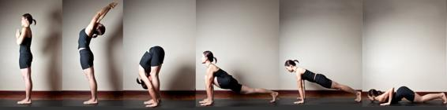
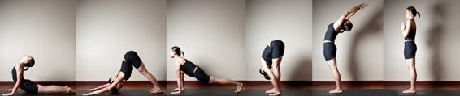

<b class="calibre3">Surya Namaskar </b>

 <i class="calibre4">(12-Step Sun Salutation) </i>

<b class="calibre3"> </b>

<b class="calibre3">Introduction: </b>

Surya Namaskar, translated as Salutation to the Sun, is a gesture to show our respect and appreciation to the Sun, our source of energy. Surya Namaskara was a daily ritual for Indian ancients. It was practiced at dawn, facing the rising sun in the East. It has been handed down from the enlightened sages of the Vedic Age. The sun symbolizes spiritual consciousness. 

The Sun connects to pingala nadi, the pranic channel which carries solar energy in the body. Regular practice regulates this nadi, balancing energy levels within the body. 

This  is  a  12-step  sequence  performed  in  most  yoga  classes  and  serves  as  a warm up for the Yoga asana practice. It is also a good form of exercise on its own. The spine moves in different directions and the entire body is stretched and strengthened. 

<b class="calibre3"> </b>

<b class="calibre3"> </b>

<b class="calibre3"> </b>

<b class="calibre3"> </b>

<b class="calibre3"> </b>

<b class="calibre3"> </b>

 <i class="calibre4">  </i> 11 

 <i class="calibre4"> </i>

<b class="calibre3">Origin: </b>

This is the legend of Surya Namaskar: 

When Hanuman was quite young, he saw the rising Sun in the sky and thought it was a ripe fruit. He was hungry and leapt towards the sky to reach for it. God Indra  feared  the  world  would  perish  without  the  Sun  and  used  his  powerful weapon  the  Vajra  (thunderbolt),  injuring  Hanuman’s  jaw.  Hanuman  fel unconscious. Vayu-deva, Hanuman’s father, was furious and withdrew himself from  the  universe.  Consequently  the  winds  in  the  sky  and  life  became suspended.  Al   the  demigods,  headed  by  Brahma  tried  to  appease  Vayu’s anger. 

Vayu  final y  cooled  down  and  resumed  his  function  in  the  universe  and  the grateful demigods showered many benedictions on Hanuman. Indra gave him the boon of being able to die as desired and Brahma bestowed protection from his powerful weapon the brahma-astra. 

After studying Vedic scriptures and the science of war, Hanuman (literal y ‘one with a broken jaw’), accepted the Sun God he once tried to swal ow. He would prostrate in front of the Sun God and perform the Surya Namaskar to show his faith 

and 

respect 

for 

him. 

<b class="calibre3">Benefits: </b>

1. 

Warms up the body, loosens the joints 

2. 

Stretches the spine in different directions 

3. 

Stretches  and  tones  the  major  muscles,  e.g.  hamstrings,  abdominal muscles, arms 

4. 

Improves overal  flexibility 

5. 

Increases blood circulation and flow of prana 

6. 

Increase lymphatic circulation hence speeds up the removal of toxins 7. 

Exercises cardiovascular system 

8. 

Massages the internal organs, e.g. digestive organs, reproductive organs 9. 

Regulates the pingala nadi which is the solar energy channel in the body 10.  Enhances memory and concentration 

11.  Invigorates the nervous system as spine is stretched 12.  Promotes good sleep and calms anxiety 

<b class="calibre3"> </b>

<b class="calibre3"> </b>

<b class="calibre3"> </b>

 <i class="calibre4">  </i> 12 

 <i class="calibre4"> </i>

<b class="calibre3">Contraindications: </b>

1. 

Pregnancy 

2. 

Hernia, slipped disc 

3. 

Severe heart problems 

4. 

Spinal,  back  injury,  severe  high  blood  pressure  (should  seek  doctor’s advice and qualified Yoga teacher’s guidance for modified versions) 

<b class="calibre3"> </b>

<b class="calibre3">Sequence: </b>

<b class="calibre3">Starting position: </b>

Stand  in  Tadasana.  Feet  together  or  hip-width  apart,  knee  caps  engaged, buttocks  and  abs  gently  engaged.  Arms  beside  the  body,  rol   the  shoulders back, fingers active. Stand tal  and gaze forward. 

<b class="calibre3">Step 1:</b> Samasthiti (Standing prayer) 

Inhale and as you exhale, place the palms together at the heart centre. 

<b class="calibre3">Step 2:</b> Ardha Chakrasana (Half Wheel Pose) 

Inhaling, raise both arms up, elongate the spine, contract the gluteal muscles as you bend backwards. Gaze in between eyebrows. 

<b class="calibre3">Step 3:</b> Uttansana (Intense forward bend) 

Exhaling,  lengthen  the  spine,  fold  forward  from  the  hips  with  belly  in.  Place palms down next to respective feet. Try to bring the abdomen in contact with the thighs, face in contact with the shins. 

<b class="calibre3"> </b>

<b class="calibre3">Step 4:</b> Ashwa Sanchalansana (Horse Lunge pose) 

Inhaling, step the right leg back into a lunge position. Ensure that the left knee is at 90 degrees and does not go beyond the toes. Keep the right knee straight, hips  squared,  spine  elongated,  shoulders  rol ed  back  and  gaze  between  the eyebrows. 

<b class="calibre3">Step 5:</b> Santolasana (Plank pose) 

Holding the breath, step the left leg back into a plank position. Ensure that the shoulders  are  directly  above  the  wrists.  Spread  the  fingers  and  ground  the entire  palms  firmly.  Engage  the  core  muscles  and  keep  the  entire  body  in  a single diagonal line. Make sure the tail bone is tucked in. Gaze at a point on the floor about 1 m away. 

 <i class="calibre4">  </i> 13 

 <i class="calibre4"> </i>

<b class="calibre3">Step 6:</b> Ashtanga Namaskar (8 limb salutation) 

Exhaling, lower the knees, chest and chin to the ground. The chest should be in line with both palms, elbows close to the body and stacked above wrists. Keep the lumber arched and point the sit bones up. Gaze as per Step 5. 

<b class="calibre3">Step 7:</b> Bhujangasana (Cobra pose) 

Inhaling, slide the upper body forward and up, rol ing the shoulders back. Keep the pelvis, legs and feet on the ground, engage the gluteal muscles slightly and stretch the sternum forward. Gaze in between the eyebrows. 

<b class="calibre3">Step 8:</b> Adho Mukha Swanasana (Downward Facing Dog Pose) Exhaling, ground the palms, lift chest and hips off the floor, bend at the hip and point sit bones to the ceiling. Straighten knees and elbows, forming an inverted V shape. Legs are separated hip-width apart. Keep the spine and legs straight. 

Fingers  are  extended,  arms  and  legs  are  active.  Contract  the  quadriceps  to draw the knee caps up. If possible, press the heels to the ground. Gaze towards the navel. 

<b class="calibre3">Step 9:</b> Ashwa Sanchalansana (Horse Lunge Pose) 

Inhaling, step the right leg forward in line with the palms into a lunge position. 

Alignment as per Step 4. 

<b class="calibre3">Step 10:</b> Uttansana (Intense forward bend) 

Exhaling,  step  the  left  leg  forward  to  meet  with  the  right  and  fold  forward. 

Alignment as per Step 3. 

<b class="calibre3">Step 11:</b> Ardha Chakrasana (Half Wheel Pose) 

Inhaling, lengthen the spine, raise both arms up, come up to standing with a flat back. 

<b class="calibre3">Step 12:</b> Samasthiti (Standing prayer) 

Exhaling,  in  standing  position,  place  the  palms  together  at  the  heart  centre. 

Gaze forward. 

<b class="calibre3">This is half a round. Repeat steps 1 to 12 on the left leg to complete 1 round. </b>

<b class="calibre3"> </b>

<b class="calibre3"> </b>

<b class="calibre3"> </b>

<b class="calibre3"> </b>

 <i class="calibre4">  </i> 14 

 <i class="calibre4"> </i>

<b class="calibre3">Practice Tips: </b>

Best  practiced  in  the  early  morning  as  this  will  energize  you  throughout  the day.  For  beginners,  it  is  recommended  that  you  do  the  steps  slowly  and steadily. Do not rush. 

Try to synchronize the breathing and movement to keep the mind steady. With consistent practice, the body gets more limber and energetic. 

Start with 3 rounds and progress to 6 and eventually 12 rounds. If there is not enough time to practice 12 rounds, 6 is the recommended minimum which wil take about 15 – 20 minutes. 

After being familiar with the sequence, bring your practice a little deeper by focusing on the breath, or fol owing the table below to bring awareness to the different  chakras.  Chakras,  translated  as  wheels  or  discs,  are  energy  centres along  the  spine  that  receives  and  expresses  prana,  our  life  force  energy.  By concentrating on the chakra, you are bringing more prana to it. 

 <i class="calibre4">  </i> 15 

 <i class="calibre4"> </i>

<b class="calibre3"> </b>

<b class="calibre3">Summary: </b>

Step 

Name 

Breath 

Chakra 

Gaze 

1 

Samasthiti 

- 

Heart 

Forward 

2 

Ardha Chakrasana 

Inhale 

Throat 

In between 

eyebrows 

3 

Uttansana 

Exhale 

Root 

Tip of nose 

4 

Ashwa 

Inhale 

Forehead 

In between 

Sanchalansana 

eyebrows 

5 

Santolasana 

Hold 

Throat 

Tip of nose 

6 

Ashtanga Namaskar  Exhale 

Navel 

Tip of nose 

7 

Bhujangasana 

Inhale 

Root 

In between 

eyebrows 

8 

Adho Mukha 

Exhale 

Throat 

Navel 

Swanasana 

9 

Ashwa 

Inhale 

Forehead 

In between 

Sanchalansana 

eyebrows 

10 

Uttansana 

Exhale 

Root 

Tip of nose 

11 

Ardha Chakrasana 

Inhale 

Throat 

In between 

eyebrows 

12 

Samasthiti 

Exhale 

Heart 

Forward 

