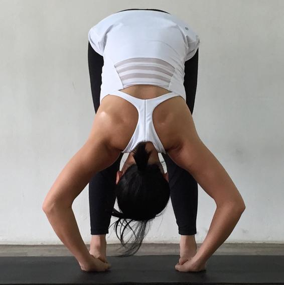
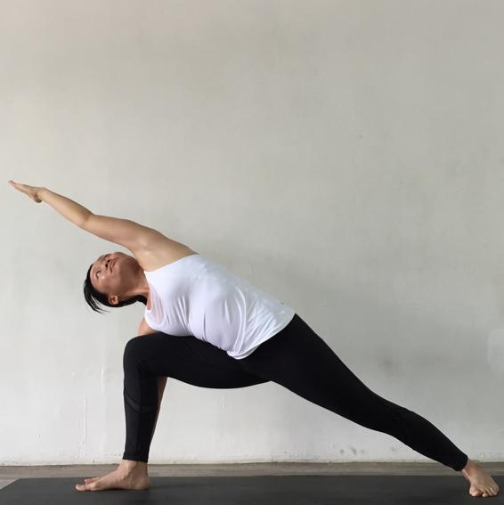
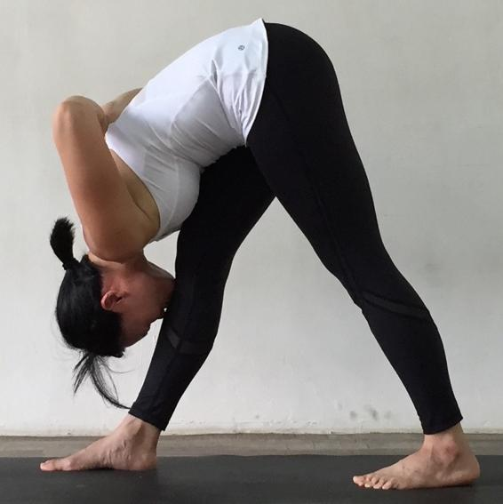
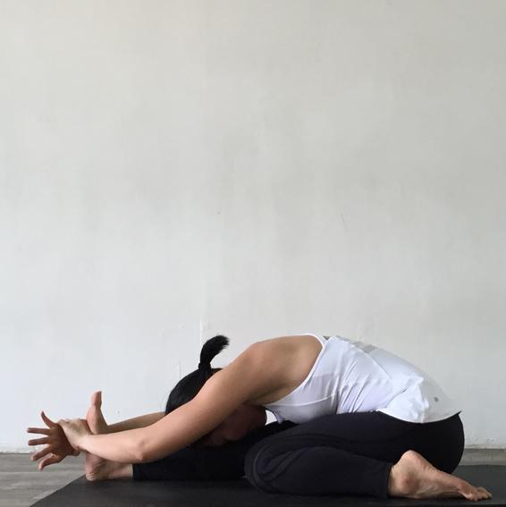
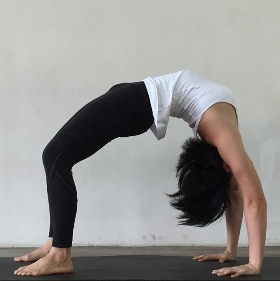

  

   
  

  

  

  

   <b class="calibre3">
    Surya Namaskara A
   </b>
  

  

   (Sun Salutation A)
  

  

  

  

  

  

  

  

   Instructions:
  

  

  

  

  

  

   EX  Samasthiti
  

  

  

  

  

  

  

  

  

  

  

  

  

  

  

  

  

  

  

  

   
  

  

   
  

  

  

  

   <b class="calibre3">
    Surya Namaskara B
   </b>
  

  

   (Sun Salutation B)
  

  

  

  

  

  

  

  

   Instructions:
  

  

  

  

   IN  Utkatasana, arms up
  

  

   IN
  

  

   Left leg forward
  

  

   EX  Uttanasana
  

  

  

  

  

  

   (Virabhadrasana A)
  

  

   EX
  

  

   Chaturanga
  

  

   IN  Half way lift
  

  

   IN
  

  

   Urdhva Mukha
  

  

   EX  Jump back (Chaturanga)
  

  

   Svanasana
  

  

   IN  Urdhva Mukha Svanasana
  

  

   EX
  

  

   Adho Mukha
  

  

   EX  Adho Mukha Svanasana
  

  

   Svanasana – hold for
  

  

   IN  Right leg forward
  

  

   IN
  

  

   Jump forward
  

  

   (Virabhadrasana A)
  

  

   EX  Chaturanga
  

  

   EX
  

  

   Uttanasana
  

  

   IN
  

  

   Utkatasana, arms up
  

  

   IN  Urdhva Mukha Svanasana
  

  

   EX
  

  

   Samasthiti
  

  

  

  

  

  

  

  

   
  

  

   
  

  

   
  

  

  

  

  

  

   <b class="calibre3">
    Padangusthasana
   </b>
  

  

   (Standing Forward Bend With Bound Toe)
  

  

   Dristi: Nosetip
  

  

  

  

  

  

  

  

  

  

   Instructions:
  

  

   Lift the sternum and arch back slightly
  

  

  

  

   stay for 5 breaths
  

  

  

  

  

  

  

  

  

  

   
  

  

   
  

  

   
  

  

  

  

   <b class="calibre3">
    Padahastasana
   </b>
  

  

   (Standing Forward Bend With Palms Under Feet)
  

  

   Dristi: Nosetip
  

  

  

  

  

  

  

  

   Instructions:
  

  

  

  

   stay for 5 breaths
  

  

  

  

  

  

   Bring hands to the hips
  

  

  

  

  

  

   Look up, raise the trunk al  the way up, return to Samasthiti Copyrights reserved.
  

  

  

  

   
  

  

   
  

  

  

  

   <b class="calibre3">
    Utthita Trikonasana
   </b>
  

  

   (Extended Triangle)
  

  

   Dristi: Thumb
  

  

  

  

  

  

  

  

   Instructions:
  

  

  

  

  

  

   Turn the right foot 90 degrees out to the side
  

  

  

  

  

  

   Spread arms horizontal y at shoulder height and reach out to the right side
  

  

  

  

  

  

  

  

  

  

   
  

  

   
  

  

  

  

   <b class="calibre3">
    Parivritta Trikonasana
   </b>
  

  

   (Revolved Triangle Pose)
  

  

   Dristi: Upper Thumb
  

  

  

  

  

  

  

  

   Instructions:
  

  

  

  

   Right hand on right hip, raise left arm up, lengthen the spine 2  EX  Place the left palm on the outside of the right foot. Twist from the mid  and  upper  back  and  gaze  at  the  right  thumb  –  stay  for  5
  

  

   breaths
  

  

  

  

  

  

  

  

  

  

  

  

  

  

  

  

  

  

  

  

  

  

   
  

  

   
  

  

  

  

   <b class="calibre3">
   </b>
  

  

   <b class="calibre3">
    Utthita Parsvakonasana
   </b>
  

  

   (Extended Side Angle Stretch Pose)
  

  

   Dristi: Upper Thumb
  

  

  

  

  

  

  

  

   Instructions:
  

  

   breaths
  

  

  

  

  

  

  

  

  

  

  

  

  

  

  

  

   <b class="calibre3">
   </b>
  

  

  

  

  

  

   
  

  

   
  

  

  

  

   <b class="calibre3">
    Parivritta Parsvakonasana
   </b>
  

  

   (Revolved Side Angle Stretch Pose)
  

  

   Dristi: Upper Thumb
  

  

  

  

  

  

  

  

   Instructions:
  

  

  

  

  

  

  

  

  

  

   
  

  

   
  

  

  

  

   <b class="calibre3">
    Prasarita Padottanasana A
   </b>
  

  

   (Spread Legs Intense Stretch Pose)
  

  

   Dristi: Nose Tip
  

  

  

  

  

  

  

  

  

  

   Instructions:
  

  

   Lower the crown of the head to the ground without rounding the spine – stay for 5 breaths
  

  

  

  

   
  

  

   
  

  

  

  

   <b class="calibre3">
   </b>
  

  

   <b class="calibre3">
    Prasarita Padottanasana B
   </b>
  

  

   (Spread Legs Intense Stretch Pose)
  

  

   Dristi: Nose Tip
  

  

  

  

  

  

  

  

   Instructions:
  

  

   stay for 5 breaths
  

  

  

  

  

  

  

  

  

  

  

  

  

  

  

  

  

  

  

  

  

  

  

  

  

  

  

  

   <b class="calibre3">
   </b>
  

  

  

  

  

  

   
  

  

   
  

  

  

  

   <b class="calibre3">
    Prasarita Padottanasana C
   </b>
  

  

   (Spread Legs Intense Stretch Pose)
  

  

   Dristi: Nose Tip
  

  

  

  

  

  

  

  

   Instructions:
  

  

  

  

  

  

  

  

  

  

  

  

  

  

  

  

  

  

  

  

  

  

  

  

  

  

  

  

  

  

  

  

  

  

   
  

  

   
  

  

  

  

   <b class="calibre3">
    Prasarita Padottanasana D
   </b>
  

  

   (Spread Legs Intense Stretch Pose)
  

  

   Dristi: Nose Tip
  

  

  

  

  

  

  

  

   Instructions:
  

  

   Without  bending  the  knees,  lengthen  the  spine,  depress  the shoulders and scapula, ground the feet firmly. Stay for 5 breaths 3  IN  Lengthen the spine, place hands on the hips and come up 4  EX  Return to Samasthiti
  

  

  

  

  

  

  

  

  

  

  

  

  

  

  

  

  

  

   <b class="calibre3">
   </b>
  

  

  

  

  

  

   
  

  

   
  

  

  

  

   <b class="calibre3">
    Parsvottanasana
   </b>
  

  

   (Intense Stretch To The Side Pose)
  

  

   Dristi: Nose Tip
  

  

  

  

  

  

  

  

   Instructions:
  

  

   Lift the sternum while gazing upwards
  

  

  

  

  

  

   breaths
  

  

  

  

  

  

  

  

   
  

  

   
  

  

  

  

   <b class="calibre3">
    Utthita Hasta Padangusthasana A
   </b>
  

  

   (Extended Hand To Big Toe Pose)
  

  

   Dristi: Nose Tip
  

  

  

  

  

  

  

  

   Instructions:
  

  

  

  

  

  

  

  

  

  

  

  

  

  

  

  

  

  

  

  

  

  

  

  

  

  

  

  

  

  

  

  

  

  

   
  

  

   
  

  

  

  

   <b class="calibre3">
    Utthita Hasta Padangusthasana B
   </b>
  

  

   (Extended Hand To Big Toe Pose)
  

  

   Dristi: Corner of the Left Eye
  

  

  

  

  

  

  

  

   Instructions:
  

  

  

  

   
  

  

   
  

  

  

  

   <b class="calibre3">
    Utthita Hasta Padangusthasana C
   </b>
  

  

   (Extended Hand To Big Toe Pose)
  

  

   Dristi: Toes
  

  

  

  

  

  

  

  

   Instructions:
  

  

   Release the hands keeping leg paral el to the floor
  

  

  

  

  

  

  

  

  

  

  

  

  

  

  

  

  

  

  

  

  

  

  

  

  

  

  

  

  

  

  

  

  

  

  

  

  

  

  

  

   
  

  

   
  

  

  

  

   <b class="calibre3">
    Utthita Hasta Padangusthasana D
   </b>
  

  

   (Extended Hand To Big Toe Pose)
  

  

   Dristi: Toes
  

  

  

  

  

  

  

  

   Instructions:
  

  

  

  

   
  

  

   
  

  

   
  

  

  

  

   <b class="calibre3">
    Ardha Baddha Padmottanasana
   </b>
  

  

   (Half Bound Lotus Intense Stretch Pose)
  

  

   Dristi: Nose Tip
  

  

  

  

  

  

  

  

  

  

   Instructions:
  

  

   Repeat on the left side
  

  

  

  

  

  

  

  

  

  

  

  

  

  

  

  

  

  

  

  

  

  

   
  

  

   
  

  

  

  

   <b class="calibre3">
    Utkatasana
   </b>
  

  

   (Fierce / Chair Pose)
  

  

   Dristi: Thumbs
  

  

  

  

  

  

  

  

   Instructions:
  

  

  

  

  

  

  

  

  

  

  

  

  

  

  

  

  

  

  

  

  

  

  

  

  

  

  

  

   
  

  

   
  

  

  

  

   <b class="calibre3">
    Virabhadrasana A
   </b>
  

  

   (Fierce Warrior Pose)
  

  

   Dristi: Thumbs
  

  

  

  

  

  

  

  

   Instructions:
  

  

   breaths
  

  

  

  

  

  

  

  

  

  

  

  

  

  

  

  

  

  

  

  

  

  

  

  

  

  

  

  

  

  

  

  

  

  

  

  

  

  

  

  

   
  

  

   
  

  

  

  

   <b class="calibre3">
    Virabhadrasana B
   </b>
  

  

   (Fierce Warrior Pose)
  

  

   Dristi: Thumb
  

  

  

  

  

  

  

  

   Instructions:
  

  

  

  

  

  

  

  

  

  

  

  

  

  

  

  

  

  

  

  

  

  

  

  

  

  

  

  

  

  

   
  

  

   
  

  

  

  

   <b class="calibre3">
    Dandasana
   </b>
  

  

   (Staff pose)
  

  

   Dristi: Nose Tip
  

  

  

  

  

  

  

  

   Instructions:
  

  

   Place the palms on the floor next to the hips
  

  

   Keep the body perpendicular to the legs
  

  

   Suck in the bel y and lift the chest
  

  

   Do a slight chin lock – stay for 5 breaths
  

  

  

  

  

  

   *  This  is  the  starting  position  for  the  fol owing  asana  unless otherwise stated
  

  

  

  

  

  

  

  

  

  

  

  

  

  

  

  

  

  

  

  

  

  

  

  

  

  

  

  

  

  

  

  

  

  

  

  

  

  

  

  

  

  

  

  

  

  

  

  

  

  

   
  

  

   
  

  

  

  

   <b class="calibre3">
    Paschimottanasana A,B,C,D
   </b>
  

  

   (West posterior stretch pose)
  

  

   Dristi: Toes
  

  

  

  

  

  

  

  

  

  

  

  

   Instructions:
  

  

  

  

  

  

  

  

  

  

  

  

  

  

  

  

  

  

  

  

  

  

  

  

  

  

  

  

  

  

   
  

  

   
  

  

  

  

   <b class="calibre3">
    Purvottanasana
   </b>
  

  

   (East anterior stretch pose)
  

  

   Dristi: Nose tip
  

  

  

  

  

  

  

  

   Instructions:
  

  

   Place the hands about 1 foot away from the hips
  

  

   Externally rotate the shoulders, lift the chest
  

  

   Press the soles firmly down and squeeze the inner thighs together –
  

  

   stay for 5 breaths
  

  

  

  

  

  

  

  

  

  

  

  

  

  

  

  

  

  

  

  

  

  

  

  

  

  

  

  

  

  

  

  

  

  

  

  

  

  

  

  

  

  

  

  

  

  

  

  

   
  

  

   
  

  

  

  

   <b class="calibre3">
    Ardha Baddha Padma Paschimottanasana
   </b>
  

  

   (Half bound lotus posterior stretch pose)
  

  

   Dristi: Toes
  

  

  

  

  

  

  

  

   Instructions:
  

  

   Repeat on the other side
  

  

  

  

  

  

  

  

  

  

  

  

  

  

  

  

  

  

  

  

  

  

  

  

  

  

  

  

  

  

  

  

  

  

  

  

  

  

  

  

  

  

  

  

  

  

  

  

   
  

  

   
  

  

  

  

   <b class="calibre3">
    Triang Mukha Ekapada Paschimottanasana
   </b>
  

  

   (3 limb facing one leg posterior stretch pose)
  

  

   Dristi: Toes
  

  

  

  

  

  

  

  

   Instructions:
  

  

   Fold the right knee and place the right heel next to the hip, heel and sole facing up
  

  

  

  

  

  

  

  

  

  

  

  

  

  

  

  

  

  

  

  

  

  

  

  

  

  

  

  

  

  

  

  

  

  

  

  

  

  

  

  

  

  

  

  

  

  

  

  

  

  

  

  

  

  

   
  

  

   
  

  

  

  

   <b class="calibre3">
    Janu Sirsasana A,B,C
   </b>
  

  

   (Head to knee pose)
  

  

   Dristi: Toes
  

  

  

  

  

  

   Instructions:
  

  

  

  

  

  

   Repeat on the left side
  

  

  

  

  

  

  

  

   
  

  

   
  

  

  

  

   <b class="calibre3">
    Marichyasana A
   </b>
  

  

   (Marichya pose A)
  

  

   Dristi: Toes
  

  

  

  

  

  

  

  

   Instructions:
  

  

   Bend  the  right  knee  and  place  the  right  foot  on  the  floor  with heel close to the hip
  

  

  

  

  

  

  

  

  

  

  

  

  

  

  

  

  

  

  

  

  

  

  

  

  

  

  

  

  

  

   
  

  

   
  

  

  

  

   <b class="calibre3">
    Marichyasana B
   </b>
  

  

   (Marichya pose B)
  

  

   Dristi: Nose Tip
  

  

  

  

  

  

  

  

   Instructions:
  

  

  

  

  

  

   Repeat on the other side
  

  

  

  

  

  

  

  

  

  

  

  

  

  

  

  

  

  

  

  

  

  

  

  

   
  

  

   
  

  

   
  

  

  

  

   <b class="calibre3">
    Marichyasana C
   </b>
  

  

   (Marichya pose C)
  

  

   Dristi: Side
  

  

  

  

  

  

  

  

   Instructions:
  

  

   Bend the right knee and place the right foot on the floor with heel close to the hip
  

  

  

  

  

  

   Repeat on the other side
  

  

  

  

  

  

  

  

  

  

  

  

  

  

  

  

  

  

  

  

  

  

  

  

  

  

  

  

  

  

  

  

  

  

  

  

   
  

  

   
  

  

   
  

  

  

  

   <b class="calibre3">
    Marichyasana D
   </b>
  

  

   (Marichya pose D)
  

  

   Dristi: Side
  

  

  

  

  

  

  

  

   Instructions:
  

  

  

  

  

  

   Repeat on the other side
  

  

  

  

  

  

  

  

  

  

  

  

  

  

  

  

  

  

  

  

  

  

  

  

  

  

  

  

  

  

  

  

  

  

  

  

   
  

  

   
  

  

   
  

  

  

  

   <b class="calibre3">
    Navasana
   </b>
  

  

   (Boat pose)
  

  

   Dristi: Toes
  

  

  

  

  

  

  

  

   Instructions:
  

  

   Keep the knees straight and together
  

  

   Stretch the arms paral el to the floor
  

  

   Try to sit on the ischium (sit bones)
  

  

  

  

  

  

  

  

  

  

  

  

  

  

  

  

  

  

  

  

  

  

  

  

  

  

  

  

  

  

  

  

  

  

  

  

  

  

  

  

  

  

  

  

  

  

  

  

   
  

  

   
  

  

  

  

   <b class="calibre3">
    Bhujapidasana / Tittibhasana
   </b>
  

  

   (Arm pressure / Firefly pose)
  

  

   Dristi: Nose tip
  

  

  

  

  

  

  

  

   Instructions:
  

  

  

  

   
  

  

   
  

  

   
  

  

  

  

   <b class="calibre3">
    Kurmasana (A) / Supta Kurmasana (B)
   </b>
  

  

   (Tortoise/ Sleeping Tortoise pose)
  

  

   Dristi: Third eye
  

  

  

  

  

  

  

  

  

  

   Instructions:
  

  

   Spread  your  legs  to  a  distance  slightly  wider  than  hip width apart
  

  

  

  

  

  

  

  

  

  

  

  

  

  

  

  

  

  

  

  

  

  

  

  

   
  

  

   
  

  

  

  

   <b class="calibre3">
    Garbha Pindasana
   </b>
  

  

   (Embryo in womb pose)
  

  

   Dristi: Nose tip
  

  

  

  

  

  

  

  

   Instructions:
  

  

   Fold your legs into lotus
  

  

   Slide your elbows through two gaps formed in the lotus
  

  

   Place the chin in between the palms
  

  

   Variation: Rol  9 times back and forth in a straight line 5
  

  

   Variation: Rol  9 times back and forth in a clockwise direction Copyrights reserved.
  

  

  

  

   
  

  

   
  

  

  

  

   <b class="calibre3">
    Kukkutasana
   </b>
  

  

   (Rooster pose)
  

  

   Dristi: Nose Tip
  

  

  

  

  

  

  

  

   Instructions:
  

  

   Tip: Use the bandhas for an upward lifting action
  

  

  

  

  

  

  

  

  

  

  

  

  

  

  

  

  

  

  

  

  

  

  

  

  

  

  

  

  

  

  

  

  

  

  

  

  

  

  

  

  

  

  

  

  

  

  

  

  

  

  

  

  

  

  

  

  

  

  

  

   
  

  

   
  

  

   
  

  

  

  

   <b class="calibre3">
    Baddha Konasana A,B
   </b>
  

  

   (Bound angle pose)
  

  

   Dristi: Nose Tip
  

  

  

  

  

  

  

  

   Instructions:
  

  

   Place the soles together and bring the heels close to the groin with hands on the feet
  

  

   stay for 5 breaths
  

  

  

  

  

  

  

  

  

  

  

  

  

  

  

  

  

  

  

  

  

  

  

  

  

  

  

  

  

  

   
  

  

   
  

  

  

  

   <b class="calibre3">
    Upavistha Konasana / Supta Konasana
   </b>
  

  

   (Seated / Sleeping angle pose)
  

  

   Dristi: Upwards / Nose Tip
  

  

  

  

  

  

  

  

  

  

   Instructions:
  

  

   Spread your legs about 3 – 4 feet apart
  

  

  

  

   
  

  

   
  

  

   
  

  

  

  

   <b class="calibre3">
    Supta Padangusthasana A,B
   </b>
  

  

   (Sleeping thumb to foot stretch pose)
  

  

   Dristi: Toes
  

  

  

  

  

  

  

  

   Instructions:
  

  

   Lie on the back
  

  

   breaths
  

  

  

  

  

  

   Repeat on the left side
  

  

  

  

  

  

  

  

  

  

  

  

  

  

  

  

  

  

  

  

  

  

  

  

  

  

  

  

  

  

   
  

  

   
  

  

   
  

  

  

  

   <b class="calibre3">
    Ubhaya Padangusthasana
   </b>
  

  

   (Both thumbs to feet pose)
  

  

   Dristi: Upwards
  

  

  

  

  

  

  

  

   Instructions:
  

  

   Lie on the back
  

  

   Hold the big toes
  

  

  

  

   
  

  

   
  

  

   
  

  

  

  

   <b class="calibre3">
    Urdhva Mukha Paschimottanasana
   </b>
  

  

   (Upward facing posterior stretch pose)
  

  

   Dristi: Toes
  

  

  

  

  

  

   Instructions:
  

  

   Lie on the back
  

  

   Hold the ankles or heels
  

  

   Fold deeper and bring the chin to the shin – stay for 5 breaths Copyrights reserved.
  

  

  

  

   
  

  

   
  

  

   
  

  

   
  

  

  

  

   <b class="calibre3">
    Setu Bandhasana
   </b>
  

  

   (Bridge formation pose)
  

  

   Dristi: Nose tip
  

  

  

  

  

  

  

  

   Instructions:
  

  

   Lie on the back
  

  

   With knees slightly bent, step your feet down like Charlie Chaplin (legs rolled outwards, supported by the outer soles)
  

  

   Options:  Ground  the  elbows  and  lift  the  chest  /  Use  hands  as support behind the head to lift hips and chest up / Keep hips and chest lifted and cross the arms in front of the chest or shoulders 4  IN  Rol  the head back, hyperextend the neck and support the head on the top of the forehead – stay for 5 breaths
  

  

  

  

  

  

  

  

  

  

  

  

  

  

  

  

  

  

  

  

  

  

  

  

  

  

  

  

  

  

  

  

  

  

  

  

   
  

  

   
  

  

  

  

   <b class="calibre3">
    Urdhva Dhanurasana
   </b>
  

  

   (Upward Bow pose)
  

  

   Dristi: Nose tip
  

  

  

  

  

  

  

  

   Instructions:
  

  

   Lie on the back
  

  

   Bend the knees and place the heels close to the hips, place the palms next to the ears with elbows pointing up
  

  

  

  

   
  

  

   
  

  

  

  

   <b class="calibre3">
    Sarvangasana
   </b>
  

  

   (All limbs pose, Shoulderstand)
  

  

   Dristi: Nose tip
  

  

  

  

  

  

  

  

  

  

   Instructions:
  

  

   Lie on the back
  

  

  

  

  

  

  

  

  

  

  

  

  

  

  

  

  

  

  

  

  

  

  

  

  

  

  

  

  

  

  

  

  

  

  

  

  

  

  

  

  

  

   
  

  

   
  

  

  

  

   <b class="calibre3">
    Halasana
   </b>
  

  

   (Plough pose)
  

  

   Dristi: Nose tip
  

  

  

  

  

  

  

  

   Instructions:
  

  

   From sarvangasana,
  

  

   Interlock the fingers behind your back – stay for 10 breaths Copyrights reserved.
  

  

  

  

   
  

  

   
  

  

  

  

  

  

   <b class="calibre3">
    Karanapidasana
   </b>
  

  

   (Ear pressure pose)
  

  

   Dristi: Nose tip
  

  

  

  

  

  

  

  

  

  

   Instructions:
  

  

   From Halasana, bend the knees and place them next to the ears 2
  

  

   Gently  squeeze  the  knees  against  the  ears.  Plantarflex  your ankles and try to place the shin down against the floor - stay for 5 breaths
  

  

   Keep the hands interlaced behind the back
  

  

  

  

  

  

  

  

  

  

  

  

  

  

  

  

  

  

  

  

  

  

  

  

  

  

  

  

  

  

  

  

  

  

  

  

  

  

  

  

  

  

   
  

  

   
  

  

  

  

   <b class="calibre3">
    Urdhva Padmasana
   </b>
  

  

   (Upward lotus pose)
  

  

   Dristi: Nose tip
  

  

  

  

  

  

  

  

   Instructions:
  

  

   Return to Sarvangasana, fold the legs in lotus, place the palms on the knees and straighten the elbows.
  

  

   Keep the legs paral el to the floor. Balance with the chin in contact with the sternum - stay for 5 breaths
  

  

  

  

  

  

  

  

  

  

  

  

  

  

  

  

  

  

  

  

  

  

  

  

  

  

  

  

  

  

  

  

  

  

  

  

  

  

  

  

  

  

  

  

  

  

  

  

  

  

  

  

  

  

  

  

  

  

  

  

  

  

  

  

  

  

  

  

   
  

  

   
  

  

  

  

   <b class="calibre3">
    Pindasana
   </b>
  

  

   (Embryo pose)
  

  

   Dristi: Nose tip
  

  

  

  

  

  

  

  

   Instructions:
  

  

   From Urdhva Padmasana, flex the hips and hug the legs close  to the chest
  

  

   Bind the hands around the legs – stay for 5 breaths
  

  

  

  

  

  

  

  

  

  

  

  

  

  

  

  

  

  

  

  

  

  

  

  

  

  

  

  

  

  

  

  

  

  

  

  

  

  

  

  

  

  

  

  

  

  

  

  

  

  

  

  

  

  

  

  

  

  

  

  

  

  

  

  

  

  

  

  

  

  

  

  

   
  

  

   
  

  

  

  

   <b class="calibre3">
    Matsyasana
   </b>
  

  

   (Fish pose)
  

  

   Dristi: Nose tip or third eye
  

  

  

  

  

  

  

  

   Instructions:
  

  

   Lift the chest and place the crown of the head down – stay for 5
  

  

   breaths
  

  

  

  

  

  

  

  

  

  

  

  

  

  

  

  

  

  

  

  

  

  

  

  

  

  

  

  

  

  

  

  

  

  

  

  

  

  

  

  

  

  

  

  

  

  

  

  

   
  

  

   
  

  

  

  

   <b class="calibre3">
    Uttana Padasana
   </b>
  

  

   (Extended stretch foot pose)
  

  

   Dristi: Nose tip
  

  

  

  

  

  

  

  

   Instructions:
  

  

   From Matsyasana, release the legs from lotus and raise them up to a  45  degree  angle.  Join  the  palms,  straighten  the  arms,  pointing fingers towards the toes or ceiling
  

  

   Keep the chest lifted – stay for 5 breaths
  

  

  

  

  

  

  

  

  

  

  

  

   Chakrasana (back-rol ) to Adho Mukha Svanasana
  

  

  

  

  

  

  

  

  

  

  

  

  

  

  

  

  

  

  

  

  

  

  

  

  

  

  

  

  

  

  

  

  

  

  

  

  

  

  

  

  

  

   
  

  

   
  

  

   
  

  

  

  

   <b class="calibre3">
    Sirsasana
   </b>
  

  

   (Headstand pose)
  

  

   Dristi: Nose tip
  

  

  

  

  

  

  

  

   Instructions:
  

  

   From  Adho  Mukha  Svanasana,  lower  the  knees,  interlace  the fingers and place elbows down shoulder width apart
  

  

   Place the crown of the head down on the floor, lift the knees and walk the legs closer, shift the weight onto the shoulders 3
  

  

   Once  you  feel  the  legs  become  weightless,  raise  the  legs  up  to form a straight vertical line – stay for 25 breaths
  

  

  

  

  

  

   *Do not crush the neck, depress the shoulder blades to keep them stable
  

  

   Stil   in  sirsasana,  fold  at  the  hips,  bring  both  legs  paral el  to  the floor – stay for 10 breaths
  

  

   Come down to Balasana (child’s pose) to rest
  

  

  

  

  

  

   Do a vinyasa and jump through to Dandasana
  

  

  

  

  

  

  

  

   
  

  

   
  

  

  

  

   <b class="calibre3">
    Baddha Padmasana
   </b>
  

  

   (Bound Lotus pose)
  

  

   Dristi: Nose tip
  

  

  

  

  

  

  

  

   Instructions:
  

  

   From Dandasana, fold the knees into lotus (right knee first before the left)
  

  

   Wrap  the  right  arm  around  the  back  and  hold  the  right  big  toe.
  

  

   Same as the left side
  

  

   Lengthen the spine and open the chest – stay for 5 breaths Copyrights reserved.
  

  

  

  

   
  

  

   
  

  

   
  

  

  

  

   <b class="calibre3">
    Yoga Mudra
   </b>
  

  

   (Yoga gesture)
  

  

   Dristi: Nose tip
  

  

  

  

  

  

  

  

   Instructions:
  

  

  

  

  

  

  

  

  

  

   IN  Come back up and take 5 breaths in Padmasana (Lotus)
  

  

  

  

  

  

  

  

  

  

  

  

  

  

  

  

  

  

  

  

  

  

  

  

  

  

  

  

  

  

  

  

  

  

   
  

  

   
  

  

  

  

   <b class="calibre3">
    Utpluthih
   </b>
  

  

   (Spring up)
  

  

   Dristi: Nose tip
  

  

  

  

  

  

  

  

   Instructions:
  

  

   From Padmasana, place the palms down on the floor next to the legs
  

  

   Stay  in  the  position  and  do  25  forceful  and  quick  pumps  of exhalations
  

  

  

  

  

  

  

  

  

  

  

  

  

  

  

  

  

  

  

  

  

  

  

  

  

  

  

  

   <b class="calibre3">
   </b>
  

  

   <b class="calibre3">
   </b>
  

  

  

  

  

  

  

  

  

  

  

  

   
  

  

  

  

  

  

  

  

  

  

   <b class="calibre3">
   </b>
  

  

   <b class="calibre3">
   </b>
  

  

   <b class="calibre3">
   </b>
  

  

  

  

  

