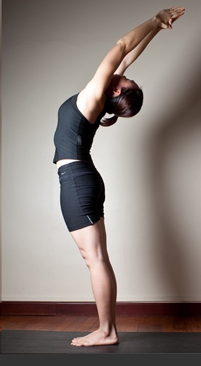

  

   
  

  

  

  

   <b class="calibre3">
    Ardha Chakrasana
   </b>
  

  

  

  

   <i class="calibre4">
    Half Wheel Pose
   </i>
  

  

   <b class="calibre3">
    Meaning
   </b>
  

  

   Ardha: Half
  

  

   Chakra: Wheel
  

  

  

  

  

  

   <b class="calibre3">
    Technique (Getting into the pose):
   </b>
  

  

   Stand in Tadasana
  

  

   Inhaling,  raise  both  arms  up,  straighten  the  elbows  and  extend  the fingers
  

  

   Exhaling,  engage  the  abs  and  gluteal  muscles  to  maintain  a  tucked  in tailbone as you lengthen and arch the spine backwards
  

  

   Maintain  steady  breathing.  Gaze  between  the  eyebrows.  Come  out  of the pose if you get dizzy
  

  

  

  

   <b class="calibre3">
    Technique (Getting out of the pose):
   </b>
  

  

   Inhaling, bring the body upright and back to centre
  

  

   Exhaling, lower both arms down by the side of the body
  

  

  

  

   <b class="calibre3">
    Tips:
   </b>
  

  

   Legs must be active to stay grounded
  

  

   Abs have to be engaged to protect the lumbar
  

  

  

  

   <b class="calibre3">
   </b>
  

  

   <b class="calibre3">
    Physical Benefits:
   </b>
  

  

   Strengthens the back and gluteal muscles
  

  

   Stretches and tones the abdominal muscles
  

  

   Stretches the abdominal organs and hence improves digestion 4.
  

  

   Expands the chest and lungs, promotes thoracic breathing
  

  

   Improves the flexibility of the spine
  

  

  

  

  

  

  

  

  

  

   
  

  

  

  

  

  

   <b class="calibre3">
    Spiritual Benefits:
   </b>
  

  

   Enhances the functions of vishuddhi chakra
  

  

  

  

   <b class="calibre3">
    Contraindications:
   </b>
  

  

   Back injury, recent abdominal surgery
  

  

  

  

   <b class="calibre3">
    Modifications:
   </b>
  

  

   Place  hands  at  the  sacrum,  fingers  pointing  downwards.  Keep  pressing  the palms firmly to  keep the  tailbone tucked in. Rol  the shoulders back, expand the  chest  and  point  the  elbows  backwards,  not  outwards.  Inhale,  slightly engage
  

  

   the
  

  

   abs
  

  

   and
  

  

   glutes,
  

  

   arch
  

  

   backwards.
  

  

  

  

   <b class="calibre3">
   </b>
  

  

   Common mistakes
  

  

   Corrections
  

  

   Tailbone is pointing backwards,
  

  

   Engage the lower abs and glutes,
  

  

   lumbar spine is compressed
  

  

   before arching back
  

  

   Head is dropping back too much
  

  

   Engage the front muscles of the
  

  

   (hyperextension at the neck)
  

  

   neck to bring the neck and head
  

  

   back to neutral position
  

  

  

  

  

  

   
  

  

  

