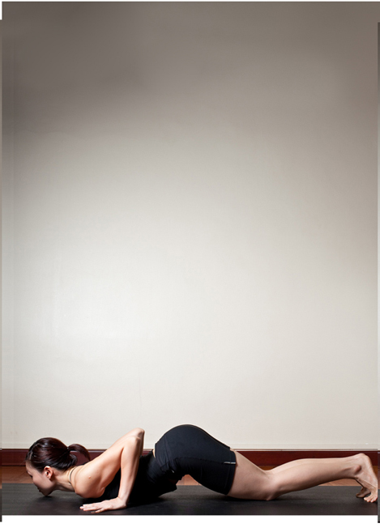

  

   
  

  

  

  

   <b class="calibre3">
    Ashtanga Namaskar
   </b>
  

  

   <b class="calibre3">
   </b>
  

  

   <b class="calibre3">
   </b>
  

  

   <b class="calibre3">
   </b>
  

  

  

  

   <b class="calibre3">
   </b>
  

  

  

  

   <b class="calibre3">
   </b>
  

  

   <b class="calibre3">
   </b>
  

  

   <b class="calibre3">
   </b>
  

  

   <b class="calibre3">
    Meaning:
   </b>
  

  

   <b class="calibre3">
   </b>
  

  

   Ashtau: 8
  

  

   <b class="calibre3">
   </b>
  

  

   Anga: Limb
  

  

   <b class="calibre3">
   </b>
  

  

   Namaskar:
  

  

   Salutation
  

  

   <b class="calibre3">
   </b>
  

  

  

  

   <b class="calibre3">
   </b>
  

  

   <b class="calibre3">
   </b>
  

  

   <b class="calibre3">
   </b>
  

  

   <b class="calibre3">
    Technique (Getting into the pose):
   </b>
  

  

   From  Santolasana  or  Plank  pose,  lean  forwards,  bringing  shoulders slightly beyond wrists
  

  

   Exhale, bring knees, chest, chin to the ground. Hug elbows close to the rib cage, keeping them stacked directly above the wrists
  

  

   Keep the hips off the ground, round the lower back. Gaze at nose tip
   <b class="calibre3">
    Tips:
   </b>
  

  

   The  art  of  going  into  this  pose  should  be  slow  and  fluid,  without  jerky movements.
  

  

   <b class="calibre3">
   </b>
  

  

   <b class="calibre3">
    Physical Benefits:
   </b>
  

  

   Tones the forearm and shoulders
  

  

   Prepares the spine for the next pose (Bhujangasana) in Surya Namaskar 3.
  

  

   Open the vessels, the heartbeat can be felt against the floor
  

  

   <b class="calibre3">
   </b>
  

  

   <b class="calibre3">
    Contraindications:
   </b>
  

  

   Wrist and neck injuries
  

  

  

  

   <b class="calibre3">
    Modifications:
   </b>
  

  

   Those  who  would  like  to  work  more  on  the  arms  can  do  a  baby  chaturanga with chest off the floor.
  

  

   <b class="calibre3">
   </b>
  

  

   <b class="calibre3">
   </b>
  

  

   <b class="calibre3">
   </b>
  

  

  

  

  

  

   
  

  

  

  

   Common mistakes
  

  

   Corrections
  

  

   Elbows open outwards
  

  

   Press the shoulder blades towards
  

  

   the hips, draw the elbows close to
  

  

   the back ribs, use the strength from
  

  

   the triceps to bring the chest down
  

  

   Hips and abdomen are resting on
  

  

   Arch the lower back, point the sit
  

  

   the ground
  

  

   bones to the ceiling. Keep the hips
  

  

   off the floor
  

  

  

  

   
  

  

  

  

  

  

  

  

  

  

  

  

  

  

  

  

  

  

  

