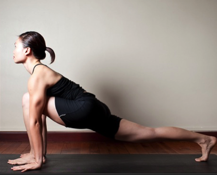

  

   
  

  

  

  

  

  

   <b class="calibre3">
    Ashwa Sanchalasana
   </b>
  

  

  

  

  

  

   <i class="calibre4">
    Horse Lunge Pose
   </i>
  

  

   <b class="calibre3">
   </b>
  

  

   <b class="calibre3">
    Meaning:
   </b>
  

  

   Ashwa: horse (worldly
  

  

   meaning); nation (divine
  

  

   meaning)
  

  

   Sanchalasana:
  

  

   movement, step cycle,
  

  

   lunge
  

  

  

  

  

  

   <b class="calibre3">
    Technique (Getting into the pose):
   </b>
  

  

   Stand in Tadasana
  

  

   Inhaling, raise both arms up with straight elbows and fingers 3.
  

  

   Exhaling,  fold  forward  from  the  hips  into  a  forward  bend.  Place  the palms next to the feet
  

  

   Inhaling, take a big step back with the right leg with the left knee bent at 90 degrees
  

  

   Keep the right leg straight, gaze in between the eyebrows
   <b class="calibre3">
    Technique (Getting out of the pose):
   </b>
  

  

   Exhaling, step the right leg forward into a standing forward bend 2.
  

  

   Inhaling, with flat back, raise the body upright
  

  

   Exhaling, lower the arms down slowly by the side of the body
   <b class="calibre3">
    Tips:
   </b>
  

  

   Make sure the front knee is not beyond the toes
  

  

   Keep the front knee joint directly above the ankle joint
  

  

   Keep the back leg straight, with the back ankle in a dorsi-flexed position (press the back heel closer to the ground)
  

  

   Keep the hips squared
  

  

   Make sure the spine is not slanted
  

  

  

  

  

  

  

  

  

  

  

  

  

  

  

  

   
  

  

  

  

   <b class="calibre3">
    Physical Benefits:
   </b>
  

  

   Stretches the hip flexors of the back leg
  

  

   Tones the hamstrings of the back leg
  

  

   Strengthens the thigh muscles of the front leg
  

  

   Stretches  gluteus  maximus  (butts)  and  erector  spinae  (lower  back)
  

  

   <b class="calibre3">
   </b>
  

  

   <b class="calibre3">
    Contraindications:
   </b>
  

  

   Knee injury
  

  

  

  

   <b class="calibre3">
    Modifications:
   </b>
  

  

   Lower the back knee on the floor.
  

  

  

  

   For cardio workout, jump and interchange the legs back and forth, keeping the abdominal muscles engaged.
  

  

  

  

  

  

   Common mistakes
  

  

   Corrections
  

  

   Front quads opens out to side of the
  

  

   Sink the hips lower. Add height for front
  

  

   body, hips are slanted, spine is
  

  

   knee to touch the chest by placing
  

  

   crooked
  

  

   fingertips on the ground, instead of
  

  

   palms. Square the hips, elongate the
  

  

   spine.
  

  

  

  

  

  

  

  

  

  

  

  

  

  

  

  

  

  

  

  

  

  

  

  

  

  

  

  

  

  

  

  

  

  

  

  

   
  

  

  

