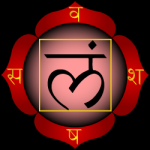
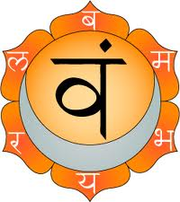
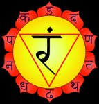
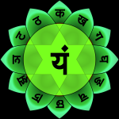
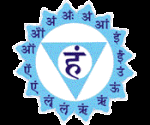
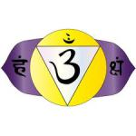
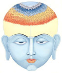

  

   <b class="calibre3">
    CHAKRAS
   </b>
  

  

   <b class="calibre3">
   </b>
  

  

   <b class="calibre3">
    Chakra
   </b>
   literally means a wheel or disc, that enables energy to flow through or around  it  at  various  speeds,  different  directions,  at  different  orbits,  with  a centre that is anchored to a fixed point.  If you real y consider the spine as the centre  of  the  human  body,  the  chakras  are  wheels  that  revolve  around  the spine with the spine being the centre of rotation.  Within the spine is a hol ow tube, the size of a very minute pin hole  which enables subtle, vital forces to travel in delicacy.  As such the Chakras came to be known as centres of subtle, vital  energy  in  the
   <b class="calibre3">
    Sushumna  nadi
   </b>
   .    Now  the  pin  hole  which  I  mentioned earlier  which  runs  along  the  spine  from  base,  coccyx,  or  muladhara  to  the Sahasrara,  the  deeper  depths  of  the  brain,  has  subtle  forces  which  travel  at very slow speeds that is hardly noticeable. The passage that the forces travel is known as Sushumna nadi.
  

  

  

  

   The  theory  of  chakras  has  hardly  been  mentioned  in  the  famous  texts  by Patanjali, Yoga Sutras, and the Bhagavad Gita although we hear more of these in the Bhagavad Gita than the Yoga Sutras. Patanjali talks about chakras briefly in the 3rd chapter while we see these mentioned randomly mentioned in the Bhagavad  Gita.    The  reason  I  think  for  these  omissions  maybe  due  to  the availability of other texts such as the Yoga Cudamani Upanishads, Shri Jabala Darshana  Upanishad,  Yoga-shikka  Upanishad  and  the  Shandilya  Upanishad which talks about the chakras in detail.
  

  

  

  

   They are storage places for energy forces or centres of consciousness.  These chakras have corresponding centres in the spinal cord and the nerve plexus in the gross physical body.   Since the physical centres have a close relationship with the astral centres, the vibrations that are produced in the physical centres by  prescribed  methods  have  the  desired  or  undesired  effects  in  the  astral centres.
  

  

  

  

   As suggested earlier, each chakra represents a state of consciousness.
   <b class="calibre3">
    It is a
   </b>
   <b class="calibre3">
    centre  of  subtle  awareness  and  has  a  specific  feeling,  tone,  bliss  or  joy  or
   </b>
   Copyrights reserved.
  

  

  

  

   
  

  

  

  

   <b class="calibre3">
    emotion.    It  is,  in  effect,  a  storage  place  for  energy  forces.
   </b>
   A  particular characteristic predominates at every chakra.
  

  

   The seven principle chakras correspond to the seven lokas (worlds or bodies), astral or mental planes. In other words, you operate at different frequencies or lokas (remember, you are not out of body, still within the body) in the same body,  depending  on  where  your  subtle  energy  is  revolving  without  you knowing or feeling anything in the physical body. And when you feel something or do something emotional y, it is at this time you are lost in the doing of the action and do not notice the energy revolving or traveling up and down within the Sushumana Nadi. While a minute fraction of this energy is used to perform tasks, we are caught up in the emotional aspect of the actions.
  

  

  

  

   The locations of the chakras and their correspondence in the physical body as described in the Upanishads very clearly.
  

  

   The Yoga-shikka Upanishad mentions the most comprehensive passages with respect to the chakras and their locations.
  

  

   <i class="calibre4">
    The human body is the abode of the Lord Siva. It represents and provides
   </i>
   <i class="calibre4">
    fulfil ment  to  al   beings  who  are  embodied  and  endowed  with  it.  The
   </i>
   <i class="calibre4">
    muladhara  chakra,  lies  between  the  anus  and  genitals,  is  triangle  in
   </i>
   <i class="calibre4">
    shape.
   </i>
  

  

  

  

  

  

  

  

  

  

  

  

  

  

   <i class="calibre4">
    Chapt 1, Verse 168
   </i>
  

  

   This verse clearly and irrevocably states that the location in between the anus and the genitals which is the perineum is in the shape of the triangle. If you delve further you wil  come to the understanding why it is a triangle shape. A triangle  forms  the  most  solid  of  al   foundations,  firmly  supported  by  three sides, dependent and leaning on each other. It gives ful  support to the human body to give fulfil ment. The triangle here is an inverted triangle.
  

  

  

  

  

  

   
  

  

  

  

  

  

   The specific energy related and located at below the base chakra, and which leads to an enlightened state is known as Shakti. When this
   <b class="calibre3">
    Shakti energy
   </b>
   is awakened, it passes from the Muladhara chakra and through al  the chakras.
  

  

   At every centre to which the yogi directs the shakti, a special form of bliss is experienced.  Siddhis, or psychic powers, and intellect is gained.
  

  

  

  

   Each chakra has a particular number of petals with a Sanskrit letter on each petal.  The vibrations that are produced at each petal by the sound energy by saying  it  which  tickles  the  Shakti  energy  is  presented  by  a  corresponding Sanskrit  letter.    Every  letter  denotes  a  mantra  of  Shakti,  existing  in  a  latent form.    These  can  be  manifested  in  the  vibrations  of  the  nadis  felt  during concentration or dharana.
  

  

   The numbers of petals of the lotuses varies:  Muladhara (4), Swadhisthana (6), Manipura (10), Anahata (12), Vishuddha (16), and Ajna (2).  All the fifty Sanskrit letters  are  on  the  fifty  petals.    The  number  of  petals  in  each  chakra  is determined by the number and position of the nadis around it.  Each chakra gives the appearance of a lotus with the nadis as its petals.  The chakras have their petals hanging downward when the Shakti is at the Muladhara Chakra.
  

  

   When it is awakened, they turn upwards i.e. they always face the side of the Shakti, to mean that there is an attraction force, like a magnet is generated.
  

  

  

  

   The chakras are revolving in the horizontal plane with reference to the spine, rotate clockwise when actions are performed that enhances the Shakti energy to rise upwards while they rotate anti-clockwise when actions performed leads to the general destruction of the body or mind and sends her to the bottom of the pit. Although in most people, they remain dormant until the body is being threatened, that she wil  awaken to release a smal  amount of potent energy Copyrights reserved.
  

  

  

  

   
  

  

   
  

  

   
  

  

   
  

  

  

  

   for  protection  and  survival,  al   practitioners  are  encouraged  to  activate  this latent force that could help us realize ourselves, maximize our potential, make us achieve our goals and enhance our lives to its maximum capacity and others as wel  along the way.
  

  

   <b class="calibre3">
   </b>
  

  

   <b class="calibre3">
    MULADHARA CHAKRA
   </b>
  

  

   <b class="calibre3">
   </b>
  

  

   Muladhara (root foundation), at the base of the spine (2nd bone  of  the  coccyx),  has  a  square  yel ow  mandala, representing the
   <b class="calibre3">
    Earth
   </b>
   principle, with the bija Mantra
   <b class="calibre3">
    Lam
   </b>
   .
  

  

   The sound vibrations of the four crimson-coloured petals, vam,  bam,  sham,  and  sam,  are  read  clockwise  from  the upper right-hand petal.
  

  

  

  

  

  

   <b class="calibre3">
    SWADHISHTHANA CHAKRA
   </b>
  

  

   <b class="calibre3">
   </b>
  

  

   Swadhishthana (abode of the self), in the genital area (4th bone  of  the  sacrum),  controls  the  lower  abdomen  in  the physical  body.    Its  element,
   <b class="calibre3">
    Water
   </b>
   ,  in  a  white  crescent moon,  has
   <b class="calibre3">
    Vam
   </b>
   as  its  bija.    The  six  vermil ion  petals  are represented by bam, bham, mam, yam, ram and lam.
  

  

  

  

  

  

   <b class="calibre3">
    MANIPURA CHAKRA
   </b>
  

  

   <b class="calibre3">
   </b>
  

  

   Manipura  (jewel  city),  at  the  navel,  corresponds  to  the solar plexus (4th lumbar spine).  The red triangular mandala in  its  centre  contains  the  element
   <b class="calibre3">
    Fire
   </b>
   ,  with  bija  Mantra
   <b class="calibre3">
    Ram
   </b>
   .    The  ten  petals,  dark  purple  like  heavy  rain  clouds, contain  dam,  dham,  nam,  tam,  tham,  dam,  dham,  nam, pam and pham.
  

  

  

  

  

  

  

  

   
  

  

   
  

  

   
  

  

   
  

  

  

  

  

  

   <b class="calibre3">
    ANAHATA CHAKRA
   </b>
  

  

   <b class="calibre3">
   </b>
  

  

   In  the  heart  region  (9th  bone  at  the  thoracic),  Anahata’s (unstruck) element,
   <b class="calibre3">
    Air
   </b>
   , is in a smoke-coloured mandala.
  

  

   The six-pointed star has
   <b class="calibre3">
    Yam
   </b>
   as its bija.  The twelve deep red  petals  contain  kam,  kham,  gam,  gham,  nam,  cam, cham, jam, jham, nam, tam and tham.
  

  

  

  

   <b class="calibre3">
    VISHUDDHA CHAKRA
   </b>
  

  

   <b class="calibre3">
   </b>
  

  

   Vishuddha (purity), at the base of the throat (4th bone of the cervical), corresponds to the laryngeal plexus in the physical body, as well as the fifth cosmic plane.  Within a pure blue circle is its element, Ether, with the bija
   <b class="calibre3">
    Ham
   </b>
   .  The sixteen smokey purple petals contain the Sanskrit vowels:  am, am, im, im, um, rm, rm, im, im, em, aim, om, aum, am, ahm.
  

  

   <b class="calibre3">
   </b>
  

  

   <b class="calibre3">
    AJNA CHAKRA
   </b>
  

  

   <b class="calibre3">
   </b>
  

  

   Between the eyebrows (pituitary gland), Ajna (unaffected), the  seat  of  the  mind,  has
   <b class="calibre3">
    OM
   </b>
   as  its  seed  letter  in  a  pure white circle.  On each side are two petals, also pure white, their vibrations represented by the Sanskrit letters ham and ksham.
  

  

   The  element  is  Avyakta,  the  primordial  cloud  of
  

  

   undifferentiated energy and matter; Meditation on Ajna destroys the karma of past lives, and gives liberation and intuitional knowledge.  It is here that yogis consciously put prana at the time of death.
  

  

  

  

  

  

  

  

  

  

  

  

  

  

   
  

  

   
  

  

  

  

   <b class="calibre3">
    SAHASRARA CHAKRA
   </b>
  

  

   <b class="calibre3">
   </b>
  

  

   Sahasrara,  above  and  beyond  the  other  six  centres,  is situated  at  the  crown  of  the  head,  corresponding  to  the pineal  gland  of  the  physical  body.    Its  thousand  petals,  on which are repeated the fifty letters of the Sanskrit alphabet, is the abode of Siva.  When Shakti is united with Siva at the Sahasrara,  the  yogi  experiences  extreme  bliss,  attains  the superconscious state, the highest knowledge turns to intel ect and intel igence, and becomes a ful y developed jnani.
  

  

  

  

  

  

  

  

  

  

  

  

  

  

  

  

  

  

  

  

  

  

  

  

  

  

  

  

  

  

  

  

  

  

  

  

  

  

  

  

   
  

  

  

