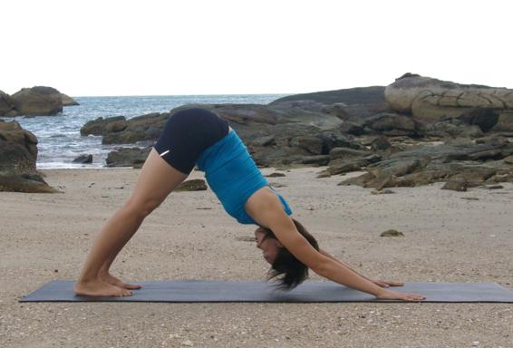

  

   
  

  

  

  

  

  

   <b class="calibre3">
    Adhomukha Shvanasana
   </b>
  

  

  

  

  

  

   <i class="calibre4">
    Downward facing
   </i>
  

  

   <i class="calibre4">
    dog pose
   </i>
  

  

   <b class="calibre3">
    Meaning:
   </b>
  

  

   Adho: down
  

  

   Mukha: face
  

  

   Swana: dog
  

  

  

  

  

  

  

  

  

  

  

  

   <b class="calibre3">
    Story:
   </b>
  

  

  

  

   The shape of this pose resembles a dog stretching its spine and legs.
  

  

  

  

   It  was  only  in  recent  times  that  the  Brahmins  of  India  classified  the  dog  as unclean. But in actual fact, the dog had a prominent place throughout Indian history in various forms.
  

  

  

  

   In  parts  of  India  especial y  eastern  states  like  Orissa,  the  supreme  spirit  is represented by Bhairava, a form of Shiva, who either takes on the form of a dog  or  more  commonly  has  dog  companions  or  vehicles  (vahanas).  These deities  appear  in  Nepalese  Buddhism  as  Yamantaka,  a  wrathful  spirit  who conquers the forces of death.
  

  

  

  

   Interestingly in Vedic literature, many deities have dog companions. Indra has his companion and messenger, the faithful dog cal ed Sarama. She gives birth to  two  sons,  the  Sarameyas,  who  in  turn  become  the  companions  and messengers of Yama, the lord of death.
  

  

  

  

   One  of  the  most  memorable  dog  stories  from  Indian  literature  involves  the heroic  Pandava  brothers  of  the  Mahabharata.  When  King  Dharmaraja,  his brothers and al  their families set off on their final journey up the Himalayas, 57
  

  

   
  

  

  

  

   each  one  fell  until  the  only  ones  left  were  King  Dharmaraja  and  his  dog companion.
  

  

  

  

   As they neared the top of the mountain, they were greeted by god Indra in his chariot.  The  God  lauded  Dharmaraja  and  said  that  he  had  earned  a  place  in heaven.  He  asked  the  king  to  board  the  chariot  and  as  he  did,  Dharmaraja cal ed for his dog. However, Indra protested saying that dogs were not al owed in his heaven.
  

  

  

  

   Upon hearing this, Dharmaraja said that he could not abandon such a faithful companion who depended on him. He declared he would rather stay on earth than abandon his dog. Final y, Indra relented and both were taken to heaven.
  

  

   Upon  arriving,  the  dog  transformed  into  the  god  Dharma,  the  lord  of  the correct way of living.
  

  

  

  

  

  

   <b class="calibre3">
    Technique (Getting into the pose):
   </b>
  

  

   Come onto your hands and knees
  

  

   Tuck the toes under; feet can be separated to hip-width apart 4.
  

  

   Exhaling, raise the hips up to the ceiling, straighten the arms and legs 5.
  

  

   Keep the back and legs straight
  

  

   Keep  the  head  down,  with  neck  and  spine  in  a  straight  line.  Gaze towards the navel
  

  

   If possible, press the heels down onto the floor
  

  

  

  

   <b class="calibre3">
    Technique (Getting out of the pose):
   </b>
  

  

   Inhaling,  lower  the  knees  and  forehead  down  to  the  floor.  Relax  the arms by the side of the thighs
  

  

  

  

   <b class="calibre3">
    Tips:
   </b>
  

  

   Keep the weight evenly distributed across hands and feet
  

  

   Make sure hands are firmly grounded
  

  

   Using  the  diaphragm,  stretch  the  abdomen  towards  the  ribs  while bringing the chest down towards the ground
  

  

   Focus on the power of the thighs to hold this asana steady
  

  

   <b class="calibre3">
   </b>
  

  

   <b class="calibre3">
    Physical Benefits:
   </b>
  

  

   Stretches the gluteal muscles, hamstrings, calves and Achil es tendon 2.
  

  

   Tones the abdominal muscles
  

  

   Strengthens the arms and shoulders
  

  

  

  

   
  

  

  

  

   Strengthens the quadriceps and anterior tibialis
  

  

   Increase flexibility in the ankles
  

  

  

  

   <b class="calibre3">
    Therapeutic Benefits:
   </b>
  

  

   Eradicates stiffness in the shoulder blades, helps in relieving arthritis of the shoulder joints
  

  

   Removes fatigue and brings energy back to the body
  

  

   Rejuvenates the brain cel s and invigorates the brain
  

  

   Improves the functions of the digestive organs
  

  

  

  

   <b class="calibre3">
    Contraindications:
   </b>
  

  

   Sciatica, lower back problems, Carpal tunnel syndrome
  

  

  

  

   <b class="calibre3">
    Modifications:
   </b>
  

  

   Beginners can start with bent or straight knees with heels lifted off the ground Common mistakes
  

  

   Corrections
  

  

   Shrugging shoulders, cramping the
  

  

   Press the shoulder blades down and
  

  

   neck
  

  

   imagine creating space for the neck,
  

  

   enhancing stability
  

  

   Lower back (lumbar spine) is
  

  

   Lift the tail bone (coccyx) pointing up
  

  

   rounded
  

  

   to the ceiling to flex the hips more.
  

  

   Suck the bel y in to create this effect.
  

  

   Middle back (thoracic spine) is
  

  

   Imagine bringing the shoulder blades
  

  

   rounded
  

  

   closer together, push the chest closer
  

  

   towards the legs. Engage the
  

  

   rhomboid muscles (deep muscles in
  

  

   the middle back)
  

  

   Knees are bent
  

  

   Engage the quadriceps and anterior
  

  

   tibialis to actively lift the knee caps
  

  

   up
  

  

   When heels are on the ground, back  Raise the heels slightly off the becomes rounded
  

  

   ground. Give priority to having a
  

  

   straight spine
  

  

   Toes are pointing inwards or
  

  

   Maintain good alignment by pointing
  

  

   outwards
  

  

   the knees and toes forward
  

  

  

  

   
  

  

  

