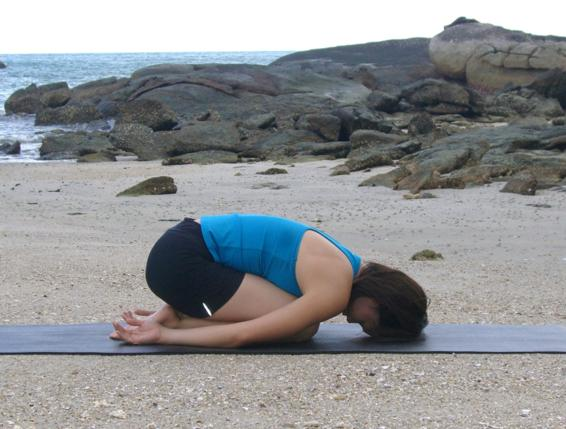

  

   
  

  

  

  

   <b class="calibre3">
    Balasana
   </b>
  

  

  

  

   <b class="calibre3">
   </b>
  

  

  

  

  

  

  

  

   <i class="calibre4">
    Child’s pose
   </i>
  

  

  

  

   <b class="calibre3">
    Meaning:
   </b>
  

  

  

  

   Bala: child
  

  

  

  

   This is a resting pose
  

  

  

  

   or counter pose for
  

  

  

  

   any prone
  

  

   backbends
  

  

  

  

  

  

  

  

  

  

  

  

  

  

   Story:
  

  

   A long time ago when the world was very young, a smal  child lay on a banyan leaf  and  wondered  as  most  of  us  keep  doing,  what  his  purpose  in  life  was  -
  

  

   “Who am I? Who created me? Why? What have I to perform?”
  

  

   True,  the  baby  was  rather  young  for  thoughts  so  profound  but  that  was because the baby was none other than Lord Vishnu Himself. Lord Vishnu was then reminded of his al -pervading powers, foremost of which was purity.
  

  

   His  duty  was  to  preserve,  to  bring  back  purity  into  the  world  as  it  was threatened. During the first 6 to 8 months of a baby’s growth, it wil  start to crawl and the moment he is able to rest his forehead on the floor, rich blood supply wil  be sent to the brain. This also enhances the learning, modeling and memory
  

  

   power
  

  

   of
  

  

   the
  

  

   child.
  

  

   <b class="calibre3">
   </b>
  

  

   <b class="calibre3">
    Technique (Getting into the pose):
   </b>
  

  

   Come onto your hands and knees, toes pointing away from the body 2.
  

  

   Exhaling,  extend  the  arms,  lengthen  the  spine  and  press  the  sit  bones onto the heels
  

  

   Separate the knees about hip width aparts, big toes touching each other 4.
  

  

   Rest on the forehead
  

  

  

  

   
  

  

  

  

   Bring the arms beside the thighs, palms facing up
  

  

   Release the fronts of the shoulders toward the floor. Feel the widening of the shoulder blades across the back
  

  

  

  

   <b class="calibre3">
    Technique (Getting out of the pose):
   </b>
  

  

   Stretch the arms forward, palms on the floor
  

  

   Inhaling, lift the hips away from the heels onto your hands and knees 3.
  

  

   Exhaling,  slowly  lower  the  body  down  to  the  floor  floor  to  a  prone position
  

  

   <b class="calibre3">
   </b>
  

  

   <b class="calibre3">
    Physical Benefits:
   </b>
  

  

   Gently stretches the back muscles
  

  

   Relieves tension in the spine
  

  

   Gently stretches the hips, gluteal muscles and ankles
  

  

   Calms the brain and helps relive stress and fatigue
  

  

  

  

   <b class="calibre3">
    Contraindications:
   </b>
  

  

   Pregnancy, knee and ankle injuries, slipped disc
  

  

   <b class="calibre3">
   </b>
  

  

   <b class="calibre3">
    Modifications:
   </b>
  

  

   If there is difficulty sitting on the heels, place a thickly folded blanket between hamstrings and calves
  

  

  

  

   If there is difficulty grounding tops of feet, place blanket under tops of feet If there is difficulty in placing the forehead onto the floor, rest forehead on a bolster or folded blanket.
  

  

  

  

   To go deeper into this pose and increase the length of the torso, stretch your arms forward. Lift the buttocks slightly away from the heels. Reach the arms forwards  while  drawing  the  shoulder  blades  down  the  back.  Then  without moving the hands, sit the buttocks down on the heels again.
  

  

  

  

   Common mistakes
  

  

   Corrections
  

  

   Buttocks not sitting on heels
  

  

   Push through the arms and sit
  

  

   deeper on the heels. Otherwise, use
  

  

   a blanket between hamstrings and
  

  

   calves
  

  

  

  

   
  

  

  

