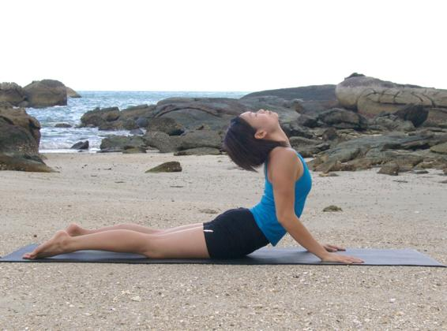

  

   
  

  

  

  

  

  

   <b class="calibre3">
    Bhujangasana
   </b>
  

  

  

  

  

  

  

  

   <i class="calibre4">
    Cobra pose
   </i>
  

  

   <b class="calibre3">
    Meaning:
   </b>
  

  

   Bhujanga: cobra
  

  

  

  

  

  

  

  

   <b class="calibre3">
    Story:
   </b>
  

  

  

  

   <i class="calibre4">
    “By  the  practice  of  this  posture  the  serpent-goddess  (the  Kundalini  force)
   </i>
   <i class="calibre4">
    awakes.”
   </i>
  

  

   Gheranda Samhita
  

  

  

  

   In  the  story  of  Adam  and  Eve,  the  serpent  possessed  the  knowledge  of discrimination  between  good  and  evil.  This  pose  promotes  our  capacity  for discrimination as we evolve to a higher level of consciousness.
  

  

  

  

   <b class="calibre3">
    From “Lord Siva and His Worship” by Swami Sivananda
   </b>
  

  

   <b class="calibre3">
   </b>
  

  

   “The Serpent in the Jiva or Individual soul rests upon Siva, the Paramatman or the Supreme Spirit. The five hoods mean the five senses or the five Tattvas, viz, earth, water, fire, air and ether. They also represent the five Pranas, which hiss in the body like the serpent. The inhalation and exhalation are like the hissing of the serpent. Lord Shiva Himself became the five Tanmantras, the five Jnana Indriyas, the five Karmendriyas and other groups of five. The individual spirit enjoys the worldly object through these Tattvas. When the individual attains knowledge through control of the senses and mind, he finds his eternal resting abode in Lord Shiva, the Supreme Spirit. This is the esoteric significance of Lord Shiva wearing the snake on His body.”
  

  

  

  

  

  

   
  

  

  

  

   <b class="calibre3">
    Patanjali
   </b>
  

  

   <b class="calibre3">
   </b>
  

  

   The  story  is  that  the  great  serpent  Ananta  (or  Adishesha),  the  bed  of  Lord Vishnu the Preserver, wished to descend to Earth to teach Yoga to humans. At the  same  time  there  was  a  woman  named  Gonika  who  was  praying  to  Lord Shiva for a son to be born while standing in the river. Gonika was virtuous and a woman of good character. As she prayed, Lord Shiva was happy, and Ananta fel   into  the  river  sand  into  her  hands.  Minute  in  size,  in  half-human,  half-serpent form, Ananta announced himself as her son.  She named him Patanjali, which means “that which fal s into praying hands” (pata=fal en, anjali=praying hands).
  

  

   <b class="calibre3">
   </b>
  

  

   <b class="calibre3">
    Technique (Getting into the pose):
   </b>
  

  

   Lie on the bel y, feet together, arms by the side of the body, forehead on the floor
  

  

   Bring the hands below the shoulders, palms down, elbows close to the ribs, pointing up
  

  

   Inhale, brush the nose and chin against the floor and slide the head and chest forward and up, using the midback muscles
  

  

   Extend the elbows, use the arms as an aid to stretch the spine further, pushing the ribs and lower abdomen up
  

  

   Gaze in between the eyebrows
  

  

  

  

   <b class="calibre3">
    Technique (Getting out of the pose):
   </b>
  

  

   Exhale, slowly lower down the body sequential y: lower abdomen, ribs, chest, chin, nose and forehead
  

  

   Bring the arms by the side of the body
  

  

  

  

   <b class="calibre3">
    Tips:
   </b>
  

  

   Avoid  compressing  the  vertebrae,  think  about  lengthening  the  entire spine  by  pushing  the  chest  forward  to  create  space  between  the vertebral discs
  

  

  

  

   <b class="calibre3">
    Physical Benefits:
   </b>
  

  

   Strengthens abdominal and back muscles
  

  

   Massages abdomen
  

  

   Helps venous blood flow back to the heart, relieve tiredness in the legs
  

  

   <b class="calibre3">
   </b>
  

  

   <b class="calibre3">
   </b>
  

  

   <b class="calibre3">
   </b>
  

  

  

  

   
  

  

  

  

   <b class="calibre3">
    Therapeutic Benefits:
   </b>
  

  

   Through regular practice, helps realign slipped spinal discs for those with light displacement
  

  

   Relieves sciatica pain
  

  

   Relieves backache
  

  

   Improves  flexibility  of  the  spinal  cord  for  better  functioning  of  the nervous system
  

  

   Releases gas trapped in the upper digestive tract
  

  

   Massages ovaries and uterus, al eviates menstrual disorders 7.
  

  

   Stimulates appetite
  

  

   Relieves constipation
  

  

   Regulates adrenal and thyroid glands
  

  

  

  

   <b class="calibre3">
    Spiritual Benefits:
   </b>
  

  

   Enhances the swadhisthana, manipura, anahata and vishuddhi chakras
   <b class="calibre3">
    Contraindications:
   </b>
  

  

   Abdominal complications like peptic ulcer, hernia and intestinal tuberculosis
   <b class="calibre3">
    Modifications:
   </b>
  

  

   Those with stiffer back can start with elbows on the floor instead of palms. This wil  al ow a more gentle stretch on the spine.
  

  

   Common mistakes
  

  

   Corrections
  

  

   Shoulders are shrugged up and rol ing  Engage the scapular stabilizing forward
  

  

   muscles to lower the shoulders away
  

  

   from the ears and rol  the shoulders
  

  

   back
  

  

   Legs are separated
  

  

   Keep the legs together by engaging
  

  

   the adductors (inner thigh muscles)
  

  

   and gluteals
  

  

   Feet is lifted up
  

  

   Keep the feet on the floor by ‘tucking
  

  

   in the tail bone’
  

  

   Whole pelvic region is lifted up
  

  

   Keep the pelvis on the floor, if pain is
  

  

   experienced in the lower back, bend
  

  

   the elbows more and lower the chest
  

  

   slightly
  

  

  

  

   
  

  

  

