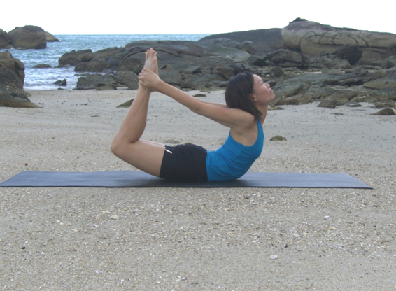

  

   
  

  

  

  

   <b class="calibre3">
    Dhanurasana
   </b>
  

  

  

  

   <b class="calibre3">
   </b>
  

  

  

  

  

  

   <i class="calibre4">
    Bow Pose
   </i>
  

  

  

  

   <b class="calibre3">
   </b>
  

  

  

  

   <b class="calibre3">
    Meaning:
   </b>
  

  

   Dhanu- means bow
  

  

  

  

   and the bow represents
  

  

  

  

   the mystical symbol of
  

  

  

  

   AUM, the arrow the
  

  

   mind and the target is
  

  

  

  

   the Inner Higher Self
  

  

  

  

   (Brahman).
  

  

  

  

  

  

  

  

  

  

  

  

   <b class="calibre3">
    Story:
   </b>
  

  

  

  

   Focused attention leads to action. In the Bhagavad Gita this  is highlighted in the  conversation  between  Arjuna  and  Krishna,  where  Arjuna  wavers  as  he fights his own kinsmen:
  

  

  

  

   On the battlefield, Arjuna, overcome with great compassion, said: “O Krishna, seeing  my  kinsmen  standing  with  a  desire  to  fight,  my  limbs  fail  me  and  my mouth becomes dry. My body shivers and my hairs stand on end.
  

  

  

  

   <b class="calibre3">
    The  bow,  Gaandeeva
   </b>
   ,  slips  from  my  hand  and  my  skin  intensely  burns.  My head turns, I am unable to stand steady and, O Krishna, I see bad omens. I see no use kil ing my kinsmen in battle.
  

  

  

  

   I desire neither victory nor pleasure nor kingdom, O Krishna. What is the use of the kingdom, or enjoyment, or even life, O Krishna?” (1.32) Later, Krishna explains to Arjuna that his friends and relatives are actually his own  negative  personality  traits  and  thoughts  that  need  to  be  destroyed  in order to progress spiritual y.
  

  

  

  

  

  

   
  

  

  

  

   <b class="calibre3">
    Technique (Getting into the pose):
   </b>
  

  

   Lie on the bel y, feet together, arms by the side of the body, forehead on the floor
  

  

   Exhale, bend both knees and bring the heels close to the sit bones 3.
  

  

   Hold on to the respective ankles gripping tightly
  

  

   Inhale, lift the fore head, chest, chin and thighs away from the floor 5.
  

  

   Straighten  both  elbows  and  peel  the  body  away  from  the  floor  by engaging  the  buttocks  and  back  muscles.  Tuck  the  tailbone  under.  Lift the chest up
  

  

   Gaze upward in between your eyebrows
  

  

   Normal thoracic breathing should be maintained al  the times. Breathe more into the back of your torso, and be sure not to stop breathing
   <b class="calibre3">
    Technique (Getting out of the pose):
   </b>
  

  

   Exhale, slowly release the pose by bringing the chest, head and forehead down on the floor
  

  

   Straighten the knees and bring the arms by the side of the body.
  

  

   Rest in Makarasana
  

  

  

  

   <b class="calibre3">
    Tips:
   </b>
  

  

   Squeeze  the  shoulder  blades  towards  each  other  to  have  the  chest opened to the maximum while holding the pose
  

  

   Engage the triceps brachii and the deltoids to have optimal lift from the floor
  

  

   Engage the gluteus to stabilize the hip and protect the lumbar spine 4.
  

  

   Engage the hamstrings to enable the legs to lift
  

  

   Lift the head and pul  it up towards the back as far as possible
  

  

   <b class="calibre3">
   </b>
  

  

   <b class="calibre3">
    Physical Benefits:
   </b>
  

  

   Tones the muscles of the back, arms, shoulders and thighs.
  

  

   Removes stiffness in the shoulder joints
  

  

   Expands the front of the body, ankles, thighs and groins, abdomen and chest, and throat, and deep hip flexors (psoas muscle)
  

  

   Corrects kyphosis (hunch back) and rounded shoulders
  

  

   Stimulates  the  organs  of  the  abdomen  and  improves  digestion  by stimulating gastric secretions and relieves congestion of the blood in the abdominal viscera
  

  

   Reduces fat around the abdomen.
  

  

  

  

   
  

  

  

  

   Tones and massages the liver, pancreas, kidneys and adrenal glands 9.
  

  

   Improves hyperextension of the thoracic spine. Eliminates gas from the stomach and intestines, relieve flatulence
  

  

  

  

   This asana helps one connect with the breath
  

  

   Increased prana is brought to the neck and shoulder areas 3.
  

  

   Helps  to  enhance  the  visuddha  chakra,  thus  improving  speech  and intuition
  

  

   Helps to improve the manipura chakra, thus enhancing self-esteem 5.
  

  

   Brings prana to the anahata charkra
  

  

   <b class="calibre3">
   </b>
  

  

   <b class="calibre3">
    Contraindications:
   </b>
  

  

   Recent abdominal surgery, digestive diseases like peptic ulcer 2.
  

  

   Weak heart
  

  

   Shoulder or rotator cuff injuries
  

  

   Cervical spine injury
  

  

   Serious lower-back injury
  

  

   High blood pressure (can perform but should not hold for too long) This asana should not be practiced before sleep at night as it stimulates  the adrenal glands and the sympathetic nervous system
  

  

   <b class="calibre3">
   </b>
  

  

   <b class="calibre3">
    Modifications:
   </b>
  

  

   For those who are not able to hold the ankles directly, wrap a strap or towel around the fronts of the ankles and hold the free ends of the strap, keeping the arms ful y extended
  

  

  

  

   This pose can also be done one side at a time
  

  

   <b class="calibre3">
   </b>
  

  

   <b class="calibre3">
   </b>
  

  

   <b class="calibre3">
   </b>
  

  

   <b class="calibre3">
   </b>
  

  

  

  

   
  

  

   Common mistakes
  

  

   Corrections
  

  

   Not lifting the chest
  

  

   Inhale and squeeze the shoulder
  

  

   blades together
  

  

   Holding of breath
  

  

   Keep breathing at the thoracic
  

  

   region
  

  

   Not lifting the head
  

  

   Engage the trapezius and neck
  

  

   muscles to open the front of the
  

  

   neck
  

  

   Flexing the elbows
  

  

   Engage the triceps brachii to
  

  

   straighten and hold the ankles and
  

  

   pull it upwards
  

  

   Imbalance
  

  

   Squeeze the gluteal muscles and rest
  

  

   comfortably on the pelvis
  

  

   Not lifting the legs
  

  

   Imagine straightening legs and
  

  

   squeeze the inner thighs to enable
  

  

   the lift of the legs
  

  

   <b class="calibre3">
   </b>
  

  

   <b class="calibre3">
   </b>
  

  

   <b class="calibre3">
   </b>
  

  

   <b class="calibre3">
   </b>
  

  

   <b class="calibre3">
   </b>
  

  

   <b class="calibre3">
   </b>
  

  

   <b class="calibre3">
   </b>
  

  

   <b class="calibre3">
   </b>
  

  

   <b class="calibre3">
   </b>
  

  

   <b class="calibre3">
   </b>
  

  

  

  

  

  

  

  

   <b class="calibre3">
   </b>
  

  

  

  

   
  

  

  

