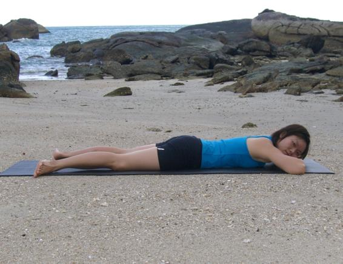

  

   
  

  

  

  

  

  

   <b class="calibre3">
    Makarasana
   </b>
  

  

   <b class="calibre3">
   </b>
  

  

  

  

  

  

  

  

   <i class="calibre4">
    Crocodile pose
   </i>
  

  

  

  

   <b class="calibre3">
   </b>
  

  

  

  

   <b class="calibre3">
    Meaning:
   </b>
  

  

   Makara: crocodile
  

  

  

  

  

  

  

  

  

  

  

  

  

  

  

  

  

  

   <b class="calibre3">
    Story:
   </b>
  

  

  

  

   About 2500 years ago in Pooja, lived a childless couple, Sivaguru, and his wife, Aryambal. They spent their lives giving alms to those in need. They prayed for a child  and  Lord  Shiva,  moved  by  their  devotion,  appeared  before  them.  Lord Shiva  offered  them  a  choice  between  any  number  of  children  or  just  one exceptionally intelligent son who will live a short life. The couple decided to let the Lord make the choice for them.
  

  

  

  

   Soon  after,  a  child  was  born  and  was  named  Shankara.  He  was  no  ordinary child. He wanted to renounce the world and become a Sanyasi (a renounced person) but his mother objected.
  

  

  

  

   One day when Shankara was taking a bath in the river, he was attacked by a crocodile. Shankara cried for his mother but she did not know how to save him.
  

  

  

  

   Sankara told his mother that his life was nearing to an end, but if he decided to become  a  Sanyasi,  he  could  start  a  new  life.  It  was  then  he  obtained permission from his mother to become a Sanyasi. Immediately, the
   <b class="calibre3">
    crocodile
   </b>
   released its grip on Shankara.
  

  

  

  

  

  

  

  

  

  

   
  

  

  

  

   <b class="calibre3">
    Technique (Getting into the pose):
   </b>
  

  

   Lie on the bel y, feet together, toes pointing away from body, arms by the side, forehead on the floor
  

  

   Bring  the  legs  slightly  wider  than  hip-width  apart,  heels  pointing outwards, toes inwards
  

  

   Cross the arms and place both palms, one on top of the other 4.
  

  

   Rest the forehead on the stacked palms
  

  

   Breath normally
  

  

  

  

   <b class="calibre3">
    Physical Benefits:
   </b>
  

  

   Slows down the heart-rate and breath
  

  

   Relaxes al  parts of the body
  

  

   Induces relaxation of the mind and normalizes breathing
  

  

  

  

   <b class="calibre3">
    Spiritual Benefits:
   </b>
  

  

   Helps to connect our breath and soul
  

  

   Helps to activate the earth element in our body
  

  

   <b class="calibre3">
   </b>
  

  

   <b class="calibre3">
    Contraindication:
   </b>
  

  

   Those having heart problems, obesity, gas or high blood pressure should not practice this too long
  

  

   Do not breath heavily in this asana as it wil  compress the abdomen too much
  

  

   <b class="calibre3">
   </b>
  

  

   <b class="calibre3">
    Modifications:
   </b>
  

  

   The head can be turned either to the left or right, placing one cheek on the back of the hand
  

  

   <b class="calibre3">
   </b>
  

  

   <b class="calibre3">
   </b>
  

  

   <b class="calibre3">
   </b>
  

  

   <b class="calibre3">
   </b>
  

  

   <b class="calibre3">
   </b>
  

  

   <b class="calibre3">
   </b>
  

  

   <b class="calibre3">
   </b>
  

  

  

  

   
  

