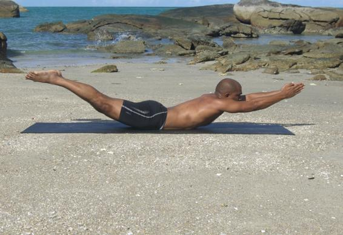

  

   
  

  

  

  

   <b class="calibre3">
    Naukasana
   </b>
  

  

  

  

   <b class="calibre3">
   </b>
  

  

   <b class="calibre3">
   </b>
  

  

   <i class="calibre4">
    Boat pose
   </i>
  

  

   <b class="calibre3">
   </b>
  

  

   <b class="calibre3">
   </b>
  

  

   <b class="calibre3">
   </b>
  

  

   <b class="calibre3">
    Meaning:
   </b>
  

  

   Nauka: boat hull
  

  

   <b class="calibre3">
   </b>
  

  

  

  

   <b class="calibre3">
   </b>
  

  

   <b class="calibre3">
   </b>
  

  

   <b class="calibre3">
   </b>
  

  

   <b class="calibre3">
   </b>
  

  

   <b class="calibre3">
   </b>
  

  

   <b class="calibre3">
   </b>
  

  

   <b class="calibre3">
    Technique (Getting into the pose):
   </b>
  

  

   Lie on the bel y, feet together, arms by the side of the body, forehead on the floor
  

  

   Stretch the arms forward, palms together
  

  

   Inhaling, raise the chest and thighs off the floor simultaneously
   <b class="calibre3">
    Technique (Getting out of the pose):
   </b>
  

  

   Exhaling, lower down the chest and thighs and place the arms by side of the body
  

  

  

  

   <b class="calibre3">
    Tips:
   </b>
  

  

   <b class="calibre3">
    Physical Benefits:
   </b>
  

  

   Strengthens the entire back
  

  

   Tones the gluteal muscles and hamstrings
  

  

   Increases the flexibility of the spine
  

  

   Stretches the quadriceps and abdominal muscles
  

  

   <b class="calibre3">
   </b>
  

  

   <b class="calibre3">
   </b>
  

  

   <b class="calibre3">
   </b>
  

  

   <b class="calibre3">
   </b>
  

  

   <b class="calibre3">
   </b>
  

  

  

  

   
  

  

  

  

   <b class="calibre3">
    Therapeutic Benefits:
   </b>
  

  

   Relieves nerve strains like sciatica
  

  

   Benefits people suffering from slipped discs*
  

  

   Tones the bladder and prostate gland
  

  

  

  

   *only  recommended  for  those  in  recovery.  Individuals  at  initial  stages  of slipped  discs  should  seek  professional  medical  advice  before  attending  yoga class.
  

  

  

  

  

  

   <b class="calibre3">
    Contraindications:
   </b>
  

  

   Abdominal complications
  

  

  

  

   <b class="calibre3">
    Modifications:
   </b>
  

  

   Arms can be by the side of the body instead of forwards.
  

  

   Common mistakes
  

  

   Corrections
  

  

   Legs are separated
  

  

   Engage the inner thighs (adductors)
  

  

   to bring the knees together
  

  

  

  

  

  

  

  

  

  

  

  

  

  

  

  

  

  

  

  

  

  

   
  

