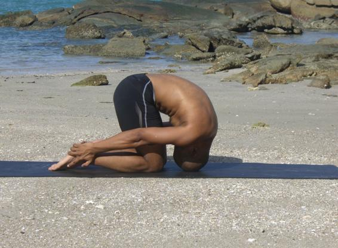

  

   
  

  

  

  

   <b class="calibre3">
    SasanGasana
   </b>
  

  

  

  

   <b class="calibre3">
   </b>
  

  

  

  

   <i class="calibre4">
    Rabbit Pose
   </i>
  

  

  

  

   <b class="calibre3">
   </b>
  

  

  

  

   <b class="calibre3">
    Meaning:
   </b>
  

  

  

  

   Sasanga means
  

  

   rabbit or hare. The
  

  

  

  

   final position looks
  

  

  

  

   like a bounding
  

  

  

  

   hare.
  

  

  

  

  

  

  

  

  

  

  

  

  

  

   <b class="calibre3">
    Story:
   </b>
  

  

  

  

   The Story of The Foolish Lion and the clever rabbit
  

  

  

  

   Once upon a time, there lived a ferocious and greedy lion which kil ed animals indiscriminately. Seeing this, the animals of the forest came up with a plan to sacrifice  one  animal  of  each  species  a  day  to  the  lion.  When  it  came  to  the rabbits' turn, they chose a very wise and old rabbit. It took its own sweet time to meet the Lion. The Lion was getting impatient and swore to kil  al  animals the next day.
  

  

  

  

   The rabbit came to the Lion before sunset. The Lion was angry but the wise old rabbit remained calm and slowly told the Lion that it was not his fault. He told the Lion that a group of rabbits were supposed to come to him for the day. But on the way, another angry Lion attacked them and ate all the rabbits except himself. He said the other Lion was chal enging the supremacy of his Lordship.
  

  

   The Lion was natural y very enraged and asked to be taken to the location of the other Lion.
  

  

  

  

   The wise rabbit agreed and led the Lion towards a deep wel  fil ed with water.
  

  

   Then he showed the Lion his reflection in the water of the wel . The Lion was furious and started growling and natural y the  “other Lion” also displayed its anger. Then the Lion jumped into the wel  and so lost its life. This was how the wise rabbit saved the forest and its inhabitants from the proud Lion.
  

  

  

  

  

  

   
  

  

  

  

   This story tel s us that intel igence is far superior to brute force. This pose enhances our intelligence by sending fresh blood to the brain and prana from the Mooladhara to the Ajna chakra.
  

  

   <b class="calibre3">
    Technique (Getting into the pose):
   </b>
  

  

   Sit on your heels
  

  

   Rest the sit bones in between the inner edges of the heels 3.
  

  

   Keep the knees and thighs close together, hip width apart 4.
  

  

   The soles of the feet should face upwards
  

  

   Inhale deeply lift the arms overhead
  

  

   Exhale, gradually round your trunk forwards
  

  

   Bring the crown of the head in between the knees and hold on to the heels
  

  

   Lift the buttocks off the heels and round forwards to the maximum limit of the arms
  

  

   Rest the crown on the floor in front of the knees
  

  

   <b class="calibre3">
   </b>
  

  

   <b class="calibre3">
    Technique (Getting out of the pose):
   </b>
  

  

   Inhale,  extend  the  arms  forwards,  lift  the  head,  come  back  to  neutral spine
  

  

   Contract  the  arm  and  back  muscles  and  lift  the  arms  away  from  the floor, bring the body upright while keeping the arms by the side of the ears
  

  

   Exhale  slowly  lower  the  arms  by  the  side  of  the  body  and  sit  back  on your heels
  

  

   <b class="calibre3">
   </b>
  

  

   <b class="calibre3">
    Tips:
   </b>
  

  

   Bring the forehead as close as possible in between the knees and crown on the floor before lifting hips up
  

  

   <b class="calibre3">
   </b>
  

  

   <b class="calibre3">
    Physical Benefits:
   </b>
  

  

   Helps to tone the muscles of the arms, shoulders, thighs, neck and back 2.
  

  

   Removes the stiffness of the joints and spine becomes more flexible 3.
  

  

   Stretches the shoulder girdle and the sacral region
  

  

   Stimulates the organs of the abdomen and neck improves digestion by stimulating gastric secretions and relieves congestion of the blood in the abdominal viscera
  

  

   <b class="calibre3">
   </b>
  

  

   <b class="calibre3">
   </b>
  

  

  

  

   
  

  

  

  

   <b class="calibre3">
    Spiritual Benefits:
   </b>
  

  

  

  

   <b class="calibre3">
    Contraindications:
   </b>
  

  

   Shoulder or rotator cuff injuries
  

  

   Severe lower back injury
  

  

  

  

   <b class="calibre3">
    Modifications:
   </b>
  

  

   For those who are not able to keep the arms fully extended, bring the arms at the back near the waist and interlace the fingers
  

  

  

  

   In the advanced version of this pose, the head is placed in between the knees and the buttocks are raised towards the ceiling when holding on to the ankles.
  

  

   The cervical spine is extended forwards in an intense way.
  

  

  

  

   Keep the crown on a block
  

  

  

  

   For those with back pain, place the forehead further forward Common mistakes
  

  

   Corrections
  

  

   Head is placed far away from the
  

  

   Round the shoulders and bring the
  

  

   knees
  

  

   crown of the head down, not
  

  

   forehead
  

  

   Not lifting the buttocks high
  

  

   Keep breathing at the thoracic
  

  

   region. Push through the hamstrings
  

  

   Bending the elbows
  

  

   Engage the triceps brachii to
  

  

   straighten and pul  it upwards
  

  

  

  

  

  

  

  

  

  

   
  

  

  

  

  

  

  

  

   <b class="calibre3">
   </b>
  

  

   <b class="calibre3">
   </b>
  

