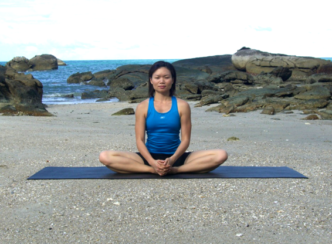

  

   
  

  

  

  

  

  

   <b class="calibre3">
    Baddha Konasana
   </b>
  

  

   <b class="calibre3">
   </b>
  

  

   <b class="calibre3">
   </b>
  

  

  

  

   <i class="calibre4">
    Bound Angle / Butterfly /
   </i>
  

  

   <i class="calibre4">
    Cobbler’s pose
   </i>
  

  

   <b class="calibre3">
   </b>
  

  

   <b class="calibre3">
    Meaning:
   </b>
  

  

   Baddha means bound
  

  

   Kona means angle
  

  

  

  

   <b class="calibre3">
    Story:
   </b>
  

  

   Bound  Angle  Pose,  also  known  as  Cobbler's  Pose  after  the  typical  sitting position of Indian cobblers. This is an excellent groin- and adductors-opener.
  

  

   Many people have tight hips from sitting in chairs and also from high impact activities  such  as  running,  hiking,  and  biking.  This  pose  is  an  excel ent preparation for child birth and suggested during menstruation.
  

  

  

  

   <b class="calibre3">
    Technique (Getting into the pose):
   </b>
  

  

   Sit in Dandasana
  

  

   Exhale, bend both knees and pul  both heels as close as possible to the pelvis
  

  

   Lets the knees fal  to the sides and press the soles of the feet together 4.
  

  

   Wrap the hands under the toes of both feet. Keep the outer edges of the feet firmly on the floor.
  

  

   Pul  the spine upwards and push bel y forwards
  

  

   Flap the sides of the knees up and down
  

  

  

  

   <b class="calibre3">
    Technique (Getting out of the pose):
   </b>
  

  

   Inhale, bring the spine back into neutral position
  

  

   Straighten both legs and come back to Dandasana
  

  

   <b class="calibre3">
   </b>
  

  

   <b class="calibre3">
   </b>
  

  

   <b class="calibre3">
   </b>
  

  

   <b class="calibre3">
   </b>
  

  

  

  

   
  

  

  

  

   <b class="calibre3">
    Tips:
   </b>
  

  

   Press your shoulder blades against your back to support the lift of the chest
  

  

   Tilt the pelvis forwards such that the tailbone points backwards 4.
  

  

   Broaden chest to enable the lift of the sternum
  

  

   Lift the abdomen upwards
  

  

   <b class="calibre3">
   </b>
  

  

   <b class="calibre3">
    Physical Benefits:
   </b>
  

  

   <b class="calibre3">
   </b>
  

  

   <b class="calibre3">
    Spiritual Benefits:
   </b>
  

  

  

  

   <b class="calibre3">
    Modifications:
   </b>
  

  

   Place blocks under sit bones or knees
  

  

   <b class="calibre3">
   </b>
  

  

   Common mistakes
  

  

   Corrections
  

  

   Rounding the back
  

  

   Sit on a blanket or a block
  

  

   Knees are too high away from the  Lift the pelvis and place a bolster at floor
  

  

   each side of the knee to support it
  

  

   from below
  

  

   Not lifting the abdominal organs
  

  

   Engage uddiyana bandha
  

  

   up
  

  

  

  

   
  

