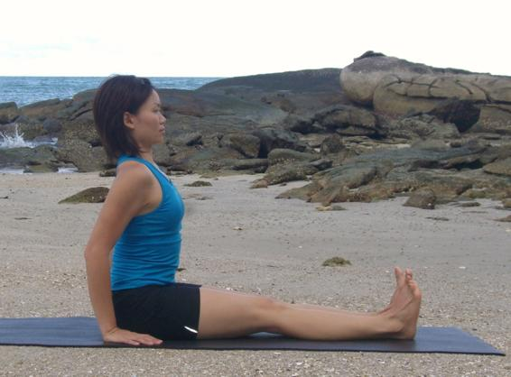

  

   
  

  

  

  

   <b class="calibre3">
    Dandasana
   </b>
  

  

  

  

  

  

  

  

  

  

  

  

   <i class="calibre4">
    Staff pose
   </i>
  

  

  

  

   <b class="calibre3">
   </b>
  

  

  

  

   <b class="calibre3">
    Meaning:
   </b>
  

  

   Danda: stick, rod
  

  

  

  

   or staff
  

  

  

  

  

  

  

  

  

  

  

  

  

  

  

  

  

  

   <b class="calibre3">
    Story:
   </b>
  

  

   Once upon a time, there lived a farmer and his wife who had a newborn son.
  

  

   The farmer's wife desired to have a pet animal to protect the child and also be a companion to the child. So they brought a mongoose and started rearing it. A couple of months later, the farmer and his wife wanted to go out of the house leaving the child at home. The farmer trusted that the mongoose would take care of the child while they were away so they left.
  

  

  

  

   The  farmer's  wife  returned  home  earlier  and  found  that  the  mouth  of  the mongoose  was  stained  with  blood.  She  immediately  inferred  that  the mongoose  had  kil ed  the  child.  In  anger  she  took  a
   <b class="calibre3">
    staff
   </b>
   /
   <b class="calibre3">
    stick
   </b>
   and  beat  the mongoose to death.
  

  

  

  

   Then she rushed inside to see what happened to the child. To her surprise, she found that there was a dead snake lying in the room. She then realised that that the mongoose was trying to save the child. In despair and guilt she cried out loud.
  

  

  

  

   <b class="calibre3">
    Similar to the story, this pose encourage us not act in haste, achieve proper
   </b>
   <b class="calibre3">
    alignment  in  this  foundational  pose  before  attempting  any  other  difficult
   </b>
   <b class="calibre3">
    seated poses.
   </b>
  

  

   <b class="calibre3">
   </b>
  

  

  

  

   
  

  

  

  

   <b class="calibre3">
   </b>
  

  

   <b class="calibre3">
    Technique (Getting into the pose):
   </b>
  

  

   Sit on the floor with the legs stretched out front, knees straight 2.
  

  

   Place the palms on the floor by the hips, fingers pointing to the feet 3.
  

  

   Keep the back erect, shoulders rol  back and pressed down 4.
  

  

   Point the toes up.
  

  

  

  

   <b class="calibre3">
    Technique (Getting out of the pose):
   </b>
  

  

   Inhaling, lift the arms and body up and away from the ground
   <b class="calibre3">
   </b>
  

  

   Exhaling, bring the palms back to the side of the hips
  

  

  

  

   <b class="calibre3">
    Tips:
   </b>
  

  

   Press  the  thighs,  knees  and  shins  down  but  don’t  hyperextend  at  the knee  joints.  Tilt  the  pelvis  forwards  and  tuck  the  tops  of  the  thighs  in towards the pelvis
  

  

   Press the hands into the floor, extend the sides and back of the body up.
  

  

   Stretch the sacrum and lumbar regions
  

  

   <b class="calibre3">
   </b>
  

  

   <b class="calibre3">
    Physical Benefits:
   </b>
  

  

   Stretches the hamstrings
  

  

   Strengthens the back muscles supporting the spine
  

  

   Gently tones the abdominal muscles
  

  

   Opens the chest and promotes deeper breathing
  

  

   <b class="calibre3">
   </b>
  

  

   <b class="calibre3">
    Modifications:
   </b>
  

  

   If the lower back is rounded, sit on folded blankets or block 71
  

  

   
  

  

  

  

  

  

   Common mistakes
  

  

   Corrections
  

  

   Knees are bent
  

  

   Straighten the knees by engaging
  

  

  

  

   the quadriceps, pulling the knee
  

  

   caps towards the thighs, stretch the
  

  

   back of the knees.
  

  

   Body is slanting backwards
  

  

   The pelvis may be tilting forward.
  

  

   Peel the butt cheeks back to sit on
  

  

   the sit bones more, bringing the
  

  

   pelvis forward. Keep the lower
  

  

   abdomen slightly pul ed in, without
  

  

   tensing it. Press the hands into the
  

  

   floor, lengthen the sides and back
  

  

   of the body upwards.
  

  

   Upper back is hunched, shoulders are  Lift the rib-cage; bring the shoulder shrugged. Chest is col apsed.
  

  

   blades together. Lift the chest.
  

  

  

  

  

  

   Toes are rol ed outwards, knees are
  

  

   Press the heels forward, keep them
  

  

   separated.
  

  

   directly below the toes. Internal y
  

  

   rotate the legs by making sure
  

  

   knees and toes point up to the
  

  

   ceiling
  

  

  

  

  

  

  

  

  

  

  

  

  

  

  

  

  

  

  

  

  

  

  

  

  

  

  

  

   <b class="calibre3">
   </b>
  

  

  

  

   
  

  

  

