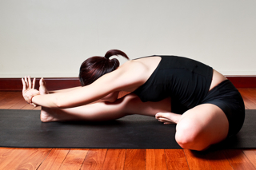

  

   
  

  

  

  

   <b class="calibre3">
    Janu Sirsasana
   </b>
  

  

   <i class="calibre4">
    Head to Knee pose
   </i>
  

  

   <b class="calibre3">
   </b>
  

  

   <b class="calibre3">
    Meaning:
   </b>
  

  

   Janu: knee
  

  

   Sirsa: head
  

  

  

  

  

  

   <b class="calibre3">
    Technique (Getting into the pose):
   </b>
  

  

   Sit in Dandasana
  

  

   Bend one knee and press the heel of the bent leg close to the perineum (groin area), sole against the inner thigh of the straight leg 3.
  

  

   Check that the hip is squared
  

  

   Inhaling, raise both arms up and elongate the spine upwards 5.
  

  

   Exhaling, fold from the hips and catch hold of the foot of the straight leg with both hands
  

  

   If possible, hold the sole or even the heel
  

  

   Inhaling, straighten the spine and gaze forward
  

  

   Exhaling,  bend  the  elbows  sideways,  extend  the  trunk  forwards  more and bring the chest towards the straight leg. For those who are flexible, rest the chin on the shin.
  

  

  

  

   <b class="calibre3">
    Technique (Getting out of the pose):
   </b>
  

  

   Head up slightly with arms in line with the ears.
  

  

   Inhaling, raise the body and arms up
  

  

   Exhaling, arms down
  

  

   <b class="calibre3">
   </b>
  

  

   <b class="calibre3">
    Tips:
   </b>
  

  

   Go down deeper with every exhalation
  

  

   Keep both shoulders level so that the spine is flexed symmetrical y
  

  

  

  

   <b class="calibre3">
   </b>
  

  

   <b class="calibre3">
   </b>
  

  

  

  

   
  

  

  

  

   <b class="calibre3">
   </b>
  

  

   <b class="calibre3">
    Physical Benefits:
   </b>
  

  

   Increases  the  flexibility  of  the  calves,  hamstrings,  gluteal  and  back muscles
  

  

   Increases the flexibility of the spine
  

  

   Tones the abdominal muscles
  

  

  

  

   <b class="calibre3">
    Therapeutic
   </b>
   <b class="calibre3">
    Benefits:
   </b>
  

  

   Calms the mind
  

  

   Loosens stiff backs
  

  

   Beneficial for people with scoliosis
  

  

   <b class="calibre3">
   </b>
  

  

   <b class="calibre3">
    Spiritual Benefits:
   </b>
  

  

   Enhances the swadhisthana chakra
  

  

  

  

   <b class="calibre3">
    Contraindications:
   </b>
  

  

   Slipped disc, sciatica
  

  

  

  

   <b class="calibre3">
    Modifications:
   </b>
  

  

   Those with tight hamstrings can sit on folded blankets or a block and use a belt or towel to catch hold of the foot
  

  

   <b class="calibre3">
   </b>
  

  

   Common mistakes
  

  

   Corrections
  

  

   Folding from waist, rounding back
  

  

   Pul  the bel y in, engage uddiyana
  

  

   bandha, gaze forwards instead of
  

  

   downwards
  

  

   Knee of extended leg is bent
  

  

   Engage the quadriceps and pull the
  

  

   knee cap towards the thigh
  

  

   <b class="calibre3">
   </b>
  

  

   <b class="calibre3">
   </b>
  

  

   <b class="calibre3">
   </b>
  

  

  

  

   <b class="calibre3">
   </b>
  

  

  

  

   
  

  

  

