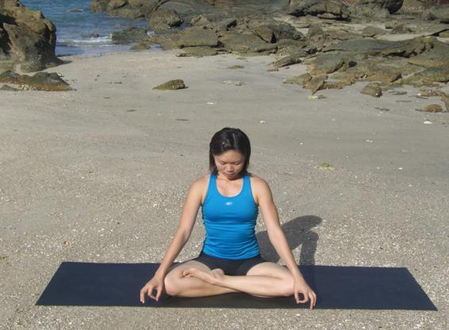

  

   
  

  

  

  

  

  

   <b class="calibre3">
    Padmasana
   </b>
  

  

  

  

  

  

  

  

  

  

   <i class="calibre4">
    Lotus Pose
   </i>
  

  

  

  

   <b class="calibre3">
   </b>
  

  

  

  

   <b class="calibre3">
    Meaning:
   </b>
  

  

   Padma means lotus
  

  

  

  

  

  

  

  

  

  

  

  

  

  

  

  

   Story:
  

  

  

  

   The arrangement of the hands and feet resembles a lotus when seen from a distance. The feet placed on the opposite thighs resemble the leaves while the hands, when placed one over the other, resemble the lotus in ful  bloom. It is the best asana for contemplation.
  

  

  

  

   The  lotus  is  the  foremost  symbol  of  beauty,  prosperity  and  fertility.  Within each human inhabiting the earth is the spirit of the sacred lotus. It represents eternity, purity and divinity and is widely used as a symbol of life, fertility, everlasting youth and feminine beauty, especially for the eyes in some religions.
  

  

  

  

   One  of  the  most  common  metaphysical  analogies  compares  the  lotus'
  

  

   perennial rise to faultless beauty from a miry environment to the evolution of man's  consciousness--from  instinctive  impulses  to  spiritual  liberation.  In  the Bhagavad  Gita,  man  is  adjured  to  be  like  the  lotus--he  should  work  without attachment,  dedicating  his  actions  to  God--untouched  by  sin  like  water  on  a lotus leaf and the beautiful flower standing high above the mud and water. In the postures of hatha yoga, the lotus position, Padmasana, is adopted by those striving to reach the highest level of consciousness, which itself is found in the thousand-petal ed  lotus  chakra  at  the  top  of  the  head.  For  Buddhists,  lotus symbolizes  the  most  exalted  state  of  man--his  head  held  high,  pure  and undefiled in the sun, his feet rooted in the world of experience.
  

  

  

  

  

  

   
  

  

  

  

   There is a story about a lotus that rose from the navel of God Vishnu, and at the  center  of  the  flower  sat  Brahma.  Brahma  (the  Creator),  Vishnu  (the Protector) and Siva (the Merger) are associated with this plant.
  

  

  

  

   There  are  also  accounts  of  the  world  born  through  a  "Golden  Lotus"  and Padmakalpa, the Lotus Age in the Padmapurana (678 ce).
  

  

  

  

   Hindu  scriptures  say  that  the  Atman  dwel s  in  the  lotus  within  the  heart.
  

  

   Visualize within yourself a lotus in the center of your chest, right within your heart. Try to mental y feel and see the heart as a lotus flower right within you.
  

  

   Within the center of the lotus, try to see a smal  light.
  

  

  

  

   Hindu scriptures state that the Atman within the heart looks like a bril iant light about the size of your thumb--just a smal  light. This light is an emanation of your  effulgent  being.  It  is  dwelling  right  within.  The  Self  God  is  deeper  than that. The  lotus is within the heart, and the Self God dwel s deep within that lotus
  

  

   of
  

  

   light.
  

  

   <b class="calibre3">
    Technique (Getting into the pose):
   </b>
  

  

   Sit in Dandasana
  

  

   Hold the right ankle with the right hand and the right foot with the left hand
  

  

   Bend the right knee and place the right foot on the left hip crease 4.
  

  

   The sole of the right foot should be turned upwards and press the right outer knee down on the floor
  

  

   Repeat on the left side
  

  

   Both legs wil  be bound now and keep the knees on the floor to have a firm grounding
  

  

   Keep the spine, neck and head erect
  

  

   Brings both hands on top of the knees respectively in chin mudra
  

  

   <b class="calibre3">
   </b>
  

  

   <b class="calibre3">
    Technique (Getting out of the pose):
   </b>
  

  

   Slowly unbind the legs from the position and stretch them forwards 3.
  

  

   Wiggle the toes and move the ankles in a circular motion to release the tension from the foot and ankle joints
  

  

   Dorsiflex and plantar flex the foot to get blood circulation going
  

  

   <b class="calibre3">
   </b>
  

  

   <b class="calibre3">
   </b>
  

  

   <b class="calibre3">
   </b>
  

  

   <b class="calibre3">
   </b>
  

  

  

  

   
  

  

  

  

   <b class="calibre3">
    Tips:
   </b>
  

  

   Lift the sternum towards the ceiling
  

  

   Lock the knee tight by pressing the back of the thigh to the calf to get the range of movement in the hip joint
  

  

   Rotate the leg in front of the torso, swiveling from the hip and not the knee
  

  

   Rol  the shoulder blades towards each other and pul  it downwards 5.
  

  

   Pul  the abdomen towards the spine and lift the sides of the body
   <b class="calibre3">
    Physical Benefits:
   </b>
  

  

   Ligaments and tendons of the lower extremities are extended and flexed 2.
  

  

   Promotes rich blood supply to pelvic and abdominal-genital regions 3.
  

  

   Firms the sacral and coccygeal spine and the sciatic nerve 4.
  

  

   Tones the colon and eases menstrual discomfort
  

  

   Strengthens  the  thighs  and  calves  and  makes  the  hamstrings  more elastic
  

  

   Helps those with heart, lung and digestive disorders
  

  

   Prevents lumbago
  

  

  

  

   <b class="calibre3">
    Spiritual Benefits:
   </b>
  

  

   Practiced when doing meditation and pranayama
  

  

   Helps to turn the mind inwards and calms the mind
  

  

   Helps  to  activate  the  muladhara  chakra  and  raise  the  Kundalini  shakti quicker
  

  

   <b class="calibre3">
   </b>
  

  

   <b class="calibre3">
    Contraindications:
   </b>
  

  

   People with knee, ankle and groin injury should avoid this pose 2.
  

  

   People with tight hips and inner thigh muscles should practice half lotus (one leg in lotus at a time)
  

  

  

  

  

  

  

  

  

  

  

  

  

  

  

  

  

  

  

  

  

  

  

  

  

  

   
  

  

  

