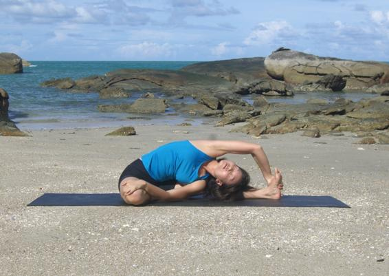

  

   
  

  

  

  

   <b class="calibre3">
    Parivrita Janu Sirsasana
   </b>
  

  

  

  

   <i class="calibre4">
    Revolving Head to
   </i>
  

  

   <i class="calibre4">
    Knee Pose
   </i>
  

  

   <b class="calibre3">
    Meaning:
   </b>
  

  

   Parivrita: revolving
  

  

   Janu: knee
  

  

   Sirsa: head
  

  

  

  

  

  

  

  

  

  

   <b class="calibre3">
   </b>
  

  

   <b class="calibre3">
    Technique (Getting into the pose):
   </b>
  

  

   Sit in Dandasana
  

  

   Bend one knee, press the heel of bent leg close to the perineum (groin area), sole against the inner thigh of straight leg
  

  

   Twist towards the bent leg, bring body in line with the straight leg. Keep the straight leg engaged, toes pointing up
  

  

   Exhale, twist a little deeper and lean over the straight leg. Try to bring the same side elbow down to the floor in front of the straight leg 5.
  

  

   Inhaling, reach opposite arm overhead and grab on to foot of straight leg 6.
  

  

   Twist  the  torso,  chest  and  shoulders  more  by  pulling  on  the  foot  and using the resistance from the grounded elbow
  

  

   Turn the head up and gaze upwards.
  

  

   <b class="calibre3">
   </b>
  

  

   <b class="calibre3">
    Technique (Getting out of the pose):
   </b>
  

  

   Inhaling, lift the body up to centre
   <b class="calibre3">
   </b>
  

  

   Exhaling, place the arms by the side of the hips
  

  

   Turn the body back to face the straight leg
  

  

   Bring both legs back to Dandasana
  

  

   <b class="calibre3">
   </b>
  

  

   <b class="calibre3">
    Physical Benefits:
   </b>
  

  

   Stretches the sides of the body
  

  

   Balances the spine with a twisting effect and a forward bend. It should be practiced after forward bends and back bends
  

  

  

  

   <b class="calibre3">
   </b>
  

  

  

  

   
  

  

  

  

   <b class="calibre3">
    Therapeutic
   </b>
   <b class="calibre3">
    Benefits:
   </b>
  

  

   Tones and massages the intestines
  

  

   Massages the liver
  

  

  

  

   <b class="calibre3">
    Spiritual Benefits:
   </b>
  

  

   Enhances the manipura chakra
  

  

  

  

   <b class="calibre3">
    Contraindications:
   </b>
  

  

   Pregnancy, back problems
  

  

  

  

   <b class="calibre3">
    Modifications:
   </b>
  

  

   Loop a strap or towel around the foot of the straight leg and hold on to the ends
  

  

  

  

   Hold a pole with one hand and pul  the same side shoulder forwards towards the pole to bring chest to face the ceiling more
  

  

  

  

  

  

   Common mistakes
  

  

   Corrections
  

  

   Body col apsing forwards, the back
  

  

   Revolve the body more by pressing
  

  

   is facing the ceiling instead of the
  

  

   the grounded elbow against the
  

  

   side of the body
  

  

   straight leg, while lengthening the
  

  

   muscles around the waist
  

  

  

  

  

  

   <b class="calibre3">
   </b>
  

  

   <b class="calibre3">
   </b>
  

  

  

  

  

  

  

  

   
  

