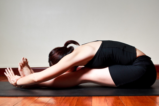

  

   
  

  

  

  

   <b class="calibre3">
    Paschimottanasana
   </b>
  

  

   <i class="calibre4">
    Seated Forward Bend
   </i>
  

  

   <b class="calibre3">
   </b>
  

  

   <b class="calibre3">
    Meaning:
   </b>
  

  

   Paschi means West
  

  

   Uttan means intense flexion
  

  

  

  

   <b class="calibre3">
   </b>
  

  

   <b class="calibre3">
   </b>
  

  

   <b class="calibre3">
    Story:
   </b>
  

  

  

  

   From Hatha Yoga Pradipika
  

  

   (Chapter 1 : On Asanas)
  

  

  

  

   “Having stretched the feet on the ground, like a stick, and having grasped the toes of both feet with both hands, when one sits with his forehead resting on the thighs, it is cal ed Paschima Tana.”
  

  

  

  

   This Paschima Tana carries the air from the front to the back part of the body (
   <i class="calibre4">
    i.e.
   </i>
   to  the  susumna).  It  kindles  gastric  fire,  reduces  obesity  and  cures  all diseases of men.
  

  

  

  

   Surrendering is an important lesson that this pose teaches.  This pose extends all the muscles, ligaments and tendons.  In this pose you are not able to see the  back  or  above.  This  pose  also  means  intense  stretch  to  the  west.    The fol owing  story  tel s  of  how  Lord  Vishnu  made  the  mighty  Mahabali  (who laughed at Lord Vishnu when he asked for 3 feet of land) surrender his ego and sent him to the nether world.
  

  

  

  

   Bali was a powerful demon king who conquered the three worlds. In spite of being a demon, he ruled his land and people with justice. Even though Bali was just,  Land  of  the  Demi-Gods  had  to  be  returned  to  the  Devas,  who  felt humiliated at the loss of their kingdom to Bali.
  

  

  

  

   
  

  

  

  

   Lord Vishnu could not bring Himself to fight so virtuous a king, and therefore he  took  the  disguise  of  a  dwarf  Brahmin  boy.  He  managed  to  make  Bali surrender  al   his  land  in  three  smal   steps  and  sent  Bali  to  rule  the  lower regions.
  

  

  

  

   <b class="calibre3">
    Technique (Getting into the pose):
   </b>
  

  

   Sit on the floor in Dandasana
  

  

   Push heels away from you and point toes towards you
  

  

   Peel the butt cheeks back to sit on the sit bones
  

  

   Inhale, extend the spine upwards and slightly arch back
  

  

   Raise the back, hips, breast bone and head upwards together with arms 6.
  

  

   Lengthen  the  tailbone  and  exhale  keeping  the  arms  by  the side of the ears, bend forward half way
  

  

   Extend the sides of the trunk
  

  

   Inhale, once more, and bend forward and hold on to the sides of the feet with your hands
  

  

   Exhale  again  and  extend  the  front  torso  forward,  keeping  the  head raised and back concaved at all times
  

  

  

  

   <b class="calibre3">
    Technique (Getting out of the pose):
   </b>
  

  

   <b class="calibre3">
   </b>
  

  

   Inhale, lift the head, keeping the arms by the side of the ears 2.
  

  

   Keep the spine neutral while bringing the body upwards
  

  

   Contract  the  arm  and  back  muscles  and  lift  the  torso  away  from  the thighs
  

  

   Exhale slowly lower the arms by the side of the body and come back to Dandasana
  

  

   <b class="calibre3">
   </b>
  

  

   <b class="calibre3">
    Tips:
   </b>
  

  

   Lift the sternum toward the ceiling
  

  

   Hinge forward from the hip joints
  

  

   Lengthen the tailbone away from the back of your pelvis
  

  

   Rol  the thighs towards each other by engaging the adductors, keeping both knees together
  

  

   <b class="calibre3">
   </b>
  

  

   <b class="calibre3">
   </b>
  

  

  

  

   
  

  

  

  

   <b class="calibre3">
    Physical Benefits:
   </b>
  

  

   Stretches  the  entire  posterior  part  of  the  body:  calves,  hamstrings, gluteal muscles, back
  

  

   Elongates the spine
  

  

   Increases flexibility in the hip joints
  

  

   Tones  the  abdominal  and  pelvic  region  including  the  liver,  pancreas, spleen, kidneys and adrenal glands.
  

  

   Alleviates  disorders  of  the  reproductive  (menstrual  disorders)  and urinary system
  

  

   Stimulates blood circulation to the nerves and muscles of the spine 7.
  

  

   Enhances the swadhisthana chakra
  

  

  

  

   <b class="calibre3">
    Contraindication:
   </b>
  

  

   Spinal injuries such as slipped disc or sciatica
  

  

   <b class="calibre3">
   </b>
  

  

   <b class="calibre3">
    Modifications:
   </b>
  

  

   Place a blanket or block below the sit bones
  

  

  

  

   Use a belt, if unable to reach toes with a concaved back
  

  

   <b class="calibre3">
   </b>
  

  

   Common mistakes
  

  

   Corrections
  

  

   Not lifting the chest
  

  

   Squeeze the shoulder blades
  

  

   together and lift the pectoralis major
  

  

   upwards
  

  

   Not keeping the spine neutral,
  

  

   Engage the back muscles with pelvis
  

  

   back is rounded to have the head
  

  

   tilted forward, look forward, lead the
  

  

   down
  

  

   forward motion with the chest rather
  

  

   than the head
  

  

   Tummy is bulging out which
  

  

   Engage the uddiyana bandha
  

  

   obstructs the forward bend
  

  

   (abdominal lock) and use the
  

  

   diaphragm to lift up the organs up
  

  

   towards the ribs, al owing a deeper
  

  

   forward bend with flat tummy
  

  

  

  

   
  

  

  

