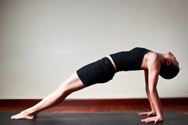

  

   
  

  

  

  

  

  

   <b class="calibre3">
    Purvottanasana
   </b>
  

  

  

  

   <i class="calibre4">
    Reverse/Upward Plank
   </i>
  

  

   <b class="calibre3">
   </b>
  

  

   <b class="calibre3">
    Meaning:
   </b>
  

  

   Intense Eastern Stretch
  

  

   Purvo means east
  

  

   Uttana means intense
  

  

   stretch
  

  

  

  

   <b class="calibre3">
   </b>
  

  

   <b class="calibre3">
   </b>
  

  

   Story:
  

  

   There is a beautiful story in Ramayana about Hanuman and his mother, Sita.
  

  

   After the great war was over, Sita gave Hanuman a necklace of priceless pearls as a reward for his heroism and devotion.
  

  

  

  

   In front of the assembled crowd of nobles and learned, Hanuman pul ed the necklace  apart,  holding  each  beautiful  pearl  up  to  his  ear,  shaking  it,  then throwing it to the ground in disgust.
  

  

  

  

   Sita  asked  in  shock:  "What  are  you  doing?"  Hanuman  replied  his  mother:  "I wanted  to  see  if  the  pearls  were  saying  the  name  of  Rama.  Only  something which  says  the  name  of  the  Lord  has  meaning  to  me."
  

  

  

  

   "A  pearl  is  an  inanimate  object.  It  cannot  speak,"  said  Sita.  But  Hanuman countered:  "Everything  that  is  saturated  with  the  love  of  Rama  speaks  his name." Hanuman then pulled a handful of hair from his chest and held it  to Sita's ears. Every hair on Hanuman's body was softly chanting "RAM."
  

  

  

  

   Then to everybody’s awe and surprise, Hanuman ripped his chest open. In his heart  was  an  image  of  Rama  and  Sita.  This  shows  the  devotion  one  has  for Rama and for someone who loves another. This pose helps to open the heart chakra  and  reveal  the  goodness  in  every  human  being.  It  enhances  the  love and devotion we have for ourselves and others.
  

  

  

  

  

  

   
  

  

  

  

  

  

   <b class="calibre3">
    Technique (Getting into the pose):
   </b>
  

  

   In Dandasana, place the hands 1 feet behind the hips on the mat with fingers pointing forwards
  

  

   Ground the heels, point the toes away from the body. Inhaling, lift the hips away from the mat and press hands firmly into the mat 3.
  

  

   Keep lifting the hips up until they are in line with toes and shoulders in a reversed plank position
  

  

   Drop the head backwards without compressing the back of the neck
   <b class="calibre3">
    Technique (Getting out of the pose):
   </b>
  

  

   Inhale, lift the head up into neutral position
  

  

   Keep  the  spine  neutral  while  slowly  lowering  the  body  back  down  to Dandasana
  

  

  

  

   <b class="calibre3">
    Tips:
   </b>
  

  

   Lift the sternum towards the ceiling and internally rotate the thighs 2.
  

  

   Hinge upwards and backwards from the hip joints
  

  

   Press your shoulder blades against your back to support the lift of your chest
  

  

   Contract the gluteal muscles to give you the extra lift and push the navel towards the spine
  

  

   Feel the energy rising from the muladhara
  

  

   Firm up the deltoids, triceps and biceps brachi  to stay in the pose for at least 30 seconds
  

  

   Point the toes away from the body with the feet flat on the mat. This wil enable the body to lift higher and further.
  

  

   Firm up the calves and hamstrings to keep the legs steady
  

  

   <b class="calibre3">
   </b>
  

  

   <b class="calibre3">
    Physical Benefits:
   </b>
  

  

   Strengthens the back muscles
  

  

   The shoulders and chest become strong especial y the deltoids 3.
  

  

   Improves posture, particularly in the lower back
  

  

   Extends the muscles of the legs
  

  

   Massages the abdominal organs, tones the kidneys
  

  

   Strengthens the arms, wrists and legs
  

  

   Stretches the front of the ankles
  

  

   <b class="calibre3">
   </b>
  

  

   <b class="calibre3">
    Contraindications:
   </b>
  

  

   Shoulder or rotator cuff injuries should avoid this posture 2.
  

  

   Severe lower back injury need not lift the pelvis too high 83
  

  

  

  

   
  

  

  

  

  

  

   Wrist injury
  

  

   Those with a neck injury, support the head against a wal  or chair seat
   <b class="calibre3">
    Modifications:
   </b>
  

  

   Micro-Bend the knees and come to a table top position
  

  

  

  

   Common mistakes
  

  

   Corrections
  

  

   Not lifting the chest
  

  

   Squeeze the shoulder blades together
  

  

   and lift the pectoralis major and minor
  

  

   upwards
  

  

   Straining the neck
  

  

   Engage the muscles of the neck to and
  

  

   let the head drop back with control
  

  

   Bending or hyperextending the
  

  

   Engage the triceps brachii to straighten
  

  

   elbows
  

  

   the arms and keep them strongly
  

  

   Not lifting the abdominal organs up
  

  

   Engage uddiyana bandha
  

  

   towards the ribs
  

  

   Feet not flat on the floor and the feet  Use the gastronemius and anterior supinate
  

  

   tibialis muscles to enable to you to
  

  

   keep the feet flat
  

  

   <b class="calibre3">
   </b>
  

  

  

  

   <b class="calibre3">
   </b>
  

  

  

  

  

  

   
  

