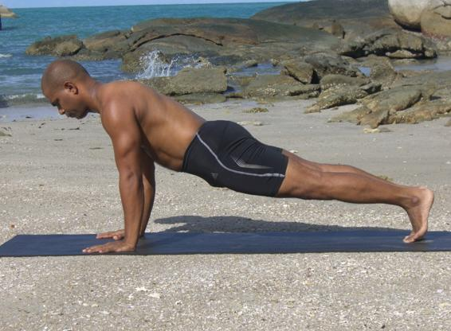

  

   
  

  

  

  

  

  

   <b class="calibre3">
    Santolasana or Phalakasana
   </b>
  

  

  

  

   <b class="calibre3">
   </b>
  

  

  

  

  

  

  

  

   <i class="calibre4">
    Plank Pose
   </i>
  

  

  

  

   <b class="calibre3">
    Meaning:
   </b>
  

  

  

  

   Santola: Plank
  

  

  

  

   Phalak: High chair
  

  

  

  

  

  

  

  

  

  

  

  

  

  

  

  

  

  

   <b class="calibre3">
    Story:
   </b>
  

  

  

  

   Just like a plank which is strong and steady, plank pose is so cal ed because the ful  body and spine, is total y engaged and straight  like a staff. Plank pose is also an arm balance which builds strength in your upper body and arms. Do not worry if you cannot do or hold the pose for a long period of time. Practice makes perfect.
  

  

  

  

   Phalak also refers to a kind of high chair used by revered persons.
  

  

   Traditional y, people carry the kings and queens on a Phalak around the city.  It is normally made of very strong, high quality wood.
  

  

   <b class="calibre3">
    Technique (Getting into the pose):
   </b>
  

  

   Lie on the bel y, feet together, toes on the ground, arms by the side of the body
  

  

   Bring the hands below the shoulders, palms down, elbows close to the ribs, pointing up
  

  

   Inhale and lift the body up until the elbows are ful y extended with the shoulders directly over the wrists, torso diagonal to the floor 4.
  

  

   Press  outer  arms  inwards  and  firm  the  bases  of  index  fingers  into  the floor. Firm the shoulder blades flat against the back
  

  

   Broaden the collarbones away from the sternum
  

  

   Engage the quadriceps, draw tailbone towards the heels
  

  

  

  

   
  

  

  

  

   Keep  the  neck  neutral  by  looking  ahead  at  the  floor  about  1m  away, keeping the throat and eyes soft
  

  

   Pul  in the belly and activate the core muscles to stabilize yourself in this pose
  

  

  

  

   <b class="calibre3">
    Technique (Getting out of the pose):
   </b>
  

  

   Exhale, bend knees, chest and chin to the floor sequential y 2.
  

  

   Inhale, come to makrasana
  

  

   <b class="calibre3">
   </b>
  

  

   <b class="calibre3">
    Tips:
   </b>
  

  

   Spread the fingers with the middle finger pointing forwards 2.
  

  

   Tuck the tailbone under so the legs, hips and torso are in one straight line
  

  

   Stabilize the mid section of the body by contracting the gluteal muscles 4.
  

  

   Engage the triceps, externally rotate the arms, making sure the insides of the elbows are facing forwards
  

  

  

  

   <b class="calibre3">
    Physical Benefits:
   </b>
  

  

   Tones abdominal muscles and increases core strength
  

  

   Strengthens the lower back muscles
  

  

   Lengthens the spine and the hamstrings
  

  

   Strengthens the wrists, arms, shoulders, back, legs, feet and toes
  

  

   <b class="calibre3">
   </b>
  

  

   <b class="calibre3">
    Contraindications:
   </b>
  

  

   Chronic injury to the arms, back or shoulders
  

  

   Carpal tunnel syndrome should avoid holding the pose too long 3.
  

  

   Microbend hyperextended elbow joints
  

  

  

  

   <b class="calibre3">
    Modifications:
   </b>
  

  

   Have one or both knees on the floor
  

  

  

  

   Dynamic  push  up  variation:  Exhale,  bend  the  elbows  close  to  the  body  and lower  the  chest  down  just  before  it  touches  the  floor.  Inhale,  extend  the elbows, bring the body back up to Santolasana
  

  

  

  

   One-leg-lifted variation: After coming into the position, inhale and lift one leg paral el  to  the  floor.  Press  strongly  through  the  raised  heel  and  lengthen through  the  crown  of  your  head,  keeping  the  tailbone  pressed  towards  the pubis. Repeat on other side.
  

  

  

  

  

  

   
  

  

  

  

   Common mistakes
  

  

   Corrections
  

  

   Elbows opening out to the side
  

  

   Squeeze shoulder blades, external y
  

  

   rotate the shoulders and use triceps
  

  

   muscles to lift
  

  

   Holding of breath
  

  

   Keep breathing in the abdominal
  

  

   region
  

  

   Buttocks sinking towards the floor
  

  

   Engage gluteal and abdominal
  

  

   muscles, suck the bel y in towards
  

  

   the spine
  

  

   Extending the neck or chin coming
  

  

   Keep cervical spine neutral by
  

  

   forwards
  

  

   looking at a point on the floor 1m
  

  

   away
  

  

   Shoulders not perpendicular to
  

  

   Shift the body forwards to have the
  

  

   wrists, buttocks pul ing up towards  shoulders directly above the wrists, the ceiling
  

  

   engage core muscles, gluteal muscles
  

  

   and  hamstrings to bring the hips in
  

  

   line with the heels and shoulders
  

  

   <b class="calibre3">
   </b>
  

  

  

  

   <b class="calibre3">
   </b>
  

  

  

  

   
  

