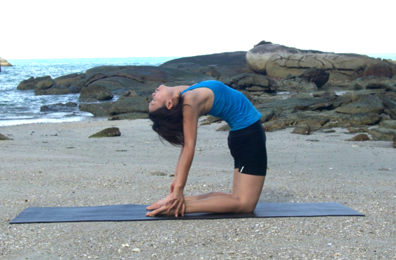

  

   
  

  

  

  

   <b class="calibre3">
    Ushtrasana
   </b>
  

  

  

  

   <b class="calibre3">
   </b>
  

  

   <b class="calibre3">
   </b>
  

  

   <b class="calibre3">
   </b>
  

  

   <b class="calibre3">
   </b>
  

  

   <i class="calibre4">
    Camel Pose
   </i>
  

  

   <b class="calibre3">
   </b>
  

  

   <b class="calibre3">
   </b>
  

  

   <b class="calibre3">
    Meaning:
   </b>
  

  

   <b class="calibre3">
   </b>
  

  

   Ustra: camel
  

  

   <b class="calibre3">
   </b>
  

  

  

  

   <b class="calibre3">
   </b>
  

  

   <b class="calibre3">
   </b>
  

  

   <b class="calibre3">
   </b>
  

  

   <b class="calibre3">
   </b>
  

  

   <b class="calibre3">
    Technique (Getting into the pose):
   </b>
  

  

   Come to Vajrasana (thunderbolt pose)
  

  

   Lift the hips off the heels, come to a kneeling position
  

  

   Separate the knees to about hip width apart, point the toes away from the body so that the tops of the feet can rest on the floor 4.
  

  

   Place  the  palms  on  the  hips,  fingers  pointing  down,  elbows  shoulder width apart, rol ing the shoulders back
  

  

   Engage the buttocks and thighs
  

  

   Inhaling, lengthen the spine upwards, push the chest out and arch back as much as possible while pushing the hips forward
  

  

   One hand at a time, catch hold of the heels or ankles
  

  

   Gently drop the head back
  

  

  

  

   <b class="calibre3">
    Technique (Getting out of the pose):
   </b>
  

  

   Release the hands one by one from the heels or ankles and rest them on the hips
  

  

   Come up sequential y with control, starting from the lower back, middle back, upper back and final y the head.
   <b class="calibre3">
    Do not rush to come up.
   </b>
  

  

  

  

   <b class="calibre3">
    Physical Benefits:
   </b>
  

  

   Increases the flexibility in the spine
  

  

   Stretches the chest muscles
  

  

   Stretches the front of the shoulders
  

  

   Stretches the quadriceps and hip flexors
  

  

   Tones the butts and back muscles
  

  

  

  

   <b class="calibre3">
   </b>
  

  

  

  

   
  

  

  

  

   <b class="calibre3">
    Therapeutic
   </b>
   <b class="calibre3">
    Benefits:
   </b>
  

  

   Corrects hunch back and rounded shoulders
  

  

   Ful y opens the chest and al eviates respiratory conditions like asthma or emphysema
  

  

   Relieves back problems like sciatica through constant practice 4.
  

  

   Stimulates the spinal nerves
  

  

   Stretches the stomach and intestines, combating constipation, good for the digestive system
  

  

   Regulates the thyroid and para- thyroid gland
  

  

   Enhances the flow of blood to the cerebellum and medulla oblongata
   <b class="calibre3">
    Spiritual Benefits:
   </b>
  

  

   Enhances  the  swadhisthana  and  the  vishuddhi  chakra  to  activate  kundalini shakti
  

  

  

  

   <b class="calibre3">
    Contraindications:
   </b>
  

  

   Severe back problems such as lumbago
  

  

   <b class="calibre3">
   </b>
  

  

   <b class="calibre3">
    Modifications:
   </b>
  

  

   Beginners can keep the hands on the hips
  

  

   <b class="calibre3">
   </b>
  

  

   Common mistakes
  

  

   Corrections
  

  

   Thighs are leaning backwards
  

  

   There should be no movement from the
  

  

   hips down. Knee joints should stil  be at
  

  

   pose and try the modification, with
  

  

   palms at hips. If knees can be
  

  

   maintained at 90 degrees, place the
  

  

   hands down.
  

  

  

  

   Do not force the hips forward in the
  

  

   slanted position. If the spine is not
  

  

   flexible, this wil  cause discomfort in the
  

  

   lumbar spine.
  

  

   Shoulders are rol ed forward
  

  

   Squeeze the shoulder blades together
  

  

   and rol  the shoulders back. Open the
  

  

   front of the shoulders and chest.
  

  

   <b class="calibre3">
   </b>
  

  

  

  

   
  

  

  

  

  

  

  

  

  

  

  

  

  

  

  

  

  

  

  

  

  

  

  

  

  

  

  

  

  

