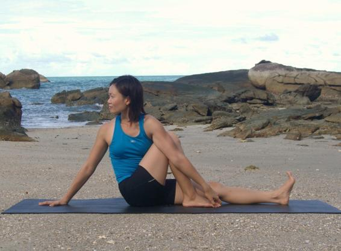

  

   
  

  

  

  

  

  

   <b class="calibre3">
    Vakrasana
   </b>
  

  

  

  

   <b class="calibre3">
   </b>
  

  

  

  

  

  

   <i class="calibre4">
    Twisted Pose
   </i>
  

  

   <b class="calibre3">
   </b>
  

  

  

  

   <b class="calibre3">
    Meaning:
   </b>
  

  

   Vakra means twisted
  

  

  

  

  

  

  

  

  

  

  

  

  

  

   <b class="calibre3">
    Technique (Getting into the pose):
   </b>
  

  

   Sit in Dandasana.
  

  

   Bend one knee and place the foot of the bent leg next to the opposite knee
  

  

   Sit up tal  and lengthen the spine
  

  

   Inhaling, raise up the arm opposite to the bent leg, lengthen the spine 5.
  

  

   Exhaling, twist the body to face the bent leg and place the tricep of the raised arm on the outside of the bent knee
  

  

   Place the hand of the free arm behind the sacrum for support 7.
  

  

   With the arm pushing against the bent knee, make a ‘stop’ sign 8.
  

  

   Look over the shoulder of the supporting arm
  

  

   To twist deeper, reach for the foot of the bent leg
  

  

  

  

   <b class="calibre3">
    Technique (Getting out of the pose):
   </b>
  

  

   Turn the head back to centre
  

  

   Inhaling, place the arms by the side of hips
  

  

   Exhaling, straighten the right leg and sit in Dandasana
  

  

   <b class="calibre3">
   </b>
  

  

   <b class="calibre3">
    Physical Benefits:
   </b>
  

  

   Increases flexibility of the spine
  

  

   Relieves backache
  

  

   Stretches the back muscles
  

  

   Stretches the gluteals and the iliotibial band
  

  

  

  

   
  

  

  

  

   Tones the abdominal muscles, especial y obliques
  

  

   Strengthens the deep muscles of the erector spinae group
  

  

   <b class="calibre3">
   </b>
  

  

   <b class="calibre3">
    Therapeutic
   </b>
   <b class="calibre3">
    Benefits:
   </b>
  

  

   Sends more blood to the spinal discs and other deep tissue 2.
  

  

   Massages the abdominal organs like the intestines, stimulates peristalsis 3.
  

  

   Compresses the abdomen, releasing unwanted gases out of the body 4.
  

  

   Tones and massages the liver, pancreas
  

  

   Stretches the kidneys
  

  

  

  

   <b class="calibre3">
    Contraindications:
   </b>
  

  

   Pregnancy, instability of spine
   <b class="calibre3">
   </b>
  

  

   <b class="calibre3">
   </b>
  

  

   <b class="calibre3">
    Modifications:
   </b>
   Stop at step 7
  

  

  

  

  

  

   Common mistakes
  

  

   Corrections
  

  

   Body is leaning backwards and
  

  

   Lean the body forwards, back to
  

  

   weight is on the supporting arm
  

  

   centre. Awareness should be on
  

  

   maintaining a straight spine
  

  

   Upper back is rounded, shoulders
  

  

   Rol  the shoulders back, open the
  

  

   are shrugged
  

  

   chest
  

  

   A large gap exists between the
  

  

   Suck the bel y in upon exhalation, shift
  

  

   abdomen and the thigh
  

  

   the triceps forward until the armpit is
  

  

   in contact with the thigh, minimize the
  

  

   gap between the abdomen and the
  

  

   thigh
  

  

   <b class="calibre3">
   </b>
  

  

  

  

   <b class="calibre3">
   </b>
  

  

  

  

   
  

  

  

