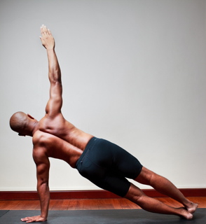

  

   
  

  

  

  

   <b class="calibre3">
    Vasisthasana
   </b>
  

  

   <i class="calibre4">
    Side Plank
   </i>
  

  

   <b class="calibre3">
   </b>
  

  

   <b class="calibre3">
    Meaning:
   </b>
  

  

   <i class="calibre4">
    Vasishtha means
   </i>
  

  

   <i class="calibre4">
    "most excellent, best,
   </i>
  

  

   <i class="calibre4">
    richest, a sage."
   </i>
  

  

  

  

   <b class="calibre3">
   </b>
  

  

   <b class="calibre3">
   </b>
  

  

  

  

   <b class="calibre3">
    Story:
   </b>
  

  

  

  

   Vasishtha was a well-known seer, the family priest of  the solar (sun) race of kings and authored several Vedic hymns. The Mahabharata talks of an episode where Vishwamitra comes with an army to take away Nandini the cow. Sage Vasishtha repulsed him by creating an army with his yogic powers. This power of Sage Vasishtha inspired Vishwamitra to become a Yogi.
  

  

  

  

   This pose is a powerful arm and wrist strengthener and might also be cal ed the One-Arm Balance. Here, we balance on the same-side hand and outer foot, with  the  torso  and  legs  aligned  at  a  45-degree  angle  with  the  floor.
  

  

  

  

   <b class="calibre3">
    Technique (Getting into the pose):
   </b>
  

  

   Lie on the bel y, feet together, arms by the side of the body 2.
  

  

   Bring the hands below the shoulders, palms down, elbows close to the ribs, pointing up
  

  

   Inhale, push yourself up to Santolasana
  

  

   On  the  next  inhalation,  shift  the  bodyweight  to  a  same  side  arm  and foot,  rol   the  opposite  hip  up  until  the  pelvis  is  perpendicular  to  the floor
  

  

  

  

   
  

  

  

  

   Stack the feet and bring the knees together
  

  

   Extend the free right up towards the ceiling and spread the fingers 7.
  

  

   Gaze at the raised thumb
  

  

   Breathe slowly and steadily
  

  

  

  

   <b class="calibre3">
    Technique (Getting out of the pose):
   </b>
  

  

   Exhale  lower  the  raised  hand  down  to  the  floor  and  come  back  to Santolasana
  

  

   Lower the knees and body down and rest in Makarasana
  

  

   Repeat on the other side
  

  

  

  

   <b class="calibre3">
    Tips:
   </b>
  

  

   Flatten the shoulder blades against the back
  

  

   Engage the triceps brachii and the deltoids to have optimal lift from the floor
  

  

   Firm the palms on  the floor, straighten al  fingers and keep  the rectus and transverses abdominis engaged
  

  

   Point the toes towards the body in dorsiflexion
  

  

   Stabilize the hips by contracting the gluteal muscles and obliques 6.    The weight is borne by the outer edge of the grounded foot and arm 7.    The  spine  should  be  aligned  so  that  your  body  makes  a  straight  line from the top of your head to the feet
  

  

   <b class="calibre3">
   </b>
  

  

   <b class="calibre3">
    Physical Benefits:
   </b>
  

  

   <b class="calibre3">
   </b>
  

  

   <b class="calibre3">
    Spiritual Benefits:
   </b>
  

  

   Helps one connect with the breath
  

  

   Increased prana is brought to the neck and shoulder areas 3.
  

  

   When pose is done with Uj ayi pranayama, increased energy is sent to the neck and shoulder areas while enhancing the visuddha chakra
  

  

   <b class="calibre3">
   </b>
  

  

   <b class="calibre3">
    Contraindications:
   </b>
  

  

   Shoulder or rotator cuff injuries should avoid this pose
  

  

   Wrists, elbow, toe, ankle injuries can perform the modified version 94
  

  

   
  

  

  

  

   Cervical  spine  injury  should  take  special  care  not  to  drop  the  head forwards or back
  

  

   Serious lower-back injury should take special care to tuck the  tailbone under
  

  

   <b class="calibre3">
   </b>
  

  

   <b class="calibre3">
    Modifications:
   </b>
  

  

   Place top foot on the floor in front of the bottom knee for support. The bottom leg remains straight
  

  

  

  

   Place  the  bottom  knee  down  on  the  floor  as  support,  the  top  leg  remains straight
  

  

   Common mistakes
  

  

   Corrections
  

  

   The chest is sagging
  

  

   Squeeze shoulder blades, use triceps
  

  

   and pec muscles to lift up
  

  

   Holding of breath
  

  

   Keep breathing at the thoracic region
  

  

   Hips sagging
  

  

   Engage the gluteal muscles and
  

  

  

  

   obliques, pull the abdomen towards the
  

  

   spine
  

  

   Unable to keep the feet together
  

  

   Engage the adductors and quadriceps
  

  

   and pul  the knee caps upwards.
  

  

   Stabilize the pelvis.
  

  

   No balance
  

  

   Pronate the bottom foot and ground
  

  

   outer edge of foot or modify
  

  

   <b class="calibre3">
   </b>
  

  

   <b class="calibre3">
   </b>
  

  

   <b class="calibre3">
   </b>
  

  

   <b class="calibre3">
   </b>
  

  

   <b class="calibre3">
   </b>
  

  

  

  

   <b class="calibre3">
   </b>
  

  

  

  

   
  

  

  

