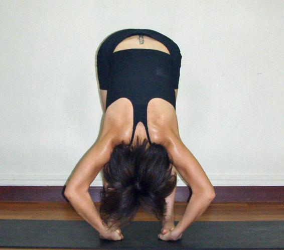

  

   
  

  

  

  

   <b class="calibre3">
    Pada Hastasana
   </b>
  

  

   <i class="calibre4">
    Hand to Feet Pose
   </i>
  

  

   <b class="calibre3">
   </b>
  

  

   <b class="calibre3">
    Meaning:
   </b>
  

  

   Pada means feet
  

  

   Hasta means hand
  

  

  

  

   <b class="calibre3">
   </b>
  

  

   <b class="calibre3">
   </b>
  

  

   <b class="calibre3">
   </b>
  

  

   Story:
  

  

  

  

   This  pose  is  similar  to  Paschimottanasana  (western  stretch)  in  sitting.  A  very powerful pose which looks like a book from a distance, the qualities of a book being full of knowledge, stories, information, guidance and longevity. This pose promotes longevity as the heart is above the head, sending nutrient-rich blood to the brain.
  

  

  

  

   When  the  pose  is performed  regularly  and  held  for  a  long  period  of  time,  it promotes  good  health,  radiant  skin,  reduces  wrinkles  on  the  face,  enhances the ajna chakra, and reduces ego and pride.
  

  

  

  

  

  

   From the Bhagavad Gita Chap.18, v.33
  

  

   <i class="calibre4">
    Dhrtya yaya dharayate
   </i>
  

  

   <i class="calibre4">
    Manah-pranendriya-kriyah
   </i>
  

  

   <i class="calibre4">
    Yogenavyabhicarinya
   </i>
  

  

   <i class="calibre4">
    Dhrtih sa partha sattviki
   </i>
  

  

  

  

  

  

   
  

  

  

  

   “O son of Pritha, that determination which is unbreakable, which is sustained with steadfastness by yoga practice and  which thus controls the activities of the mind, life and senses is determination in the mode of goodness.”
  

  

  

  

   Relating to the Gita, this pose stands steadfast like the contents of a book and enhances mind and breath control for overal  wel ness.
  

  

   <b class="calibre3">
    Technique (Getting into the pose):
   </b>
  

  

   Stand in Tadasana
  

  

   Inhaling, raise both arms up, elongating the spine
  

  

   Exhaling, slowly bend forward from the hips first to 90 degrees and place the fingertips on the floor in line with the toes
  

  

   Inhaling, look forward and straighten the spine
  

  

   Exhaling, suck  the belly in and fold deeper. Place  the palms under the bal s of feet
  

  

   Try to touch the abdomen to the thigh and the chin towards the shin
  

  

   <b class="calibre3">
   </b>
  

  

   <b class="calibre3">
    Technique (Getting out of the pose):
   </b>
  

  

   Bring the arms in line with the ears
  

  

   Inhaling, slowly raise the body to upright position with arms overhead 3.
  

  

   Exhaling, lower both arms down to Tadasana
  

  

  

  

   <b class="calibre3">
    Tips:
   </b>
  

  

   <b class="calibre3">
    Physical Benefits:
   </b>
  

  

   Stretches the entire posterior part of the body: calves, hamstrings, glutes, back
  

  

   Increases flexibility of the spine
  

  

   Lengthens the spine
  

  

   Increases blood supply to the brain
  

  

   Tones the abdomen
  

  

   <b class="calibre3">
   </b>
  

  

   <b class="calibre3">
    Therapeutic
   </b>
   <b class="calibre3">
    Benefits:
   </b>
  

  

   Tones the liver, spleen, kidneys and intestines
  

  

   Slows down the heart beat
  

  

   Rejuvenates spinal nerves, soothes the brain cel s, making you feel calm 4.
  

  

   Makes the eyes bright
  

  

   Makes the mind peaceful
  

  

  

  

   
  

  

  

  

   Beneficial  for  people  suffering  from  gastric  problems  or  a  bloating sensation in the abdomen
  

  

   Improves digestion
  

  

   Removes constipation
  

  

   Helps in eliminating or preventing stomach or abdominal ailments.
  

  

  

  

   <b class="calibre3">
    Spiritual Benefits:
   </b>
  

  

  

  

   <b class="calibre3">
    Contraindications:
   </b>
  

  

   Slipped disc, back problems
  

  

  

  

   <b class="calibre3">
    Modifications:
   </b>
  

  

   Place  2  blocks  on  the  floor  in  front  of  your  feet,  shoulder  width  apart,  and place palms on the blocks. The priority is to keep the spine and knees straight.
  

  

   <b class="calibre3">
   </b>
  

  

   Common mistakes
  

  

   Corrections
  

  

   Knees are bent
  

  

   Straighten the knees by engaging the
  

  

   quadriceps, lifting the knee caps up
  

  

   Knees are hyper-extended and
  

  

   Legs should be perpendicular to the
  

  

   bodyweight is shifted backwards;
  

  

   floor instead of slanted backwards at
  

  

   weight is pushed back on the heels
  

  

   an angle. Shift the bodyweight to the
  

  

   bal s of the feet by engaging the thighs
  

  

   and toes more. Avoid hyperextending
  

  

   the knees by lifting the knee caps up.
  

  

  

  

  

  

   
  

  

  

