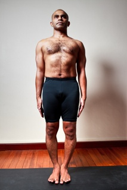

  

   
  

  

  

  

   <b class="calibre3">
    Tadasana
   </b>
  

  

   <i class="calibre4">
    Mountain Pose
   </i>
  

  

   <b class="calibre3">
    Meaning:
   </b>
  

  

   Tada means mountain or
  

  

   palm tree. This standing pose
  

  

   resembles the firmness and
  

  

   steadiness of the mountain. It
  

  

   is the foundation of standing
  

  

   asana. In some context, Tada
  

  

   may mean palm tree.
  

  

  

  

  

  

   <b class="calibre3">
   </b>
  

  

   <b class="calibre3">
   </b>
  

  

   Story:
  

  

   The mountain is heavy, immovable, stil , tal  and firm.  Mountains are made of rocks, earth and sand. At the same time, mountains are described as beautiful, flowing and pure.
  

  

  

  

   In life, we are faced with ups and downs. We should use the  mountain as a symbol of grounding and steadiness.
  

  

  

  

   Most yogis reside in the mountains to attain spirituality and enlightenment and surrender  their  ego  to  the  vastness  and  mightiness  of  the  mountain.  Such elevated  locations  tend  to  be  ideal  for  meditation  and  self-introspection.
  

  

   Within the val eys, ridges, streams and caves reside the purity, naturalness and spirit of growth and rejuvenation.
  

  

  

  

  

  

   Bhagavad Gita, Chap.12 v.8
  

  

   <i class="calibre4">
    mayy eva mana adhatsva
   </i>
  

  

   <i class="calibre4">
    mayi buddhim nivesaya
   </i>
  

  

   <i class="calibre4">
    nivasisyasi mayy eva
   </i>
  

  

   <i class="calibre4">
    ata urdhvam na samsayah
   </i>
  

  

  

  

   
  

  

  

  

   "Just fix your mind upon Me, the Supreme Personality of Godhead, and engage all your intel igence in Me. Thus you wil  live in Me always, without a doubt."
  

  

  

  

   Just as Krishna says in the Bhagavad Gita, in Tadasana, we must learn the art of standing  through  complete  internal  focus  and  awareness,  from  the  four corners
  

  

   of
  

  

   our
  

  

   feet
  

  

   to
  

  

   the
  

  

   crown
  

  

   of
  

  

   the
  

  

   head.
  

  

  

  

   <b class="calibre3">
    Technique (Getting into the pose):
   </b>
  

  

   Stand with both feet together, big toes touching or hip width apart. Lift the arches of the soles and ground the heels and bal s of the feet 2.
  

  

   Stand erect with knees straight and knee caps lifted up
  

  

   Engage the quadriceps
  

  

   Keep the arms beside the body with fingers extended
  

  

   Keep the spine neutral and elongated
  

  

   Rol  the shoulders back and expand the chest
  

  

   Relax the face and gaze straight ahead
   <b class="calibre3">
   </b>
  

  

  

  

   <b class="calibre3">
    Technique (Getting out of the pose):
   </b>
  

  

   Inhale  and  slowly  relax  the  fingers  and  toes  and  come  back  to  normal standing
  

  

   At the same release the tension on the wrists and ankles
  

  

   <b class="calibre3">
   </b>
  

  

   <b class="calibre3">
    Tips:
   </b>
  

  

   Squeeze the shoulder blades together to open the chest to its maximum 2.
  

  

   Engage  the  gluteal  muscles  and  lower  abdomen  to  tuck  the  tailbone under and stabilize the hips
  

  

   <b class="calibre3">
   </b>
  

  

   <b class="calibre3">
    Physical Benefits:
   </b>
  

  

   Brings awareness to one’s posture and alignment
  

  

   Corrects misaligned parts in a subtle but conscious manner 3.
  

  

   Teaches balance, centering and evenness
  

  

   Helps to tone the muscles of the arms, shoulders, thighs and back 5.
  

  

   Removes the stiffness of the joints and spine becomes more flexible 6.
  

  

   Tones the gluteal muscles
  

  

   Improves posture
  

  

   Improves hyper flexion of the thoracic spine
  

  

   Helps  to  relieve  rheumatism  of  the  legs,  knee-joints,  hands,  neck  and back
  

  

   <b class="calibre3">
   </b>
  

  

  

  

   
  

  

  

  

   <b class="calibre3">
    Spiritual Benefits:
   </b>
  

  

   Helps connect one with the breath
  

  

   Centres the body
  

  

   Increased prana is brought to the neck and shoulder areas 4.
  

  

   Helps to enhance the more advanced standing postures
  

  

  

  

   <b class="calibre3">
    Modifications:
   </b>
  

  

   Raise the arms up and stretch up towards the ceiling, with elbows straightened Common mistakes
  

  

   Corrections
  

  

   Legs are hinged forwards instead of  Shift the weight slightly more towards being perpendicular to the floor
  

  

   the heels, lift the entire body upwards
  

  

   Tailbone and sacrum is pointing to
  

  

   Tuck in the tailbone by engaging the
  

  

   the back, lumbar is overarched
  

  

   lower abdomen and the gluteal
  

  

   (lordosis)
  

  

   muscles. Lengthen the lumbar region
  

  

   Chest is col apsed. Upper back is
  

  

   Lift the diaphragm and the rib cage.
  

  

   hunched, shoulders are rounded
  

  

   Open the floating ribs outwards.
  

  

   forwards
  

  

   Expand the chest. Stabilize the
  

  

   shoulder blades downwards, rol  the
  

  

   shoulders back
  

  

   Not lifting the chest
  

  

   Inhale and squeeze the shoulder
  

  

   blades
  

  

   Straining the neck
  

  

   Keep the cervical spine neutral
  

  

   Straining the facial muscles
  

  

   Keep the face relaxed and focused
  

  

  

  

   <b class="calibre3">
   </b>
  

  

  

  

   
  

