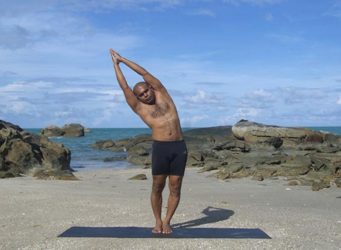

  

   
  

  

  

  

  

  

   <b class="calibre3">
    Tiryaka Tadasana
   </b>
  

  

  

  

   <b class="calibre3">
   </b>
  

  

   <i class="calibre4">
    Swaying Palm Tree Pose
   </i>
  

  

   <b class="calibre3">
    Meaning:
   </b>
  

  

   Tiryaka means swaying
  

  

   Tada means palm tree
  

  

  

  

  

  

  

  

  

  

   Story:
  

  

  

  

   An  Upanishad story  speaks  of  two  birds  perched  on  the  branch  of  a  pippala tree,  representing  the  body.  The  first  bird  represents  a  being  that  regards himself as the jivatman or individual self and the fruit it eats signifies sensual pleasure.
  

  

  

  

   In  the  same  body  (symbolized  by  the  tree)  the  second  bird  represents  the Paramatma.  He  is  the  support  of  al   being  but  he  does  not  know  sensual pleasure. Since he does not eat the fruit he natural y does not have the same experience as the jivatman.
  

  

  

  

   The Upanishad speaks with poetic beauty of the two birds. He who eats  the fruit is the individual self, jiva, and he who does not eat is the Supreme Reality, the one who knows himself to be the Atman.
  

  

  

  

  

  

   Bhagavad Gita, Chap 12, v.15
  

  

   <i class="calibre4">
    yasman nodvijate loko
   </i>
  

  

   <i class="calibre4">
    lokan nodvijate ca yah
   </i>
  

  

   <i class="calibre4">
    harsamarsa-bhayodvegair
   </i>
  

  

   <i class="calibre4">
    mukto yah sa ca me priyah
   </i>
  

  

  

  

   Krishna mentions to Arjuna: "He for whom no one is put into difficulty and who is not disturbed by anyone, who is equipoised in happiness and distress, fear and anxiety, is very dear to Me."
  

  

  

  

   
  

  

  

  

  

  

   So,  like  a  swaying  palm  tree,  strong  and  steady,  we  need  to  bring  total awareness  and  focus  into  this  pose  to  achieve  total  stability  and  steadiness while swaying from side to side.  We should not let our mind waver in times of distress and troubles, but to remain equanimous and achieve the desired optimum result.
  

  

  

  

   <b class="calibre3">
    Technique (Getting into the pose):
   </b>
  

  

   Stand in Tadasana
  

  

   Inhaling,  raise  both  arms  up  and  join  the  palms.  Stretch  the  spine upwards at the same time
  

  

   Exhaling, bend to the right side from the waist. Try not to bend forward or backward or twist the trunk
  

  

   Gaze up towards the ceiling
  

  

  

  

   <b class="calibre3">
    Technique (Getting out of the pose):
   </b>
  

  

   <b class="calibre3">
   </b>
  

  

   Inhaling, slowly come back to centre
  

  

   Exhaling, release the arms. Repeat on the other side
  

  

   <b class="calibre3">
   </b>
  

  

   <b class="calibre3">
    Tips:
   </b>
  

  

   While  inhaling,  elongate  the  spine  upwards  to  al ow  more  space between the vertebrae for side bending
  

  

   Engage the gluteal muscles for extra stability
  

  

   <b class="calibre3">
   </b>
  

  

   <b class="calibre3">
    Physical Benefits:
   </b>
  

  

   Stretches and tones the obliques
  

  

   Increases the flexibility of the spine
  

  

   Balances the right and left group of back muscles
  

  

  

  

   <b class="calibre3">
    Therapeutic
   </b>
   <b class="calibre3">
    Benefits:
   </b>
  

  

   Massages the intestines
  

  

   Stretches the intercostals muscles
  

  

   Beneficial for people with scoliosis
  

  

   <b class="calibre3">
   </b>
  

  

   <b class="calibre3">
    Spiritual Benefits:
   </b>
  

  

   Enhances the muladhara and manipura chakra
  

  

  

  

   <b class="calibre3">
    Contraindications:
   </b>
  

  

   Back problems
  

  

  

  

   
  

  

  

  

   <b class="calibre3">
    Modifications:
   </b>
  

  

   Place one hand next to the thigh and raise one hand up instead Common mistakes
  

  

   Corrections
  

  

   Body is col apsing forwards
  

  

   Maintain the chest facing front instead of
  

  

   to the floor. Keep shoulders in same
  

  

   plane.
  

  

   Not lifting the chest
  

  

   Inhale and squeeze the shoulder blades
  

  

  

  

   together
  

  

   Holding of breath
  

  

   Keep breathing at the thoracic region
  

  

   Compressing the spine while
  

  

   Engage the back muscles
  

  

   bending lateral y
  

  

   Bending the elbows
  

  

   Engage the triceps brachii to straighten
  

  

   the arms
  

  

  

  

  

  

  

  

   <b class="calibre3">
   </b>
  

  

  

  

   
  

  

  

