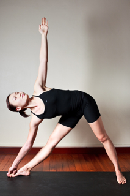

  

   
  

  

  

  

   <b class="calibre3">
    Trikonasana
   </b>
  

  

   <i class="calibre4">
    Triangle Pose
   </i>
  

  

   <b class="calibre3">
    Meaning:
   </b>
  

  

   Tri means three
  

  

   Kona means angle
  

  

  

  

   <b class="calibre3">
   </b>
  

  

   <b class="calibre3">
   </b>
  

  

  

  

   Story:
  

  

  

  

   The  triangle  appears  in  many  forms.  Some  qualities  associated  with  the triangle are stability, strength and steadiness. Lord Shiva has the trident known as the tirisoolam, which symbolizes the 3 gunas: sattvic, rajasic and tamasic.
  

  

  

  

   Photographers use the tripod to  take steady shots. The union of mind, body and spirit is known as yoga. The 3 bodies, tricycle, trinity and many more terms are derived from the qualities of the triangle.
  

  

   <b class="calibre3">
    Technique (Getting into the pose):
   </b>
  

  

   Stand in Tadasana
  

  

   Jump or step both legs sideways to 2 to 2.5 hip width apart 3.
  

  

   Tuck in the tailbone and engage the gluteal muscles to maintain a firm stance
  

  

   Square hips to the side. Feet forming a right angle
  

  

   Inhaling, raise both arms sideways to shoulder level
  

  

   Reach the body to the front to the maximum
  

  

   Exhaling, place the front hand on the same side shin or hold on to the big toe. Keep the body within a single plane
  

  

   Extend the back arm up towards the ceiling, with active fingers 10.  Turn the neck and gaze up towards the raised thumb
  

  

  

  

   
  

  

  

  

   <b class="calibre3">
    Technique (Getting out of the pose):
   </b>
  

  

   Turn the head back to face forwards
  

  

   Inhaling, contract the obliques and bring the body upright 3.
  

  

   Exhaling, lower the arms down by the side of the legs
  

  

   Jump back to Tadasana
  

  

  

  

   <b class="calibre3">
    Tips:
   </b>
  

  

   Lengthen the sides of the trunk
  

  

   Twist the chest and trunk up towards the ceiling
  

  

   Reach  the  wrists  away  from  each  other  to  get  an  extension  and expansion across the chest and the upper back
   <b class="calibre3">
   </b>
  

  

   Ground the big toe mound of the front foot
  

  

   Make sure respective knees and feet face the same direction 6.
  

  

   Press the back heel down without lifting the arches of the foot 7.        Tuck in the tailbone
  

  

  

  

   <b class="calibre3">
    Physical Benefits:
   </b>
  

  

   Tones up the leg muscles
  

  

   Tones and stretches the muscles along the sides of the body 3.
  

  

   Elongates the spine laterally
  

  

   Strengthens the ankles
  

  

   Tones up the upper trapezius muscles.
  

  

   Increases flexibility of the hips during external rotation of the femurs 7.
  

  

   Strengthens the external rotator muscles
  

  

   Expands the chest
  

  

  

  

   <b class="calibre3">
    Therapeutic
   </b>
   <b class="calibre3">
    Benefits:
   </b>
  

  

   Removes stiffness in the legs and hips
  

  

   Relieves backaches and neck sprains
  

  

   Tones the spinal nerves and abdominal organs
  

  

   Increases peristalsis of the digestive tract for better bowel movements and increased appetite
  

  

   Massages the liver and spleen
  

  

   Beneficial for people suffering from a shortening of one leg, as a result of fractures in the hip, thigh or other lower limb bones
  

  

  

  

   <b class="calibre3">
   </b>
  

  

   <b class="calibre3">
   </b>
  

  

   <b class="calibre3">
   </b>
  

  

  

  

   
  

  

  

  

   <b class="calibre3">
    Spiritual Benefits:
   </b>
  

  

   Enhances the manipura chakra and pulls prana from the muladhara chakra up to the head
  

  

  

  

   <b class="calibre3">
    Contraindications:
   </b>
  

  

   Back problems, sciatica
  

  

   <b class="calibre3">
   </b>
  

  

   <b class="calibre3">
    Modifications:
   </b>
  

  

   Place  the  hand  on  the  shin.  People  with  back  problems  can  bend  the knee slightly
  

  

   Place a block by the side of the little toe for beginners Common mistakes
  

  

   Corrections
  

  

   Body leaning forward, chest
  

  

   Do not reach for the floor, instead
  

  

   col apsing
  

  

   reach more towards the right. Open
  

  

   chest towards ceiling. Keep the body
  

  

   in a single plane.
  

  

   Neck is col apsing
  

  

   Draw shoulders away from ears.
  

  

   Engage the neck muscles to keep the
  

  

   cervical spine in a neutral position
  

  

   Knee is bent
  

  

   Straighten the knee by contracting
  

  

   the quadriceps and lifting the knee
  

  

   caps
  

  

  

  

   <b class="calibre3">
   </b>
  

  

  

  

   <b class="calibre3">
   </b>
  

  

  

  

   
  

  

  

  

  

  

   <b class="calibre3">
   </b>
  

  

  

  

   <b class="calibre3">
   </b>
  

  

  

  

  

  

  

  

  

  

  

  

  

