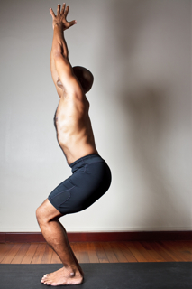
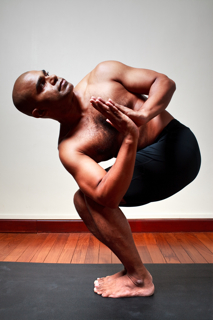

  

   
  

  

  

  

   <b class="calibre3">
    Utkatasana
   </b>
  

  

   <i class="calibre4">
    Chair/Fierce Pose
   </i>
  

  

   <b class="calibre3">
    Meaning:
   </b>
  

  

   Utkata means, fierce,
  

  

   powerful and mighty
  

  

   in Sanskrit. It is more
  

  

   commonly known as
  

  

   chair pose as it
  

  

   resembles the shape of
  

  

   a chair
  

  

  

  

   <b class="calibre3">
   </b>
  

  

   Story:
  

  

  

  

   When  we  imagine  a  chair,  the  fol owing  words  immediately  come  into  our mind:  steady,  strong,  comfortable,  supportive,  throne,  power,  respect.  The humble  chair  has  served  as a  fundamental  support  for  daily  life  through  the ages. In Egypt, chairs were made of ebony and ivory, or of carved and glided wood, covered with costly materials.
  

  

   In China, during the Tang dynasty, the high chair became a mark of respect and power. In India, the Maharajas ruled their kingdoms upon elaborately designed chairs.  As  such,  the  chair  has  become  a  symbol  of  power  and  majesty.
  

  

   <b class="calibre3">
    Technique (Getting into the pose):
   </b>
  

  

   Stand in Tadasana
  

  

   Inhaling, raise both arms up and join the palms together
  

  

   Exhaling, engage the abdominal muscles by tucking in tailbone and bend the knees
  

  

   Push the buttocks back while keeping the body upright. Keep the knees behind toes as much as possible
  

  

   Gaze towards the thumbs
  

  

   <b class="calibre3">
   </b>
  

  

   <b class="calibre3">
    Technique (Getting out of the pose):
   </b>
  

  

   Inhaling, straighten the knees
  

  

   Exhaling, slowly lower the arms down by the sides of the body 108
  

  

   
  

  

  

  

   <b class="calibre3">
    Tips:
   </b>
  

  

   The trunk wil  have a natural tendency to lean forwards. Keep engaging the abdomen to pul  the trunk back towards the vertical axis 2.
  

  

   Keep the heels down at al  times and the arches of the feet down 3.
  

  

   Extend the abdomen, lift the front rib-cage and stretch the armpits 4.
  

  

   Pul  the waist, the top of the trunk and the arms back
  

  

   Keep the elbows straight and behind the back of the ears, pinching the shoulder blades together
  

  

  

  

   <b class="calibre3">
    Physical Benefits:
   </b>
  

  

   Strengthens the quadriceps and glutes
  

  

   Tones the core muscles
  

  

   Stretches the Achil es tendon and calves
  

  

   Lifts up the rib cage and promotes ful er breaths
  

  

  

  

   <b class="calibre3">
    Spiritual Benefits:
   </b>
  

  

   Enhances the muladhara and swadhisthana chakras
  

  

  

  

   <b class="calibre3">
    Contraindications:
   </b>
  

  

   Knee joint problems
  

  

  

  

   <b class="calibre3">
    Modifications:
   </b>
  

  

   Beginners can keep the hands on the knees or level with the shoulders
  

  

   <b class="calibre3">
   </b>
  

  

   Common mistakes
  

  

   Corrections
  

  

   Lumbar arched excessively
  

  

   Tuck the tailbone under and engage
  

  

   the abdominal muscles. Think about
  

  

   lengthening the lower back and
  

  

   sacral region.
  

  

   Body leaning too far forwards
  

  

   Keep engaging the abdomen to pul
  

  

   the trunk back towards the vertical
  

  

   axis.
  

  

   Knees bowed outwards
  

  

   Contract the inner thighs (adductor
  

  

   muscles), internally rotate the
  

  

   femurs. Use the anterior tibialis to
  

  

   rotate the tibia inwards.
  

  

   <b class="calibre3">
   </b>
  

  

  

  

   
  

  

  

  

   
  

  

  

  

   <b class="calibre3">
    Parivritta Utkatasana
   </b>
  

  

   <i class="calibre4">
    Revolved
   </i>
  

  

   <i class="calibre4">
    Chair/Fierce Pose
   </i>
  

  

   <b class="calibre3">
    Meaning:
   </b>
  

  

   Parivritta means
  

  

   revolving
  

  

   Utkata means fierce
  

  

  

  

   <b class="calibre3">
   </b>
  

  

   <b class="calibre3">
   </b>
  

  

   Story:
  

  

  

  

   Every  pose  of  yoga  teaches  you  something  unique.  The  name  given  to  each asana does not reflect just a name but an inner thought and feeling. When it comes to this asana, it is critical to understand that it is not about being fierce or powerful.
  

  

  

  

   The power or fierceness in this pose is felt through full engagement through every part of your body. This is an imaginary chair that helps you find power, achieving  a  seated  pose  without  physical  support.  Holding  this  pose  is  a discovery of strength and stamina.
  

  

   <b class="calibre3">
    Technique (Getting into the pose):
   </b>
  

  

   Come into Tadasana, palms in prayer
  

  

   Inhale,  sink  the  hips,  bend  the  knees  and  stretch  the  arms  above  the head, palms facing each other
  

  

   Exhale and adjust the tailbone to point down as if to sit on a invisible chair and keep the tummy engaged to support the lower spine 4.
  

  

   Exhale, bring hands to heart center, twist from the waist up to bring the opposite elbow to the outside of the opposite knee
  

  

   Repeat on the other side
  

  

  

  

  

  

   
  

  

  

  

   <b class="calibre3">
    Technique (Getting out of the pose):
   </b>
  

  

   Inhale, turn the body back to centre, straighten the knees 2.
  

  

   Exhale, come back to Tadasana
  

  

  

  

   <b class="calibre3">
    Tips:
   </b>
  

  

   Make sure the knees are aligned with one another
  

  

   Feet are paral el and kept close to one another
  

  

   While in the pose, push the palms against each other, while pushing the elbow against the knee to get the chest to ultimately face the ceiling 4.
  

  

   You may choose to gaze upwards or downwards
  

  

  

  

   <b class="calibre3">
   </b>
  

  

   <b class="calibre3">
    Physical Benefits:
   </b>
  

  

   Improves concentration and balance, stretches spinal nerves to improve nervous system function
  

  

   Massages and strengthens the sides of the waist
  

  

   The squat action sculpts the gluteal muscles, and strengthens the thighs and lower back muscles for better posture
  

  

   The chest opening effect aids respiration
  

  

   The upper twist squeezes the kidneys, intestines, and all other digestive organs, facilitating their revitalization and cleansing process
   <b class="calibre3">
    Therapeutic
   </b>
   <b class="calibre3">
    Benefits:
   </b>
  

  

   Reduces anxiety, depression and stress from daily activities 2.
  

  

   Increased prana is brought to the neck and shoulder areas 3.
  

  

   Helps to enhance the groin and inner thigh region
  

  

   Nerve and muscular coordination is enhanced
  

  

   Enhances calmness and the attitude of satya (truthfulness) and santosha (contentment)
  

  

   <b class="calibre3">
   </b>
  

  

   <b class="calibre3">
    Contraindications:
   </b>
  

  

   Those with shoulder or rotator cuff injuries can place one forearm across the thighs and the other hand at the back of the hip
  

  

   People with severe lower back injury should tuck the tailbone under and not hyperextend the lumbar region
  

  

   <b class="calibre3">
   </b>
  

  

   <b class="calibre3">
   </b>
  

  

   <b class="calibre3">
   </b>
  

  

   <b class="calibre3">
   </b>
  

  

   <b class="calibre3">
   </b>
  

  

  

  

   
  

  

  

  

   <b class="calibre3">
    Modifications:
   </b>
  

  

   This pose can also be done on tip toes
  

  

  

  

   In the advanced version, place one palm on the floor, the other lifted towards the ceiling
  

  

  

  

  

  

   Common mistakes
  

  

   Corrections
  

  

   Not lifting the sternum
  

  

   Inhale and squeeze the shoulder
  

  

   blades together and depress the
  

  

   shoulder blades
  

  

   Body not twisting enough
  

  

   Exhale and twist deeper from the
  

  

   mid-back region
  

  

   Bending at the thoracic region
  

  

   Engage the upper back muscles
  

  

   Fal ing forwards or backwards
  

  

   Stabilize the pelvis and tuck the
  

  

   tailbone under. Lift through the side
  

  

   trunk and pull the abdominal organs
  

  

   upwards. Keep a steady gaze.
  

  

  

  

   
  

