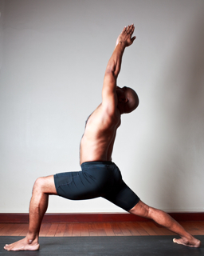

  

   
  

  

  

  

   <b class="calibre3">
    Virabhadrasana 1
   </b>
  

  

   <i class="calibre4">
    Warrior 1
   </i>
  

  

   <b class="calibre3">
    Meaning:
   </b>
  

  

   Virabhadra means
  

  

   fierce warrior created
  

  

   out of Lord Shiva’s
  

  

   hair
  

  

  

  

   <b class="calibre3">
   </b>
  

  

   <b class="calibre3">
   </b>
  

  

   <b class="calibre3">
   </b>
   Story:
  

  

  

  

   Virabhadra  is  a  super  being  created  by  Shiva  to  kil   his  father-in-law,  Daksa.
  

  

   Virabhadra was created to avenge Shiva's wife, Sati’s death.
  

  

  

  

   Daksa,  organized  a  banquet  for  a  great  sacrifice  and  did  not  invite  Shiva.
  

  

   Greatly humiliated, Sati went to the banquet and self immolated by invoking yogic flames.
  

  

  

  

   When Shiva heard about his wife's death, he tore a hair out of his head and threw  it  on  the  ground.  From  this  hair  rose  a  great  warrior  and  hero Virabhadra. Virabhadra and his army destroyed Daksa banquet and kil ed him.
  

  

  

  

   <b class="calibre3">
    Technique (Getting into the pose):
   </b>
  

  

   Stand in Tadasana
  

  

   Bring the arms up alongside the ears. Either keep the palms shoulder width apart, or for a greater chal enge and the classic pose, bring the hands together
  

  

   Inhale and step one foot about 4 feet forwards
  

  

   Square the trunk and hips to the front
  

  

  

  

   
  

  

  

  

   Exhale,  bend  the  front  knee  to  a  90°  angle.  The  thigh  bone  should  be paral el to the floor
  

  

   Do not take the knee past the ankle, as this puts undue pressure on the knee joint
  

  

   Look up at the raised thumbs for the classic pose. If this is hard on the neck, look forwards
  

  

   Repeat on the other side
  

  

  

  

   <b class="calibre3">
    Technique (Getting out of the pose):
   </b>
  

  

   Inhale  and  straighten  the  knees,  step  the  back  foot  forwards,  keeping the arms lifted
  

  

   Exhale bring the arms down and return to Tadasana
  

  

  

  

   <b class="calibre3">
    Tips:
   </b>
  

  

   Ground through the big toe mount of the front foot
  

  

   Extend the back leg away from the front and press into the outer edge of the back foot
  

  

   Tuck in the tailbone and create space in the lower back
  

  

   Broaden the back ribs and square chest to the front
  

  

   Lift chest, sternum and col arbones up towards the ceiling 6.
  

  

   Reach both arms up towards the ceiling
  

  

   Soften the neck and the shoulders
  

  

  

  

   <b class="calibre3">
    Physical Benefits:
   </b>
  

  

   Strengthens  and  stretches  the  legs  and  ankles.  Decompression  of  the inter-vertebral joints takes place, providing relief from sciatic pain 2.
  

  

   With  the  correct  alignment,  the  body  develops  coordination,  balance, poise and strength
  

  

   In  addition,  the  warrior  pose  stretches  the  groins,  chest,  lungs  and shoulders. Therapeutic  for  osteoporosis  and  sciatica. Because  of  the stretch of the para spinal muscles and the inter-vertebral ligaments, any fusion or arthritic change in the spinal joints can be prevented 4.
  

  

   Improve  sluggish  circulation  in  the  lower  limbs,  and  improve  venous return
   <b class="calibre3">
    .
   </b>
   The  longer  the  posture  is  held,  body  heat  increases  and circulation  is  improved.  When  warrior  pose  is  held  for  a  reasonable period, the cardiac muscle is strengthened
  

  

   As standing poses are static, there is very minimal lactic acid formation in the muscles so fatigue of the circulatory system is less likely to occur 6.
  

  

   Improves blood circulation to the inner organs while massaging them.  In particular, increases circulation to pelvic floor, stimulates sex organs 118
  

  

   
  

  

  

  

   Digestion is stimulated and the pose helps to relive constipation 8.
  

  

   Improves concentration and balance, stretches spinal nerves to improve nervous system function
  

  

   Massages and strengthens the sides of the waist, strengthening muscles of the leg for improved posture
  

  

  

  

   <b class="calibre3">
    Contraindications:
   </b>
  

  

   Those with shoulder or rotator cuff injuries can place hands at the back of hips
  

  

   People  with  severe  lower  back  injury  should  tuck  the  tailbone  under more and not hyperextend the lumbar region
  

  

   Those with knee and ankle injury should take care not to put too much pressure on either one of the joints
  

  

   <b class="calibre3">
   </b>
  

  

   <b class="calibre3">
    Modifications:
   </b>
  

  

   To focus on the legs and trunk and to relieve the shoulders and neck, do the pose with the hands on the hips. Point elbows back, squeezing shoulder blades together to help activate the sides of the trunk and lift the chest
  

  

   <b class="calibre3">
   </b>
  

  

   Common mistakes
  

  

   Corrections
  

  

   Hips are not square to the front
  

  

   Make sure heels are hip width apart
  

  

   and back foot is turned out at a 45°
  

  

   angle. Lift the back heel if required
  

  

   Hyper extending the lumbar region  Tuck the tailbone under and bring the navel back towards the spine
  

  

   Bending at the thoracic region
  

  

   Engage the upper back muscles
  

  

   Not lifting the sternum
  

  

   Lift the elbows and shoulders higher
  

  

   and squeeze the shoulder blades
  

  

   Torso leaning towards the front
  

  

   Keep the pelvis stable and lift the
  

  

   knee
  

  

   side trunk
  

  

   <b class="calibre3">
   </b>
  

  

   <b class="calibre3">
   </b>
  

  

  

  

   
  

  

  

