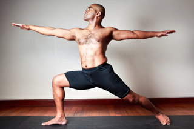

  

   
  

  

  

  

   <b class="calibre3">
    Virabhadrasana 2
   </b>
  

  

   <i class="calibre4">
    Warrior 2
   </i>
  

  

   <b class="calibre3">
    Meaning:
   </b>
  

  

   Virabhadra means
  

  

   fierce warrior created
  

  

   out of Lord Shiva’s
  

  

   hair
  

  

  

  

  

  

   <b class="calibre3">
    Technique (Getting into the pose):
   </b>
  

  

   Stand in Tadasana
  

  

   Inhale  and  step  the  feet  out  into  Utthita  Hasta  Padasana  (Extended Hands and Feet Pose)
  

  

   Step the feet wide apart
  

  

   Square hips to the side. Feet forming a right angle
  

  

   Exhale,  bend  the  front  knee  at  a  right  angle,  keeping  the  trunk  ful y vertical, the sternum lifted, chest open. Do not take the knee past the ankle, as this puts undue pressure on the knee joint.
  

  

   Look to the front thumb
  

  

  

  

   <b class="calibre3">
    Technique (Getting out of the pose):
   </b>
  

  

   Inhale, straighten the front knee and return to Utthita Hasta Padasana (Extended Hands and Feet Pose)
  

  

   Repeat on the other side.
  

  

   Bring the hands down by the side of the shoulders
  

  

   Exhale, hop back to Tadasana
  

  

  

  

   <b class="calibre3">
    Tips:
   </b>
  

  

   Ground the big toe mound of the front foot
  

  

   Keep  the  front  thigh,  knee  and  toes  pointing  towards  the  same direction.
  

  

   Ground the outer edge of the back foot
  

  

   Tuck the tailbone under
  

  

   Lift the chest and upper abdomen
  

  

  

  

   
  

  

  

  

   Reach arms away from each other
  

  

   Spread the thighs away from each other
  

  

   Soften the shoulders
  

  

  

  

   <b class="calibre3">
    Physical Benefits:
   </b>
  

  

   Standing poses are static with low lactic acid formation in the muscles, so fatigue in the circulatory system is less likely to occur 2.
  

  

   Improves  the  blood  circulation  to  the  inner  organs  while  massaging them.  In particular, increases circulation to pelvic floor, stimulates sex organs.
  

  

   As  you  hold  the  posture  longer,  capacity  of  the  circulatory  and respiratory systems are enhanced and venous return is improved 4.
  

  

   Expands the intercostal muscles, improving respiration
  

  

  

  

   <b class="calibre3">
    Therapeutic
   </b>
   <b class="calibre3">
    Benefits:
   </b>
  

  

   <b class="calibre3">
   </b>
  

  

   <b class="calibre3">
    Contraindications:
   </b>
  

  

   High  blood  pressure,  increased  awareness  in  relaxing  facial  and  neck muscles
  

  

   Medical  conditions  that  affect  balance  such  as  Parkinson’s  disease, multiple sclerosis and stroke
  

  

   Diarrhea
  

  

   Neck problems, look forward instead of looking to thumb
  

  

  

  

   <b class="calibre3">
    Modifications:
   </b>
  

  

   If  you  have  difficulty  balancing  or  find  the  pose  too  deep,  decrease  the distance between your feet. Stil  ensure that the front knee is over the ankle and not over the toes
  

  

   <b class="calibre3">
   </b>
  

  

   For a deeper variation, move the left heel back a few more inches and bring the right thigh paral el with the floor; ensure that the front knee is stil  over the ankle and not over the toes, keep the tailbone tucked under
   <b class="calibre3">
   </b>
  

  

   <b class="calibre3">
   </b>
  

  

   <b class="calibre3">
   </b>
  

  

  

  

  

  

  

  

  

  

   
  

  

  

  

   Common mistakes
  

  

   Corrections
  

  

   Pain in front knee
  

  

   Spread the legs wide, sink the hips
  

  

   low to prevent injury on the knees
  

  

   Pushing the lower abdomen
  

  

   Tuck the tailbone under and bring
  

  

   outwards and hyper extending the
  

  

   the navel back towards the spine
  

  

   lumbar region
  

  

   Hyper flexion of the thoracic region  Engage the upper back muscles, lift the sternum up
  

  

   Bending the knees of the back leg
  

  

   Engage quadriceps and pull the knee
  

  

   caps upwards towards the pelvis
  

  

   Torso leaning towards the front
  

  

   Keep the pelvis stable and lift the
  

  

   knee
  

  

   side trunk vertical y upwards
  

  

  

  

  

  

  

  

  

  

  

  

  

  

  

  

  

  

   <b class="calibre3">
   </b>
  

  

   <b class="calibre3">
   </b>
  

  

  

  

   
  

  

  

