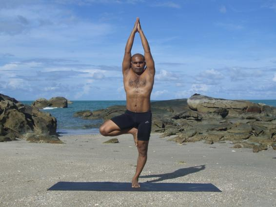

  

   
  

  

  

  

  

  

   <b class="calibre3">
    Vrikshasana
   </b>
  

  

  

  

   <b class="calibre3">
   </b>
  

  

  

  

  

  

   <i class="calibre4">
    Tree Pose
   </i>
  

  

  

  

   <b class="calibre3">
   </b>
  

  

   <b class="calibre3">
    Meaning:
   </b>
  

  

   Vriksha: Tree
  

  

  

  

  

  

  

  

  

  

  

  

  

  

  

  

   Story:
  

  

   The tree pose represents strength, uprightness and grace.  The tree has total balance  with  the  spread  of  branches,  a  strong  sturdy  trunk  and  roots  which reach deep and wide into the ground.  Just like how the roots draw and send water to every part of the tree, this posture sends energy and prana from the foot to the muladhara and further up to the crown of the head.
  

  

  

  

   The Chinese believe that trees house souls and spirits and thus are considered auspicious  and  sacred.  The  oak  tree  has  very  important  significance  in  the Western  culture.  Major  decisions  were  commonly  made  under  oak  trees.
  

  

   Buddha also found enlightenment while meditating under the Bodhi tree.
  

  

  

  

   Like  trees,  we  can  only  ensure  survival  if  our  trunk,  roots  and  branches  are sturdy and flexible, protecting us from the vagaries of weather.
  

  

  

  

   From The Bhagavd Gita, Chapter 15 v.1
  

  

   <i class="calibre4">
    sri-bhagavan uvaca
   </i>
  

  

   <i class="calibre4">
    urdhva-mulam adhah-sakham
   </i>
  

  

   <i class="calibre4">
    asvattham prahur avyayam
   </i>
  

  

   <i class="calibre4">
    chandamsi yasya parnani
   </i>
  

  

   <i class="calibre4">
    yas tam veda sa veda-vit
   </i>
  

  

  

  

  

  

  

  

   
  

  

  

  

   Translation
  

  

  

  

   The Blessed Lord said: “There is a banyan tree which has its roots upwards and its branches down and whose leaves are the Vedic hymns. One who knows this tree is the knower of the Vedas.”
  

  

  

  

   Using  this  banyan  tree  as  an  analogy  for  the  material  world  -  one  who  is engaged in activities with the intention to hoard benefits, sees no end to the banyan tree. He wanders from one branch to another, to another, to another.
  

  

   The tree of this material world has no end, and for one who is attached to this tree, there is no possibility of liberation.
  

  

  

  

   The Vedic hymns, meant for elevating oneself, are represented by the leaves of this tree. This tree's roots grow upward because they begin where Brahma is located,  the  topmost  planet  of  this  universe.  If  one  can  understand  this indestructible  tree  of  illusion,  then  one  can  get  out  of  it.
  

  

   <b class="calibre3">
    Technique (Getting into the pose):
   </b>
  

  

   Stand in Tadasana
  

  

   Bend one knee, take hold of the ankle and place the sole of the foot on the inner thigh of the standing leg with the toes pointing down towards the floor
  

  

   Bring the palms together into prayer in front of the chest 4.
  

  

   Inhale and raise the arms up over the head, alongside the ears 5.
  

  

   Repeat of the other side
  

  

  

  

   <b class="calibre3">
    Technique (Getting out of the pose):
   </b>
  

  

   Exhale, bring the palms down in front of the chest again and bring the leg back down
  

  

   Lower the hands to sides of the body into Tadasana
  

  

   <b class="calibre3">
   </b>
  

  

   <b class="calibre3">
    Tips:
   </b>
  

  

   Inhale for strength as you extend your spine
  

  

   Do not push the bel y outwards
  

  

   Breathe normal y as you hold the pose
  

  

   Push the arms back behind the ears and engage the back muscles 5.
  

  

   Lengthen  the  sides  of  the  body  so  as  to  open  the  intercostal  muscles further
  

  

   Spread the toes and ground through the standing foot. Lift up through the standing thigh
  

  

  

  

   
  

  

  

  

   Press the foot of bent leg into the inner thigh
  

  

   Reach the bent thigh out to the side without turning the pelvis 9.
  

  

   Keep the hips squared
  

  

   <b class="calibre3">
   </b>
  

  

   <b class="calibre3">
    Physical Benefits:
   </b>
  

  

   Improves concentration and balance, stretches spinal nerves to improve nervous system function.
  

  

   Massages and strengthens the sides of the waist, strengthening muscles of the leg for improved posture
  

  

   Loosens the pelvis, preventing numbness and rheumatic pain in the legs
   <b class="calibre3">
    Spiritual Benefits:
   </b>
  

  

   Shoulder  or  rotator  cuff  injuries  should  leave  hands  at  chest  level  in prayer
  

  

   People with severe lower back injury can place their heel on the calf and toes on the floor
  

  

  

  

   <b class="calibre3">
    Modifications
   </b>
  

  

   <b class="calibre3">
   </b>
  

  

   <b class="calibre3">
   </b>
  

  

  

  

   <b class="calibre3">
   </b>
  

  

  

  

   
  

  

  

  

  

  

   <b class="calibre3">
   </b>
  

  

   Common mistakes
  

  

   Corrections
  

  

   Not lifting the sternum
  

  

   Inhale and squeeze the shoulder
  

  

   blades together and depress the
  

  

   shoulder blades
  

  

   Holding of breath
  

  

   Keep breathing at the thoracic region
  

  

   Bending at the thoracic region
  

  

   Engage the upper back muscles
  

  

   Bending the elbows
  

  

   Engage the triceps brachii to
  

  

   straighten the arms
  

  

   No balance
  

  

   Stabilize the hips and tuck the
  

  

   tailbone under. Lift through the side
  

  

   trunk and pul  the abdominal organs
  

  

   upwards. Keep a steady gaze
  

  

  

  

   
  

  

  

