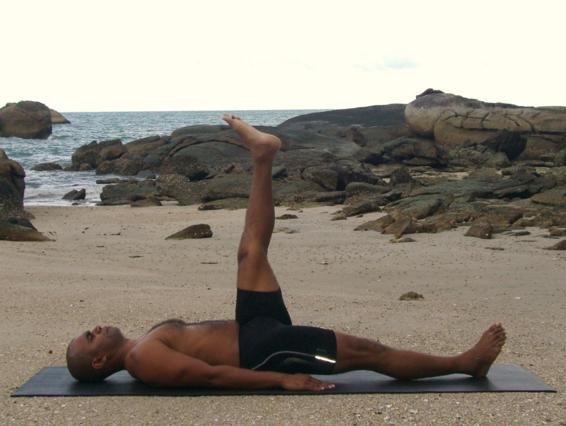

  

   
  

  

  

  

   <b class="calibre3">
    Eka Pada Uttanpadasana
   </b>
  

  

   <i class="calibre4">
    Single leg raise
   </i>
  

  

   <b class="calibre3">
   </b>
  

  

   <b class="calibre3">
    Meaning:
   </b>
  

  

   Eka: one
  

  

   Pada: leg
  

  

   Ut: intense
  

  

   tan: to stretch or
  

  

   extend
  

  

  

  

   <b class="calibre3">
   </b>
  

  

  

  

   <b class="calibre3">
    Story:
   </b>
  

  

  

  

   This pose looks like a ‘T’ and in standing looks like Virabhadrasana (Warrior) 3.
  

  

   This pose requires lots of body awareness of the hip flexors and control.
  

  

  

  

   Here is a story about a Frog in the Well:
  

  

   Once a frog that lived in a wel  was boasting to a turtle who was from the sea.
  

  

   "I am so happy!" cried the frog, "When I go out, I jump around the edge of the wel . When I come home, I rest in the holes inside the wal  of the wel . If I jump into the water, it comes all  the way up to my armpits and I can float on my bel y.  I  am  lord  of  this  wel   and  I  stand  tal   here.  My  happiness  is  great.
  

  

  

  

   My dear sir, why don't you come more often and look around my place?"
  

  

   Now it was the turtle’s turn to talk about the sea. "Even with a distance of a thousand miles we are unable to describe the size of the sea; even a height of a  thousand  meters  cannot  give  you  an  idea  of  its  depth.  In  the  time  of  the great  floods,  the  waters  in  the  sea  did  not  increase.  During  the  terrible droughts, the waters in the sea did not decrease. The sea does not change with the passage of time and its level does not rise or fal  according to the amount of rain. The greatest happiness is to live in the Sea.”
  

  

   After listening to these words, the frog in the wel  was shocked into realization of his own insignificance and became very uneasy.
  

  

  

  

   
  

  

  

  

   As  the  story  implies,  we  often  do  not  realize  the  difficulty  of  performing  a seemingly simple pose like this.  We tend to take for granted the subtleties of the  pose  which  serve  as  preparation  for  most  supine  poses.
  

  

   <b class="calibre3">
    Technique (Getting into the pose):
   </b>
  

  

   Lie flat on the back, feet together, hands by the side of the body. Point the toes up towards the ceiling
  

  

   Inhaling, engage the abs to ground the lower back as you lift the right leg up to 90 degrees. Keep both knees straight, ankles at right angles
   <b class="calibre3">
    Technique (Getting out of the pose):
   </b>
  

  

   Exhaling,  slowly  lower  the  leg  to  the  floor  with  control  engaging  the quads in eccentric contraction
  

  

  

  

   <b class="calibre3">
    Tips:
   </b>
  

  

   Avoid straining the lower back
  

  

   Try not to bend the knee if possible. In order to keep the leg straight, lift the knee cap by engaging the thighs
  

  

  

  

   <b class="calibre3">
    Physical Benefits:
   </b>
  

  

   Strengthens abdominal, back and quadriceps muscles
  

  

   Increases flexibility of hamstrings and gastronemius
  

  

   Allows venous blood to flow back to the heart, relieve tiredness in the legs, and reduces appearance of varicose veins in the long-run
   <b class="calibre3">
    Contraindications:
   </b>
  

  

   Sciatica, lower back pain
  

  

   <b class="calibre3">
   </b>
  

  

   <b class="calibre3">
    Modifications:
   </b>
  

  

   Those with lower back pain or weaker abdominal muscles can bend their knees slightly to relax the glutes.
  

  

  

  

   Those with tight leg extensors can:
  

  

   Practice with a belt to increase hamstring, glutes flexibility 2.
  

  

   Raise the leg up less than 90 degrees to work on abdominal strength 25
  

  

   
  

  

  

  

  

  

   To  improve  hamstring  flexibility,  catch  hold  of  the  ankle  and  pul   the  leg towards the face.
  

  

  

  

   To  increase  the  abdominal  strength  chal enge,  raise  both  legs.  Squeeze  both inner  thighs  together  to  engage  (adductors).  Be  sure  the  lower  back  is  not lifted off the floor.
  

  

  

  

   <b class="calibre3">
   </b>
  

  

   Common mistakes
  

  

   Corrections
  

  

   Over arching/straining lower back
  

  

   Engage the abdominal and core
  

  

   muscles to keep lower back flat on
  

  

   the ground. Round the lower back
  

  

   Holding of breath
  

  

   Keep steady breathing at mid ribs,
  

  

   inhale raise the leg, exhale lower
  

  

   Straining the neck muscles and
  

  

   Drag the shoulder blades towards
  

  

   tensing the chest
  

  

   the hips, sink the shoulders to the
  

  

   floor/mat
  

  

   The bottom leg is relaxed and rol ed  Keep bottom leg active by pointing inwards
  

  

   the toes up towards the ceiling and
  

  

   internally rotating the thigh bone
  

  

   <b class="calibre3">
   </b>
  

  

   <b class="calibre3">
   </b>
  

  

   <b class="calibre3">
   </b>
  

  

   <b class="calibre3">
   </b>
  

  

   <b class="calibre3">
   </b>
  

  

  

  

   <b class="calibre3">
   </b>
  

  

  

  

   <b class="calibre3">
   </b>
  

  

  

  

   
  

  

  

