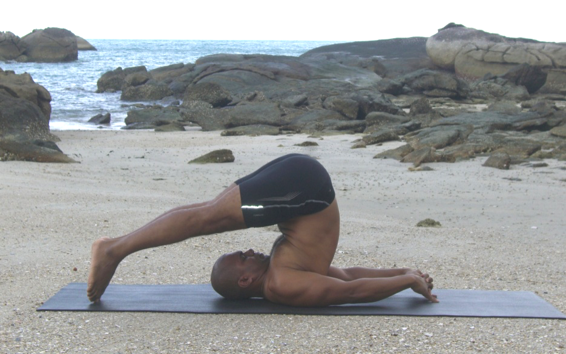

  

   
  

  

  

  

  

  

   <b class="calibre3">
    Halasana
   </b>
  

  

  

  

   <b class="calibre3">
   </b>
  

  

  

  

  

  

   <i class="calibre4">
    Plough Pose
   </i>
  

  

  

  

   <b class="calibre3">
   </b>
  

  

  

  

   <b class="calibre3">
    Meaning:
   </b>
  

  

  

  

   Hala: Indian plough
  

  

  

  

  

  

  

  

  

  

  

  

  

  

  

  

   <b class="calibre3">
    Story:
   </b>
  

  

  

  

   The  Gita  talks  about  renouncing  the  fruits  of  labor,  dedicating  them  to  the Supreme. The most difficult of these fruits to renounce are praise, recognition, fame  and  wealth.    We  can  also  relate  it  to  ploughing  the  ground  of  life  and making it fertile to receive the seeds of the divine inspiration.
  

  

  

  

   Even  to  sow  the  seeds  of  understanding  the  ground  of  the  mind  must  be ploughed. If we can plough our mind free of preconceived ideas, we would be free of convictions. A story in Ramayana il ustrates how the plough is used to reveal hidden treasures. King Janaka who was dedicated to Karma Yoga (Yoga of service and action), discovered a beautiful baby girl as he was ploughing the earth in the sacrificial ground one day. He adopted the baby and named her Sita. She later became the wife of Rama.
  

  

  

  

   We can also use the analogy of ploughing through our inner self to discover the atma in the path towards self-realization.
  

  

  

  

   <b class="calibre3">
    Technique (Getting into the pose):
   </b>
  

  

   Lie flat on the back, feet together and hands by the side of the body 2.
  

  

   Inhale lift both legs up to 90 degrees and take 5 breaths 3.
  

  

   Exhale and bring the legs and toes overhead, touching the floor 4.
  

  

   Extend the elbows and try to the interlace the fingers behind the back 5.
  

  

   Gaze sat the tip of the nose
  

  

   The eyes can be closed
  

  

  

  

   
  

  

  

  

   <b class="calibre3">
    Technique (Getting out of the pose):
   </b>
  

  

   Inhale first
  

  

   Exhale, bring the arms on the floor shoulder width apart, palms facing down
  

  

   Lower  the  body  down  vertebrae  by  vertebrae  until  the  legs  are  90
  

  

   degrees to the floor
  

  

   Lower both legs down
  

  

  

  

   <b class="calibre3">
    Tips:
   </b>
  

  

   Avoid  straining  the  lower  back  and  use  your  transverses  abdominis  to the maximum. Straighten the trunk
  

  

   Straighten the knees by engaging the quadriceps
  

  

   The legs and hands should move in opposite directions which helps to straighten the trunk and lengthen the spine
  

  

   Engage the inner thigh muscles to keep the legs together
  

  

   Stabilize the scapulae and lengthen the neck
  

  

  

  

   <b class="calibre3">
    Physical Benefits:
   </b>
  

  

   Strengthens rectus abdominis, transverses abdominis
  

  

   Increases  flexibility  of  spine  and  back  muscles  especial y  the  trapezius and erector spinae
  

  

   Helps relieve symptoms of menopause
  

  

   Keeps the intercostals muscles flexible
  

  

   Controls  hypertension  through  relieving  pressure  on  the  heart  muscle, improving blood circulation
  

  

   Helps to normalize slight deformities of the spine, maintaining a natural curve
  

  

   Prevents early degeneration of the bones
  

  

   Helps to develop healthy thyroid and parathyroid glands
  

  

   Helps to reduce congestion or enlargement of the liver and spleen 10.  Artists,  musicians  and  singers  benefit  by  performing  this  asana  as  the throat clears and the neck muscles become strong
  

  

  

  

   <b class="calibre3">
   </b>
  

  

   <b class="calibre3">
   </b>
  

  

   <b class="calibre3">
   </b>
  

  

   <b class="calibre3">
   </b>
  

  

   <b class="calibre3">
   </b>
  

  

   <b class="calibre3">
   </b>
  

  

   <b class="calibre3">
   </b>
  

  

  

  

   
  

  

  

  

   <b class="calibre3">
    Contraindications:
   </b>
  

  

   It  is  not  advisable  to  perform  the  pose  with  feet  on  the  floor  without  prior experience or supervision of an experienced instructor.
  

  

  

  

   Diarrhea
  

  

   Menstruation
  

  

   Spinal injuries like slipped disc
  

  

   Sciatica problems
  

  

   Neck injury
  

  

   Blocked arteries
  

  

   Asthma  or  high  blood  pressure:  practice  Halasana  with  the  legs supported on props.
  

  

   Pregnancy: If experienced with this pose, one can continue to practice it through pregnancy with any necessary modifications. Otherwise, avoid Halasana once you conceive.
  

  

  

  

   <b class="calibre3">
    Modifications:
   </b>
  

  

   Those with lower back pain or tightness in the hamstrings can bend their knees slightly
  

  

  

  

   Raise the legs slightly in cases of headache, bronchitis and asthma using a chair Bring hands to touch the toes above the head
  

  

  

  

   Keep hands on the back if pressing them to the floor is difficult
  

  

  

  

   <b class="calibre3">
   </b>
  

  

   <b class="calibre3">
   </b>
  

  

   <b class="calibre3">
   </b>
  

  

   <b class="calibre3">
   </b>
  

  

   <b class="calibre3">
   </b>
  

  

   <b class="calibre3">
   </b>
  

  

   <b class="calibre3">
   </b>
  

  

   <b class="calibre3">
   </b>
  

  

   <b class="calibre3">
   </b>
  

  

  

  

   
  

  

  

  

   Common mistakes
  

  

   Corrections
  

  

   Breathing becomes heavy and fast
  

  

   Do not rest the toes on the floor. Put
  

  

   it on a stool or bolster
  

  

   Holding of breath
  

  

   Keep breathing at the thoracic
  

  

   region
  

  

   Cramps in the hands
  

  

   Externally rotate the humerus more.
  

  

   Extend at the elbow further without
  

  

   hyperextending
  

  

   Turning the head
  

  

   Keep chin to the sternum and gaze
  

  

   steady at the nose tip
  

  

   Elbows are hyperextended when
  

  

   This defeats the purpose of
  

  

   trying to interlock the fingers and
  

  

   stretching the shoulder joints. Try to
  

  

   press hands to the floor
  

  

   bring the scapulae closer towards
  

  

   each other, externally rotate the
  

  

   humerus more and press the elbows
  

  

   (not hands) down firmly on the
  

  

   ground while interlocking the fingers
  

  

  

  

  

  

  

  

   
  

  

  

  

   <b class="calibre3">
   </b>
  

  

   <b class="calibre3">
   </b>
  

  

   <b class="calibre3">
   </b>
  

  

  

  

  

  

  

  

  

  

   <b class="calibre3">
   </b>
  

  

   <b class="calibre3">
   </b>
  

  

  

