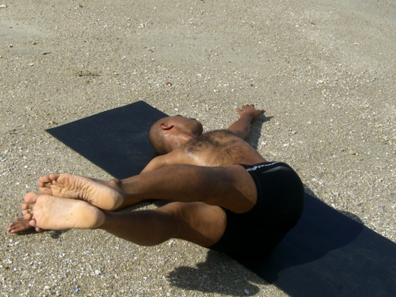

  

   
  

  

  

  

  

  

  

  

   <b class="calibre3">
    Jathara Parivartanasana
   </b>
  

  

  

  

   <i class="calibre4">
    Belly twist pose
   </i>
  

  

   <b class="calibre3">
    Meaning:
   </b>
  

  

   Jathara: belly
  

  

   Parivartana: twisting
  

  

  

  

   <b class="calibre3">
   </b>
  

  

   Story:
  

  

   Lord Ganesha's large bel y is a symbol of a perfect  man’s ability to consume and  digest  whatever  experiences  he  goes  through  with  an  unaffected  grace.
  

  

   Tales of Hindu mythology speak of Kubera, the god of wealth, who was offered dinner at Lord Ganesha’s  palace. After eating all the food that was prepared for  guests,  Lord  Ganesha  remained  unsatisfied  and  consumed  al   the  festive decorations  including  the  food/sweets.  At  this  point,  his  father  Lord  Shiva approached  him  and  offered  him  a  handful  of  roasted  rice.  Lord  Ganesha consumed the roasted rice and his hunger was satisfied immediately.
  

  

   The  moral  of  this  story  is  that  mankind  can  never  be  satisfied  with  worldly possessions  represented  by  Kubera's  feast.  The  consumption  of  the  humble handful  of  roasted  rice  indicates  the  destruction  of  desires  within  us.
  

  

   Thereafter,  we  remain  in  a  state  of  absolute  peace  and  bliss.  The  story  also tel s us that a handful of rice a day is sufficient to satisfy our hunger and is a lesson on eating moderately.
  

  

   Most  fats  wil   accumulate  around  the  bel y  before  other  parts  of  the  body.
  

  

   This rotational exercise strengthens the internal and external obliques to help 30
  

  

   
  

  

  

  

   reduce bel y fat and stabilize the spine. It also massages the abdominal organs and activates the manipura chakra.
  

  

  

  

   <b class="calibre3">
    Technique (Getting into the pose):
   </b>
  

  

   Lie on the back. Bring legs straight up together, spread arms on the floor slightly away from the body, palms facing down
  

  

   Inhaling, lift both legs to 90 degrees without bending the knees 3.
  

  

   Exhaling, twist the abdomen and lower both legs 45 degrees to the right with the toes almost touching the fingers (without touching the floor)
  

  

   <b class="calibre3">
   </b>
  

  

   <b class="calibre3">
   </b>
  

  

   <b class="calibre3">
    Technique (Getting out of the pose):
   </b>
  

  

   Inhaling, raise both legs back to centre in a controlled manner 2.
  

  

   Exhaling, (a) change sides or (b) lower both legs down to the floor.
  

  

  

  

   <b class="calibre3">
    Tips:
   </b>
  

  

   Keep the lower back and shoulders on the floor and twist from hips powerfully Instead of using arm strength, focus on the obliques for the movement
  

  

   <b class="calibre3">
   </b>
  

  

   <b class="calibre3">
   </b>
  

  

   <b class="calibre3">
    Physical Benefits:
   </b>
  

  

   Works the abdominal muscles especial y obliques, latissimus dorsi 2.
  

  

   Stretches the lower back, relieves sprains and nerve catches 3.
  

  

   Reduces excess bel y fat
  

  

   Tones and diminishes sluggishness of the liver, spleen and pancreas 5.
  

  

   Tones abdominal organs
  

  

   Alleviates gastritis**
  

  

  

  

   **Gastritis  is  the  inflammation  of  the  gastric  mucosa  (membrane)  of  the stomach caused by bacterial or fungal infection, smoking, excessive alcohol or caffeine intake, al ergies or stress.
  

  

  

  

   <b class="calibre3">
    Contraindications:
   </b>
  

  

   Recent abdominal surgery, spinal surgery
  

  

  

  

   <b class="calibre3">
    Modifications:
   </b>
  

  

   Beginners can start with knees curled
  

  

  

  

   
  

  

  

  

   <b class="calibre3">
   </b>
  

  

   <b class="calibre3">
   </b>
  

  

   <b class="calibre3">
   </b>
  

  

   Common mistakes
  

  

   Corrections
  

  

   Shoulders are lifted off the floor
  

  

   Focus on using obliques, not arms.
  

  

   Both shoulders blades should
  

  

   remain flat on the floor. Use the lats
  

  

   and traps to keep shoulder down on
  

  

   the mat
  

  

   Legs are separated
  

  

   Engage the inner thighs (adductors)
  

  

   to bring legs together
  

  

  

  

   
  

  

  

