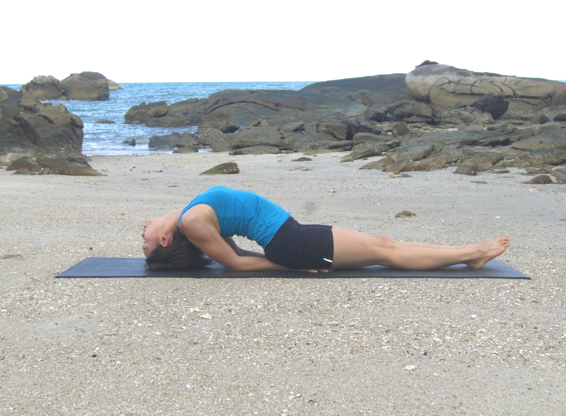

  

   
  

  

  

  

   <b class="calibre3">
   </b>
  

  

   <b class="calibre3">
    Matsyasana
   </b>
  

  

  

  

  

  

  

  

  

  

  

  

   <i class="calibre4">
    Fish pose
   </i>
  

  

   <b class="calibre3">
   </b>
  

  

   <b class="calibre3">
    Meaning:
   </b>
  

  

   Matsya: Fish. Also
  

  

   the first Avatar of
  

  

   Vishnu
  

  

  

  

  

  

  

  

  

  

   <b class="calibre3">
    Story:
   </b>
  

  

  

  

   The  Bhagavata  Purana  narrates  the  fol owing  tale  about  Vishnu's  Matsya incarnation (avatar):
  

  

  

  

   Long  ago,  when  life  first  appeared,  a  terrible  demon  terrorized  earth.  He prevented sages from performing their rituals and stole the Holy Vedas, taking refuge in a conch shel  in the depths of the ocean. Brahma, the creator of the world  approached  Vishnu  for  help  and  the  latter  immediately  assumed  the form of a fish (Matsya) and plunged into the ocean. He kil ed  the demon by ripping open his stomach and retrieved the Vedas.
  

  

  

  

   Four forms emerged from the demon's stomach representing the four Vedas: Rig, Sama, Atharva, and Yajur. Matsya is general y represented as a four-armed figure with the upper torso of a man and the lower body of a fish.
  

  

  

  

   This pose also helps a person to float on water without the help of the hands and legs.
  

  

   <b class="calibre3">
   </b>
  

  

   <b class="calibre3">
   </b>
  

  

   <b class="calibre3">
   </b>
  

  

  

  

   
  

  

  

  

   <b class="calibre3">
   </b>
  

  

   <b class="calibre3">
    Technique (Getting into the pose):
   </b>
  

  

   Lie flat on the back, feet together and hands by the side of the body 2.
  

  

   Place hands, palms facing down, under the buttocks and sit on them 3.        Bend  the  elbows,  push  them  into  the  ground.  Keep  the  weight  of  the upper body on the elbows and lift the chest up as much as possible 4.        Drop the head back so that the crown of the head is on the ground with the chest expanded
  

  

   Fix the gaze between the eyebrows in Shambavi mudra
  

  

  

  

   <b class="calibre3">
    Technique (Getting out of the pose):
   </b>
  

  

   Lift  the  head  and  bring  the  chin  to  the  chest  by  pressing  on  to  the elbows
  

  

   Gaze at the navel and slowly lower the spine to the floor vertebrae by vertebrae
  

  

   Gently move the shoulders to shake off any tension
  

  

   Slowly rol  the head from side to side once or twice, then bring the head back to center.
  

  

   <b class="calibre3">
   </b>
  

  

   <b class="calibre3">
    Tips:
   </b>
  

  

   Bring the shoulder blades together to have more opening in the chest 2.
  

  

   Engage the triceps to have optimal lift from the floor
  

  

   Firm  the  palms  on  the  floor  and  keep  the  rectus  and  transverses abdominis relaxed
  

  

   Point the toes away from the body
  

  

   Stabilize the mid-section of the body by contracting the gluteal muscles
   <b class="calibre3">
    Physical Benefits:
   </b>
  

  

   Gives a natural massage to the shoulders and neck
  

  

   Corrects rounded-shoulders by pul ing the shoulders to the back 4.
  

  

   Encourages  deep  thoracic  breathing  which  increases  lung  capacity, relieves spasm in the bronchial tubes and relieves asthma 5.
  

  

   Nourishes the cervical and upper dorsal nerves with an increased supply of blood
  

  

  

  

   
  

  

  

  

   Improves the functions of the parathyroid glands. These are four smal endocrine  glands  embedded  in  the  thyroid  tissue  in  the  neck.    The function  of  the  parathyroid  glands  is  to  regulate  calcium  levels  in  the blood and absorption by the body.  This is critical y important in relation to:
  

  

  

  

   * Contraction of al  muscles including the heart
  

  

  

  

   * Clotting of blood
  

  

  

  

   * Prevention of tooth decay
  

  

  

  

   Stimulates  and  tones  the  pituitary  and  pineal  glands,  located  in  the brain. The pituitary gland is considered to be the ‘master gland’ because it regulates the secretion of hormones and enzymes of other endocrine glands.
  

  

  

  

   <b class="calibre3">
    Spiritual benefits:
   </b>
  

  

   Regulates moods, emotions and stress
  

  

   Brings more prana to the neck and shoulder areas
  

  

   When  practiced  with  padmasana  or  lotus  legs,  prevents  loss  of  prana through the lower limbs
  

  

  

  

   <b class="calibre3">
    Contraindications:
   </b>
  

  

  

  

  

  

   <b class="calibre3">
    Modifications:
   </b>
  

  

   This pose is considered to be a beginners’ pose with the legs straight. When the  pose  is  done  with  padmasana  or  lotus  legs,  it  is  considered  to  be  an intermediate pose.
  

  

  

  

   If flexibility al ows, try this variation. In sukasana (easy seated pose), grab on to your toes. Lie back, arch back and lift chest, and rest glutes on your heels.
  

  

   Lay the top of your head on the floor.
  

  

   <b class="calibre3">
   </b>
  

  

   <b class="calibre3">
   </b>
  

  

   <b class="calibre3">
   </b>
  

  

   <b class="calibre3">
   </b>
  

  

  

  

   
  

  

  

  

   Common mistakes
  

  

   Corrections
  

  

   Chest is not lifted
  

  

   Bring shoulder blades together and
  

  

   engage triceps to get more lift. Think
  

  

   about expanding the thoracic region
  

  

   to the ful est.
  

  

   Holding of breath
  

  

   Keep breathing deeply in the throat
  

  

   region
  

  

   Cramps at the back muscles
  

  

   Regular short breathing wil  help to
  

  

   relieve cramps
  

  

   Head does not reach the floor
  

  

   Bring the elbows and scapulae closer
  

  

   together, and extend from the legs
  

  

   and tailbone more
  

  

   No arch formed at the lumbar spine  Pul  the bel y in towards the spine and lift the rib cage higher
  

  

  

  

  

  

   
  

