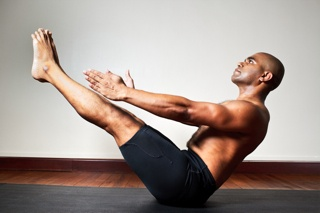
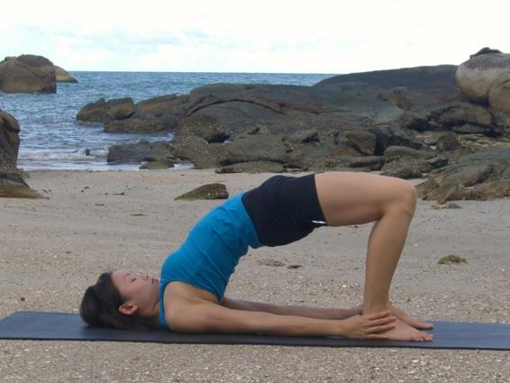

  

   
  

  

  

  

   <b class="calibre3">
    Navasana
   </b>
  

  

  

  

   <i class="calibre4">
    Boat Pose
   </i>
  

  

   <b class="calibre3">
    Meaning:
   </b>
  

  

   Nava: boat sail
  

  

  

  

   <b class="calibre3">
   </b>
  

  

  

  

   Story:
  

  

   Navasana  got  its  name  because  the  final  position  looks  like  a  boat  sail.  This asana  is  effective  for  alleviating  symptoms  of  diabetes  and  dyspepsia,  and encourages breath and mind control. Practicing it also increases appetite and enhances the manipura chakra, developing the spirit of adventure, enthusiasm and  bravery.  It  is  advised  not  to  practice  this  asana  if  you  suffer  from hypertension, heart disease or lumbar spondylitis.
  

  

  

  

   <b class="calibre3">
    The Story of Manu, the boat and the Fish:
   </b>
  

  

  

  

   Manu was a great saint and spent most of his time in meditation and penance.
  

  

   One day, Manu was washing his hands in the river when the waters brought to him a tiny fish. The fish pleaded with him to save it or it wil  be devoured by bigger fish. In return the fish said that it would save Manu from an impending flood that threatened to wash away al  living things. Manu agreed and put the fish in a pot, but it soon outgrew the pot, and he had to move it to a tank, a lake, and finally the sea itself. Once in the sea, the fish advised Manu to start building a boat as the flood was coming. Manu complied and when the boat was built and the waters rose, the fish returned and towed the boat by cable, saving  Manu.  The  fish  was  Vishnu  in  his  first  incarnation  as  Matsya  and  the cable was the serpent, Adisesa.
  

  

  

  

  

  

   
  

  

  

  

   <b class="calibre3">
    Technique (Getting into the pose):
   </b>
  

  

   Lie flat on the back, feet together and hands by side of hips 2.
  

  

   Inhale, lift both the legs up to 60 degrees
  

  

   Raise the hands point fingers towards the feet
  

  

   Exhale, pull in the belly, engage the transverses abdominis and peel the upper body off the floor, leaving only your sit bones in contact with the ground
  

  

   Gaze at your toes
  

  

  

  

   <b class="calibre3">
    Technique (Getting out of the pose):
   </b>
  

  

   Inhale raise the arms towards the ceiling
  

  

   Exhale,rol  back onto the mat vertebrae by vertebrae and lower the legs
  

  

   <b class="calibre3">
   </b>
  

  

   <b class="calibre3">
    Tips:
   </b>
  

  

   Avoid straining the lower back by engaging your transverses abdominis 2.
  

  

   Avoid jamming your chin towards the sternum
  

  

   Try not to bend the knees. Instead pul  the kneecaps up by contracting the quadriceps (hip flexor muscles)
  

  

   Engage the adductors by rolling the inner thighs towards each other 5.
  

  

   Stabilize the scapulae and lengthen the neck
  

  

   <b class="calibre3">
   </b>
  

  

   <b class="calibre3">
    Physical Benefits:
   </b>
  

  

   Strengthens  transverses  abdominis,  rectus  abdominis,  psoas,  obliques.
  

  

   Tones the quadriceps, adductors and glutes
  

  

   Increases flexibility of hamstrings
  

  

   Allows venous blood flow up through the legs, relieves tiredness in the legs, and reduces appearance of varicose veins in the long-run 4.
  

  

   Increases appetite
  

  

   Helps to improve balance on the sitting bones
  

  

   In  the  long-term,  enhances  the  manipura  chakra,  increasing  fighting spirit, enthusiasm and courage
  

  

   Help to moderate breathing at the thoracic region
  

  

   Massages the intestines
  

  

   Heats up the entire body
  

  

  

  

   <b class="calibre3">
   </b>
  

  

   <b class="calibre3">
   </b>
  

  

   <b class="calibre3">
   </b>
  

  

   <b class="calibre3">
   </b>
  

  

   <b class="calibre3">
   </b>
  

  

   
  

  

  

  

   <b class="calibre3">
    Contraindications:
   </b>
  

  

   Those  with  severe  lower  back  pain,  herniated  disk  should  embark  on the easier form of this asana
  

  

   Neck injury should avoid this total y
  

  

   Those who have undergone recent abdominal surgery
  

  

   Pregnant and menstruating women
  

  

   Those with abdominal/intestinal issues
  

  

  

  

   <b class="calibre3">
    Modifications:
   </b>
  

  

   Those with lower back pain or weaker abs can bend their knees slightly or keep feet on the ground. Round the back to come to Ardha Navasana 2.
  

  

   Those  with  tight  hamstrings  can  practice  with  a  belt  to  increase hamstrings flexibility
  

  

  

  

   Common mistakes
  

  

   Corrections
  

  

   Over arching/straining lower back
  

  

   Engage the transverses abdominis to
  

  

   keep a neutral spine
  

  

   Holding of breath
  

  

   Keep breathing at the thoracic
  

  

   region
  

  

   Straining the neck by jamming it
  

  

   Keep cervical spine neutral, engage
  

  

   towards the sternum
  

  

   the scapulae by contracting the
  

  

   upper back muscles
  

  

   Bending of knees
  

  

   Engage the quadriceps
  

  

   Not balancing
  

  

   Point toes towards you to achieve
  

  

   better balance
  

  

   Bulging tummy
  

  

   This is caused by over contraction of
  

  

   the rectus abdominis. Use the deep
  

  

   transverses abdominis instead. Think
  

  

   pulling in the bel y towards spine
  

  

   <b class="calibre3">
   </b>
  

  

  

  

   <b class="calibre3">
   </b>
  

  

   <b class="calibre3">
   </b>
  

  

   
  

  

  

  

   
  

  

  

  

   <b class="calibre3">
    Sethu Bandhasana
   </b>
  

  

  

  

   <b class="calibre3">
   </b>
  

  

  

  

  

  

   <i class="calibre4">
    Bridge pose
   </i>
  

  

  

  

   <b class="calibre3">
   </b>
  

  

  

  

   <b class="calibre3">
    Meaning:
   </b>
  

  

  

  

   Sethu: location in India
  

  

  

  

   Bandha: lock, implying a
  

  

   solid bridge formation.
  

  

  

  

   The shape of the pose
  

  

  

  

   resembles a bridge
  

  

  

  

  

  

  

  

  

  

  

  

  

  

  

  

   This poses refers to a story in Ramayana where the bridge between India and Ceylon (Sri Lanka) was built starting at the location cal ed Sethu.  The bridge can stil  be viewed from high up in the atmosphere.
  

  

  

  

   <i class="calibre4">
    “There is a bridge between time and eternity;
   </i>
  

  

   <i class="calibre4">
    and this bridge is Atman, the Spirit of man.”
   </i>
  

  

   Chandogya Upanishad
  

  

   <b class="calibre3">
   </b>
  

  

   <b class="calibre3">
   </b>
  

  

   <b class="calibre3">
    Technique (Getting into the pose):
   </b>
  

  

   Lie flat on the back, bend both knees with feet flat on the floor. Heels should be close to the sit bones, both feet hip width apart.
  

  

   Inhale, raise the hips and arch the back upwards
  

  

   Lift the chest and mid back as high as possible, chin towards sternum 4.
  

  

   Externally  rotate  the  arms,  interlace  fingers  under  your  back  or  grab onto to ankles
  

  

  

  

   <b class="calibre3">
    Technique (Getting out of the pose):
   </b>
  

  

   Place the hands and palms down shoulder width apart
  

  

   Exhaling, lower the spine one vertebrae at a time down to the floor from the neck to tailbone in a controlled manner
  

  

   Straighten the knees and rest the legs
  

  

  

  

   
  

  

  

  

  

  

   <b class="calibre3">
    Physical Benefits:
   </b>
  

  

   Increases mobility of the spine (A flexible and healthy spine indicates a healthy nervous system)
  

  

   Stretches the hip flexors and quadriceps
  

  

   Tones the glutes, hamstrings and the entire back
  

  

   Realigns the spine
  

  

   Corrects rounded shoulders with consistent practice
  

  

   Relieves backaches
  

  

   Massages the digestive organs
  

  

   Tones the female reproductive organs and helps to manage menstrual disorders
  

  

   Therapeutic for people having asthma and bronchial problems 10.  Good for those with thyroid conditions
  

  

  

  

   <b class="calibre3">
    Spiritual benefits:
   </b>
  

  

   Enhances vishuddhi or anahata chakra
  

  

  

  

   <b class="calibre3">
   </b>
  

  

   <b class="calibre3">
    Contraindications:
   </b>
  

  

   Neck injury
  

  

   Gastrointestinal tract (GIT) disorders like peptic or duodenal ulcers Abdominal hernia
  

  

  

  

   <b class="calibre3">
    Modifications:
   </b>
  

  

   Hands can support the lower back. Make sure the wrist is comfortable
   <b class="calibre3">
   </b>
  

  

  

  

   Common mistakes
  

  

   Corrections
  

  

   Knees and toes are pointed
  

  

   Engage the inner thighs (adductors)
  

  

   outwards
  

  

   to bring the knees directly above the
  

  

   ankles
  

  

   When interlacing fingers, elbows are  Don’t force hands to the ground.
  

  

   hyper-extended
  

  

   Externally rotate the humerus (arm
  

  

   bone) such that triceps are engaged.
  

  

   Elbows are pointed outwards when  Bring the shoulder blades toward palms support waist
  

  

   each other
  

  

   <b class="calibre3">
   </b>
  

  

  

  

   
  

  

  

