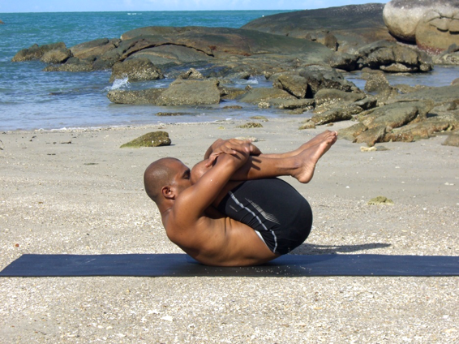

  

   
  

  

  

  

   <b class="calibre3">
    Pawan Muktasana
   </b>
  

  

  

  

   <i class="calibre4">
    Wind releasing pose
   </i>
  

  

   <b class="calibre3">
    Meaning:
   </b>
  

  

   Pawan: wind
  

  

   Mukta: release
  

  

  

  

   <b class="calibre3">
   </b>
  

  

   <b class="calibre3">
    Story:
   </b>
  

  

  

  

   This pose looks like a turtle as you curl up so here is a story about a turtle and hare.
  

  

   The  hare  was  mocking  the  turtleś  smal   feet  and  slow  pace.  However,  the turtle laughed while uttering "even if you are fast like the wind, I know I would stil   win  a  race  with  you."  "OK,”  said  the  hare,  “you  will  soon  regret  your words."
  

  

   On  the  day  of  the  race,  the  turtle  set  off  at  his  usual  slow  steady  pace.
  

  

   Natural y the hare was faster and left the turtle far behind. When the hare was halfway,  he  started  nibbling  on  some  juicy  grass  and  took  a  nap.  He  was confident that even if the turtle were  to  pass him while he was sleeping, he would be able to catch up and win the race. Meanwhile the turtle continued at a slow steady pace towards the finish line.
  

  

   When the hare woke up, he could not see the turtle anywhere, so he set off towards the finish line as fast as he could. As he approached, he saw that the turtle had already crossed the finish line and was resting comfortably on the grass.
  

  

  

  

  

  

   
  

  

  

  

  

  

   <b class="calibre3">
    Technique (Getting into the pose):
   </b>
  

  

   (Breath easily if you have asthma or hypertension)
   <b class="calibre3">
   </b>
  

  

  

  

   <b class="calibre3">
    Technique (Getting out of the pose):
   </b>
  

  

   Exhale, lower the head down to the mat and lower the hands 2.
  

  

   Inhale, straighten both legs up at 90 degrees
  

  

   Exhale, lower the legs down slowly with control by extending the hips
  

  

  

  

   <b class="calibre3">
   </b>
  

  

   <b class="calibre3">
    Physical Benefits:
   </b>
  

  

   Expels stale abdominal gases
  

  

   Stimulates the digestive system, aid in combating constipation 3.
  

  

   Relieves stiffness in the lumbar vertebrae due to compression 4.
  

  

   Stretches gluteus maximus and erector spinae
  

  

   Relieves menstrual cramps
  

  

  

  

   <b class="calibre3">
    Spiritual Benefits:
   </b>
  

  

   Restores *apana prana’s functions in the channels of elimination
  

  

  

  

   * Apana is one of the 5 types of pranic energy. It is a force that moves down and  out  of  the  lower  body.  It  is  the  force  behind  the  elimination  of  faeces, urine, orgasm, delivering a baby and menstruation. When apana is healthy and balanced, these functions are regular and can be executed without discomfort.
  

  

  

  

   <b class="calibre3">
    Contraindications:
   </b>
  

  

   Neck injury, recent abdominal surgery, hernia, disc dislocation
  

  

  

  

   <b class="calibre3">
   </b>
  

  

   
  

  

  

  

   <b class="calibre3">
   </b>
  

  

   <b class="calibre3">
   </b>
  

  

   <b class="calibre3">
    Modifications:
   </b>
  

  

   Those experiencing back pain need not lift both legs straight up, instead bend the knees towards the chest right away.
  

  

  

  

   Those with neck issues can rest the head on the floor.
  

  

  

  

   Ardha Pawan Muktasana (Half wind releasing pose) where you alternately hug one knee to the chest.
  

  

   <b class="calibre3">
   </b>
  

  

   <b class="calibre3">
   </b>
  

  

   Common mistakes
  

  

   Corrections
  

  

   Knees are open wide to the sides
  

  

   Engage the inner thighs (adductors)
  

  

   Unable to hug the shin or knees
  

  

   to bring the knees and heels
  

  

   touching each other
  

  

  

  

  

  

  

  

  

  

  

  

  

  

  

  

  

  

  

  

  

  

  

  

  

  

  

  

  

  

  

  

  

  

  

  

  

  

  

  

  

  

  

  

  

  

  

  

  

  

   
  

  

  

