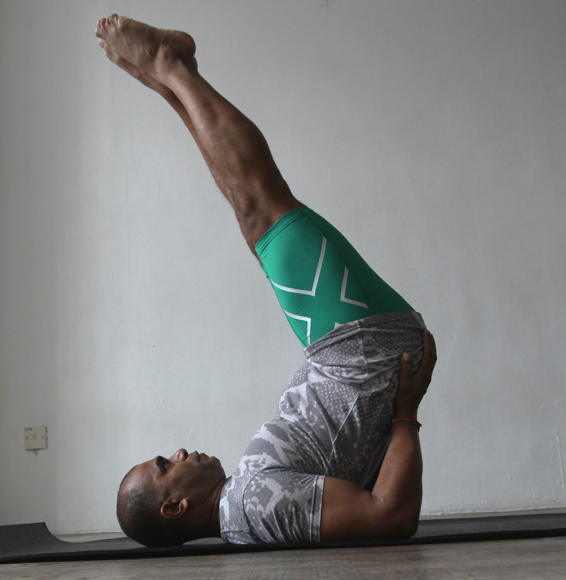

  

   
  

  

  

  

  

  

   <b class="calibre3">
    Viparita Karani
   </b>
  

  

  

  

  

  

  

  

  

  

   <i class="calibre4">
    Inverted Pose
   </i>
  

  

  

  

   <b class="calibre3">
    Meaning:
   </b>
  

  

  

  

   Viparita: accidental
  

  

  

  

   Karani: action
  

  

  

  

  

  

  

  

  

  

  

  

  

  

  

  

  

  

  

  

   <b class="calibre3">
    Story:
   </b>
  

  

  

  

   According to the Gheranda Samhita text, this pose is said to reverse the normal downward  flow  of  a  precious  subtle  fluid  cal ed  amrita  (elixir)  or  soma (extract).  Yogis  agree  that  Viparita  Karani  may  have  the  power  to  cure  most ailments, even reversing the aging process.
  

  

  

  

   Viparita Karani is also known as a mudra. When doing this asana, amrita flows towards the head and is retained at the throat (vishuddha chakra).
  

  

   <b class="calibre3">
    Technique (Getting into the pose):
   </b>
  

  

   Lie  flat  on  the  back,  feet  together  and  palms  by  the  side  of  the  body facing down
  

  

   Maintain position of toes above the forehead in one plane 6.
  

  

   Fix your gaze on the big toes and hold steady without moving the head
  

  

  

  

   <b class="calibre3">
   </b>
  

  

   <b class="calibre3">
   </b>
  

  

   <b class="calibre3">
   </b>
  

  

  

  

   
  

  

  

  

   <b class="calibre3">
    Technique (Getting out of the pose):
   </b>
  

  

  

  

   <b class="calibre3">
    Tips:
   </b>
  

  

   Avoid  straining  the  lower  back,  use  your  rectus  and  transverses abdominis to the maximum
  

  

   Avoid jamming your chin towards the sternum
  

  

   Try not  to bend the knee. Instead pul  the kneecaps up by contracting the quadriceps
  

  

   Engage the glutes and inner thighs (adductors)
  

  

   Stabilize the triceps brachi  to keep elbows steady as a fulcrum
  

  

   <b class="calibre3">
   </b>
  

  

   <b class="calibre3">
   </b>
  

  

   <b class="calibre3">
    Physical Benefits:
   </b>
  

  

   Strengthens rectus abdominis, transverses abdominis
  

  

   Allows  venous  blood  to  flow  back,  relieves  tiredness  in  the  legs,  and reduces appearance of varicose veins in the long-run
  

  

   Maintains functions of the thyroid, pituitary, gonad and adrenal glands which are being stimulated
  

  

   Helps to promote inner harmony
  

  

   Helps to tone gluteal muscles
  

  

   In  the  long-term,  enhances  the  visuddhi  chakra,  encourages  calmness, speaking abilities, voice quality, charisma
  

  

   Helps to moderate breathing at the thoracic region.
  

  

   Increases blood supply to the face, neck, brain and thorax and nourishes the skin
  

  

  

  

   <b class="calibre3">
    Contraindications:
   </b>
  

  

   Severe lower back pain, herniated disk
  

  

   Neck injury should avoid this total y
  

  

   Those who have undergone recent abdominal surgery
  

  

   Pregnant and menstruating women
  

  

   Those with serious eye injuries or conditions such as glaucoma
  

  

  

  

   <b class="calibre3">
   </b>
  

  

   <b class="calibre3">
   </b>
  

  

   <b class="calibre3">
   </b>
  

  

  

  

   
  

  

  

  

   <b class="calibre3">
    Modifications:
   </b>
  

  

   Those  with  lower  back  pain,  weaker  abs  or  tight  hamstrings  can  bend  their knees slightly
  

  

  

  

   Those with weak abs can keep the legs paral el to the floor To increase the chal enge, try raising both legs together. With straight knees
  

  

   <b class="calibre3">
   </b>
  

  

   Common mistakes
  

  

   Corrections
  

  

   Holding of breath
  

  

   Keep breathing at the thoracic
  

  

   region
  

  

   Lifting the head off the floor
  

  

   Engage the scapulae by contracting
  

  

   the upper back muscles
  

  

   Bending of knees
  

  

   Engage the quadriceps
  

  

   Not balancing
  

  

   Point toes towards you
  

  

   Jerking/using momentum into the
  

  

   Use deep core strength to lift up to
  

  

   pose
  

  

   appropriate angle in this pose
  

  

   Over arching/straining lower back
  

  

   Engage the abdominal muscles to
  

  

   keep a neutral spine
  

  

   <b class="calibre3">
   </b>
  

  

   <b class="calibre3">
   </b>
  

  

  

  

   
  

