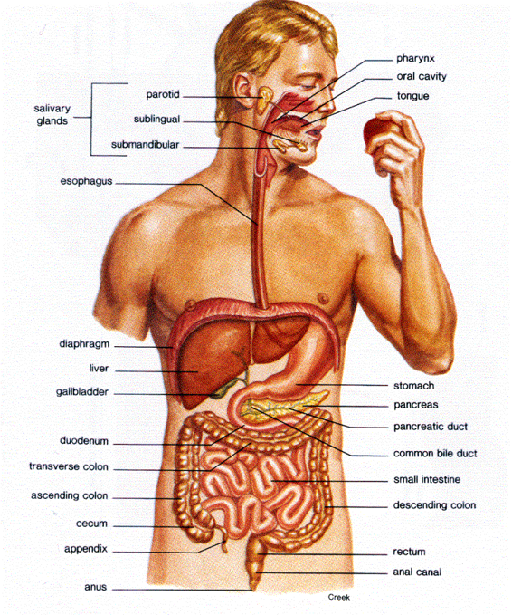

  

   <b class="calibre3">
    THE DIGESTIVE SYSTEM
   </b>
  

  

  

  

   CONCEPTS YOU WILL LEARN:
  

  

  

  

   FUNCTIONS OF THE DIGESTIVE SYSTEM
  

  

   Digestion is the process by which food and drink are broken down into their smal est  parts  so  the  body  can  use  them  to  build  and  nourish  cel s  and  to provide energy.
  

  

   When you eat foods—such as bread, meat, and vegetables—they are not in a form that the body can use as nourishment. Food and drink must be changed into smaller molecules of nutrients before they can be absorbed into the blood and carried to cel s throughout the body.
  

  

  

  

   TYPES OF FOOD AND WHAT ARE THEY
  

  

   BROKEN DOWN INTO
  

  

   <b class="calibre3">
    Carbohydrates.
   </b>
   Foods  rich  in  carbohydrates  include  bread,  potatoes,  dried peas  and  beans,  rice,  pasta,  fruits,  and  vegetables.  Many  of  these  foods contain both starch and fiber.
  

  

   The
   <b class="calibre3">
    digestible  carbohydrates
   </b>
   —
   <b class="calibre3">
    starch  and  sugar
   </b>
   —are  broken  into  simpler molecules by enzymes in the saliva, in juice produced by the pancreas, and in the  lining  of  the  smal   intestine.  Starch  is  digested  in  two  steps.  First,  an enzyme  in  the  saliva  and  pancreatic  juice  breaks  the  starch  into  molecules cal ed maltose. Then an enzyme in the lining of the smal   intestine splits the maltose into glucose molecules that can be absorbed into the blood. Glucose is carried  through  the  bloodstream  to  the  liver,  where  it  is  stored  or  used  to provide energy for the work of the body.
  

  

  

  

   
  

  

  

  

   Sugars are digested in one step. An enzyme in the lining of the smal  intestine digests  sucrose,  also  known  as  table  sugar,  into  glucose  and  fructose,  which are absorbed through the intestine into the blood. Milk contains another type of  sugar,  lactose,  which  is  changed  into  absorbable  molecules  by  another enzyme
  

  

   in
  

  

   the
  

  

   intestinal
  

  

   lining.
  

  

  

  

   <b class="calibre3">
    Fiber  is  undigestible
   </b>
   and  moves  through  the  digestive  tract  without  being broken  down  by  enzymes.  Many  foods  contain  both  soluble  and  insoluble fiber. Soluble fiber dissolves easily in water and takes on a soft, gel-like texture in  the  intestines.  Insoluble  fiber,  on  the  other  hand,  passes  essential y unchanged
  

  

   through
  

  

   the
  

  

   intestines.
  

  

  

  

   <b class="calibre3">
    Protein.
   </b>
   Foods  such  as  meat,  eggs,  and  beans  consist  of  giant  molecules  of protein  that  must  be  digested  by  enzymes  before  they  can  be  used  to  build and  repair  body  tissues.  An  enzyme  in  the  juice  of  the  stomach  starts  the digestion  of  swal owed  protein.  Then  in  the  smal   intestine,  several  enzymes from  the  pancreatic  juice  and  the  lining  of  the  intestine  complete  the breakdown of huge protein molecules into smal  molecules called amino acids.
  

  

   These  smal   molecules  can  be  absorbed  through  the  smal   intestine  into  the blood and then be carried to al  parts of the body to build the wal s and other parts of cel s.
  

  

  

  

   <b class="calibre3">
    Fats.
   </b>
   Fat molecules are a rich source of energy for the body. The first step in digestion of a fat such as butter is to dissolve it into the watery content of the intestine. The bile acids produced by the liver dissolve fat into tiny droplets and allow pancreatic and intestinal enzymes to break the large fat molecules into smal er ones. Some of  these smal   molecules are fatty acids and cholesterol.
  

  

   The  bile  acids  combine  with  the  fatty  acids  and  cholesterol  and  help  these molecules move into the cel s of the mucosa. In these cel s the smal  molecules are  formed  back  into  large  ones,  most  of  which  pass  into  vessels  cal ed lymphatics near the intestine. These small vessels carry the reformed fat to the veins of the chest, and the blood carries the fat to storage depots in different parts of the body.
  

  

  

  

  

  

   
  

  

  

  

   <b class="calibre3">
    Vitamins.
   </b>
   Another  vital  part  of  food  that  is  absorbed  through  the  smal intestine are vitamins. The two types of vitamins are classified by the fluid in which  they  can  be  dissolved:  water-soluble  vitamins  (al   the  B  vitamins  and vitamin  C)  and  fat-soluble  vitamins  (vitamins  A,  D,  E,  and  K).  Fat-soluble vitamins are stored  in the liver and fatty  tissue of the body, whereas water-soluble vitamins are not easily stored and excess amounts are flushed out in the urine.
  

  

  

  

   <b class="calibre3">
    Water and salt.
   </b>
   Most of the material absorbed through the smal  intestine is water in which salt is dissolved. The salt and water come from the food and liquid you swallow and the juices secreted by the many digestive glands.
  

  

  

  

  

  

  

  

   
  

  

   
  

  

  

  

   PARTS OF THE DIGESTIVE SYSTEM
  

  

  

  

  

  

  

  

  

  

  

  

   
  

  

  

  

   DESCRIBING THE DIGESTIVE PROCESS
  

  

   <b class="calibre3">
    Mouth:
   </b>
   When  food  enters  the  mouth,  its  digestion  starts  by  the  action  of mastication, a form of mechanical digestion, and the contact of saliva. Saliva, which is secreted by the salivary glands, contains salivary amylase, an enzyme which starts the digestion of starch in the food. After undergoing mastication and starch digestion, the food wil  be in the form of a small, round slurry mass cal ed a bolus. It wil  then travel down the
   <b class="calibre3">
    esophagus
   </b>
   and into the stomach by the
  

  

   action
  

  

   of
  

  

   <b class="calibre3">
    peristalsis
   </b>
   .
   <b class="calibre3">
   </b>
  

  

   <b class="calibre3">
   </b>
  

  

   <b class="calibre3">
    Stomach:
   </b>
   Gastric  juice  in  the  stomach  starts  protein  digestion.  Gastric  juice mainly  contains  hydrochloric  acid  and  pepsin.  As  these  two  chemicals  may damage the stomach wal , mucus is secreted by the stomach, providing a slimy layer that acts as a shield against the damaging effects of the chemicals. At the same  time
   <b class="calibre3">
    protein  digestion
   </b>
   is  occurring,  mechanical  mixing  occurs  by peristalsis,  which  are  waves  of  muscular  contractions  that  move  along  the stomach wal . This al ows the mass of food to further mix with the digestive enzymes.
  

  

   After some time,  the resulting thick liquid is cal ed chyme. When the pyloric sphincter valve opens, chime leaves the stomach and enters the duodenum.
  

  

   <b class="calibre3">
   </b>
  

  

   <b class="calibre3">
    Duodenum
   </b>
   (first  part  of  the  smal   intestines):  In  the  duodenum,  the  chyme mixes with digestive enzymes from the pancreas and
   <b class="calibre3">
    bile
   </b>
   from the gal bladder.
  

  

   Bile is produced in the liver and is stored between meals in the gal bladder. At mealtime, it is squeezed out of the gal bladder, through the bile ducts, and into the  intestine  to  mix  with  the  fat  in  food.  The  bile  acids  dissolve  fat  into  the watery  contents  of  the  intestine,  much  like  detergents  that  dissolve  grease from  a  frying  pan.  After  fat  is  dissolved,  it  is  digested  by  enzymes  from  the pancreas and the lining of the intestine.
  

  

  

  

   <b class="calibre3">
    Jejunum  and  ileum
   </b>
   (small  intestines):  Afterwhich,  itthen  passes  through  the smal  intestine, in which digestion continues. When the chyme is ful y digested, it is absorbed into the blood. 95% of absorption of nutrients occurs in the small intestine.
  

  

  

  

   
  

  

  

  

   Most digested molecules of food, as wel  as water and minerals, are absorbed through the smal  intestine. The mucosa of the smal  intestine contains many folds that are covered with tiny fingerlike projections cal ed vil i. In turn, the vil i are covered with microscopic projections cal ed microvil i. These structures create a vast surface area through which nutrients can be absorbed.
  

  

   The wastes continue its journey down the colon.
  

  

  

  

   <b class="calibre3">
    Colon
   </b>
   (large  intestines):  Water  and  minerals  are  reabsorbed  back  into  the blood  in  the  colon  (large  intestine).  Waste  material  is  eliminated  from  the rectum during defecation.
  

  

  

  

  

  

  

  

   
  

  

  

  

  

