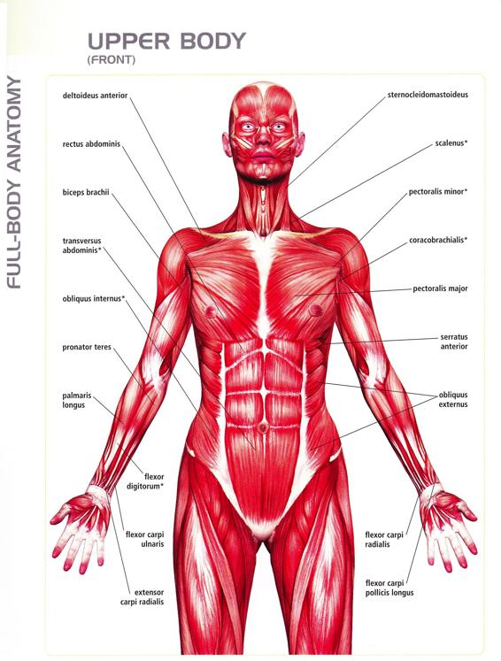
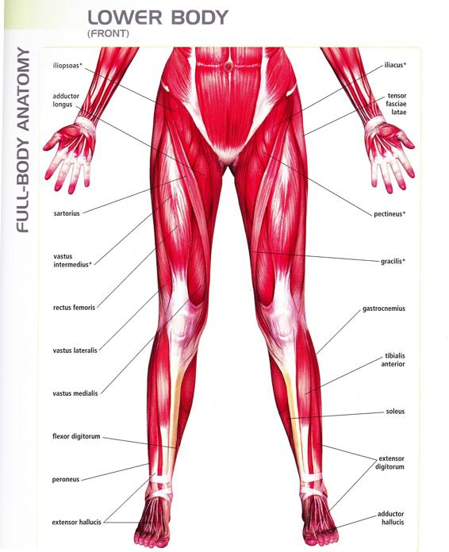
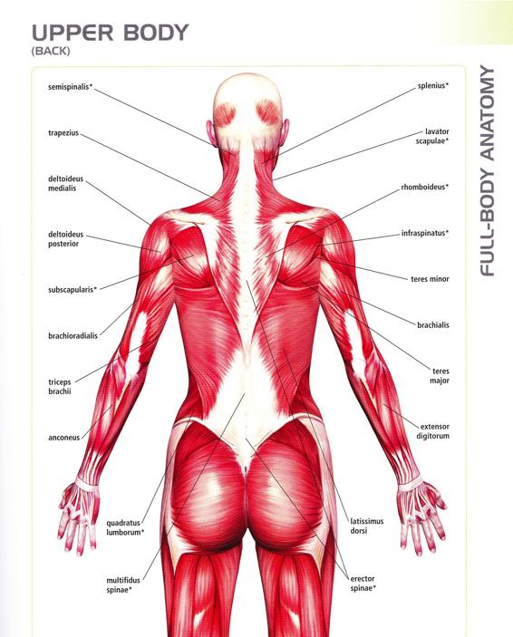
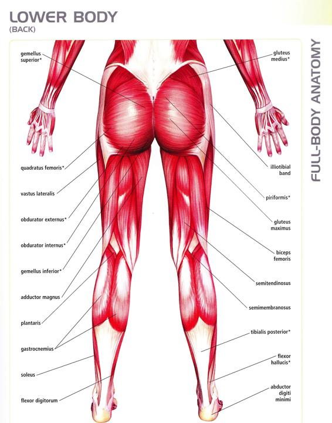
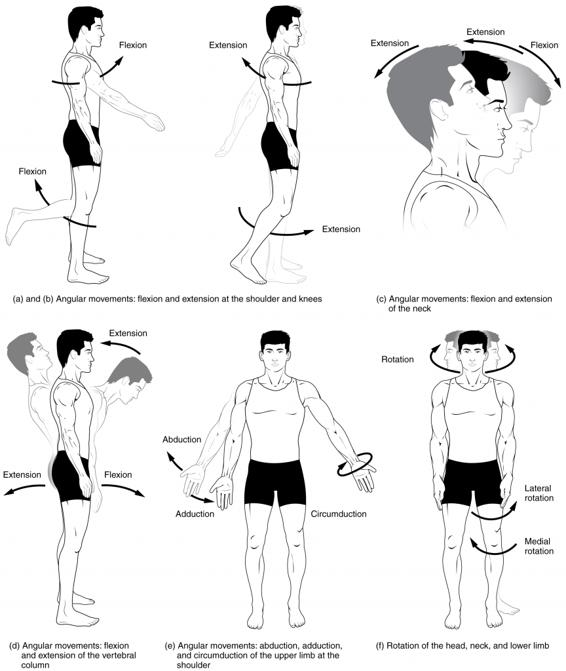
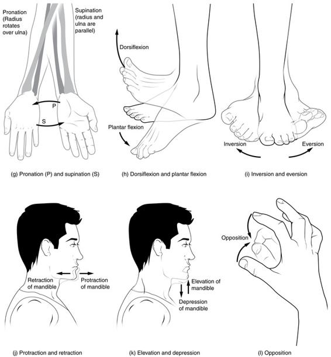
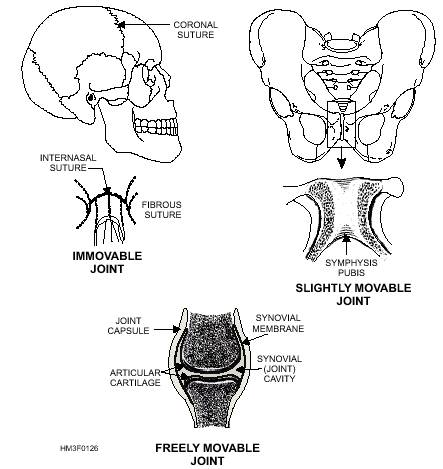

  

   <b class="calibre3">
    THE MUSCULAR SYSTEM
   </b>
  

  

   CONCEPTS YOU WILL LEARN:
  

  

  

  

   FUNCTIONS OF THE MUSCULAR SYSTEM
  

  

   For movement, both voluntary and involuntary like peristalsis in the digestive tract and to produce heat.
  

  

  

  

   CONCEPTS OF SKELETAL MUSCLE ACTIONS
  

  

   There are over 600 kinds of muscles that scientists have named. Some muscles are  tiny  -  when  we  get  goosebumps,  we  are  actual y  seeing  a  tiny  muscle Copyrights reserved.
  

  

  

  

   
  

  

  

  

   contracting to raise a hair. The longest muscle is sartorius muscle in your leg.
  

  

   The largest muscle in the body is Gluteus Maximus - the muscle you sit on!
  

  

   Muscles  are  only  able  to  contract  or  pul .  Because  our  body  has  to  move  in many directions, most muscles are set up in pairs so that one muscle can pull a bone in one direction, and another muscle can pull the bone back the other way.
  

  

   •
   <b class="calibre3">
    Prime  mover  (Agonist)
   </b>
   :  is  the  muscle  that  is  most  responsible  for  the movement.
  

  

   •
   <b class="calibre3">
    Synergists
   </b>
   are other muscles that assist the prime mover. Synergists may stabilize nearby bones or refine the movement of the prime mover.
  

  

   •
   <b class="calibre3">
    Antagonists
   </b>
   are muscles that cause a movement opposite to that of the prime mover. An antagonist is general y attached to the opposite side of the joint to which the prime mover is attached.
  

  

   TYPES OF MUSCLE FIBRE
  

  

   •
   <b class="calibre3">
    Slow  twitch
   </b>
   (a.k.a  long  fibres),  creates  continuous  extended contractions  used  for  marathon  long  distance  running,  usual y  red  in color carries more oxygen
  

  

   •
   <b class="calibre3">
    Fast  twitch
   </b>
   (a.k.a  short  fibres),  create  fast  bursts  of  energy  such  as sprinting, lighter in color (some white) carries less oxygen, fatigue very fast
  

  

  

  

   TYPES OF MUSCULAR CONTRACTIONS
  

  

   •
   <b class="calibre3">
    Concentric
   </b>
   : muscle shortens while contracting
  

  

   •
   <b class="calibre3">
    Eccentric
   </b>
   : muscle lengthens while contracting
  

  

   •
   <b class="calibre3">
    Isotonic
   </b>
   : constant tension through range of motion
  

  

   •
   <b class="calibre3">
    Isometric
   </b>
   :  muscle  creates  tension  but  no  change  in  length  of  fibres  or does not move bones
  

  

  

  

   STRETCH REFLEX
  

  

   A  reflex  is  an  involuntary  movement.  It  is  a  set  pattern  of  movement  in response  to  specific  stimuli  or  situation.  A  stretch  reflex  is  the  muscular response to stretching also known as a deep tendon reflex.  The stretch reflex Copyrights reserved.
  

  

  

  

   
  

  

  

  

   is  activated  to  resist  over  lengthening.  It  is  a  protective  response  to  avoid injury to the muscles by limiting the amount of lengthening.
  

  

   HOW ARE MUSCLES NAMED
  

  

   There  are  more  than  600  muscles  in  the  body,  which  together  account  for about 40 percent of a person's weight.
  

  

   Most skeletal muscles have names that describe some feature of the muscle.
  

  

   Often  several  criteria  are  combined  into  one  name.  Associating  the  muscle's characteristics  with  its  name  wil   help  you  learn  and  remember  them.  The fol owing are some terms relating to muscle features that are used in naming muscle
  

  

   •
   <b class="calibre3">
    Size:
   </b>
   vastus  (huge);  maximus  (large);  longus  (long);  minimus  (smal ); brevis (short).
  

  

   •
   <b class="calibre3">
    Shape:
   </b>
   deltoid  (triangular);  rhomboid  (like  a  rhombus  with  equal  and paral el  sides);  latissimus  (wide);  teres  (round);  trapezius  (like  a trapezoid, a four-sided figure with two sides paral el).
  

  

   •
   <b class="calibre3">
    Direction  of  fibers:
   </b>
   rectus  (straight);  transverse  (across);  oblique (diagonal y); orbicularis (circular).
  

  

   •
   <b class="calibre3">
    Location:
   </b>
   pectoralis  (chest);  gluteus  (buttock  or  rump);  brachii  (arm); supra- (above); infra- (below); sub- (under or beneath); lateralis (lateral).
  

  

   •
   <b class="calibre3">
    Number of origins:
   </b>
   biceps (two heads); triceps (three heads); quadriceps (four heads).
  

  

   •
   <b class="calibre3">
    Origin and insertion:
   </b>
   sternocleidomastoideus (origin on the sternum and clavicle, insertion on the mastoid process); brachioradialis (origin on the brachium or arm, insertion on the radius).
  

  

   •
   <b class="calibre3">
    Action:
   </b>
   abductor  (to  abduct  a  structure);  adductor  (to  adduct  a structure); flexor (to flex a structure); extensor (to extend a structure); levator (to lift or elevate a structure); masseter (a chewer).
  

  

   MUSCLE DIAGRAM
  

  

   Refer to appendix.
  

  

  

  

  

  

   
  

  

   
  

  

  

  

  

  

  

  

  

  

  

  

  

  

  

  

   
  

  

   
  

  

  

  

  

  

  

  

  

  

  

  

   
  

  

   
  

  

  

  

  

  

  

  

   
  

  

   
  

  

  

  

  

  

  

  

   
  

  

   
  

  

  

  

  

  

  

  

   
  

  

   
  

  

  

  

  

  

  

  

   
  

  

   
  

  

  

  

  

  

  

  

  

  

  

