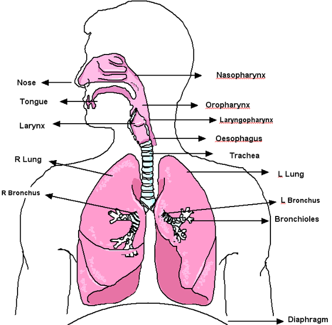
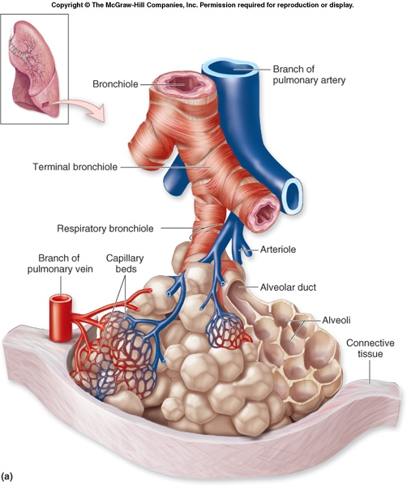
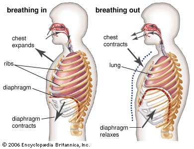
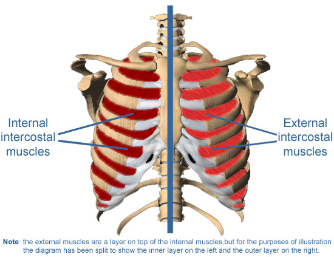

  

   <b class="calibre3">
    THE RESPIRATORY SYSTEM
   </b>
  

  

   CONCEPTS YOU WILL LEARN:
  

  

   FUNCTIONS OF THE RESPIRATORY SYSTEM
  

  

   •  To  bring  oxygen  into  the  lungs  and  cel s  and  to  take  out  the  carbon dioxide.
  

  

   •  To maintain homeostasis in the pH level of the blood.
  

  

  

  

   There are 2 types of respiration:
  

  

   <b class="calibre3">
    External respiration
   </b>
   is the process of gas exchange between the lungs and the blood. Oxygen diffuses into the blood, while carbon dioxide diffuses from the blood into the lungs.
  

  

   <b class="calibre3">
    Internal respiration
   </b>
   is the process of gas exchange between the blood and the cel s.  Inside  the  cel ,  cel ular  respiration  generates  ATP  using  oxygen  and glucose and producing waste carbon dioxide.
  

  

  

  

   PARTS OF THE RESPIRATORY SYSTEM
  

  

   The  lungs  are  a  pair  of  cone-shaped  bodies  that  occupy  the  thorax  (chest region).  They  are  being  protected  by  the  rib-cage,  sitting  on  the  diaphragm, and the apex is near to the clavicle (col ar bones).
  

  

   N.B: Notice that the left lung is smal er than the right lung. Why?
  

  

   The upper part of the respiratory tract consists of the nose, the nasal cavity and  the  pharynx.  To  ensure  particles  do  not  enter  the  airways,  the  inner surface of the nostril is lined with hairs which capture inhaled particles.
  

  

  

  

   
  

  

   
  

  

  

  

   The  pharynx  is  a  common  passageway  of  both  the  respiratory  and  digestive systems. When food is swal owed, the epiglottis seals off the larynx to prevent food from entering the airways.
  

  

  

  

  

  

  

  

   
  

  

   
  

  

  

  

  

  

   DESCRIBING THE RESPIRATORY PROCESS
  

  

   When we breathe in, the air moves through either through the nose or mouth, via  the  pharynx,  trachea,  passing  through  the  larynx,  and  into  the  bronchi, bronchioles and final y to the alveoli (air sacs).
  

  

   As  there  is  an  intensive  network  of  capil aries  surrounding  the  thin-wal ed membrane  of  the  alveoli,  gas  exchange  occurs  through  a  process  cal ed
   <b class="calibre3">
    diffusion
   </b>
   .
  

  

  

  

   
  

  

  

  

   As there is a higher concentration of oxygen in the inhaled air in the alveoli, oxygen diffuses through the alveolar wal  and enters the blood stream, being carried by the red blood cel s.
  

  

   As there is a higher concentration of carbon dioxide in the venous blood in the capil aries, the carbon dioxide diffuses from the blood into the alveoli. We then breathe out the carbon dioxide together with the remaining inert gases.
  

  

  

  

   MECHANICS OF BREATHING (VOLUNTARY BREATHING)
  

  

   This is purely muscular in nature and the stimulus for the air to be inhaled is due to pressure difference. (Boyle’s law: Pressure x Volume = constant) When you want to inhale:
  

  

   •  Brain controls the skeletal muscles.
  

  

   •  External  intercostals  muscles  contract,  internal  intercostals  muscles relaxes =&gt; rib cage rises and expands
  

  

   •  Diaphragm contracts and flattens
  

  

   •  Thoracic cavity increases in size
  

  

   •  Lung volume increase
  

  

   •  Air pressure in the lungs decreases
  

  

   •  Air is being sucked in
  

  

  

  

  

  

  

  

  

  

   
  

  

   
  

  

   
  

  

  

  

  

  

  

  

  

  

  

  

  

  

   
  

  

  

  

   WHAT HAPPENS DURING INVOLUNTARY BREATHING?
  

  

   Unconsciously, breathing is control ed by specialized centers in the brainstem (medul a  oblongata),  which  automatical y  regulate  the  rate  and  depth  of breathing depending on the body’s needs at any time. When carbon dioxide levels  increase  in  the  blood,  it  reacts  with  the  water  in  blood,  producing carbonic  acid.  When  the  blood  becomes  more  acidic,  in  order  to  maintain homeostasis, we breathe out.
  

  

  

  

   AEROBIC RESPIRATION VS ANAEROBIC RESPIRATION
  

  

   IN EXERCISE
  

  

   <b class="calibre3">
    Aerobic
   </b>
   means "with oxygen." Aerobic exercise and activities are characterized by a slightly elevated heart rate that al ows you to sustain the activities for long periods. Aerobic respiration uses sustainable pathways for creating energy for your  muscles.  Oxygen  allows  your  body  to  convert  glucose  into  ATP  more efficiently,  without  creating  excess  waste  products.  During  aerobic  activities, your heart rate is increased to provide for the additional oxygen required, but it is not so high as to not be maintainable.
  

  

   <b class="calibre3">
    Anaerobic  means
   </b>
   "without  oxygen."  Anaerobic  exercise  usual y  consists  of high-intensity  activities  including  sprinting  and  weight  lifting.  During  these activities  your  body  cannot  provide  enough  oxygen  to  account  for  normal aerobic  respiration.  Your  heart  rate  elevates  to  near  maximum  levels, attempting  to  pump  more  oxygenated  blood,  but  it  cannot  keep  up.  At  this point, anaerobic respiration kicks in, converting glucose into ATP and creating a waste product known as
   <b class="calibre3">
    lactic acid
   </b>
   . Your body can absorb only so much lactic acid before your muscles cramp and seize. This is why anaerobic respiration is sustainable only for short periods. You may experience a delayed muscle onset syndrome (which means muscle ache) if there is an accumulation of lactic acid.
  

  

  

  

  

  

  

  

  

  

  

  

   
  

  

  

