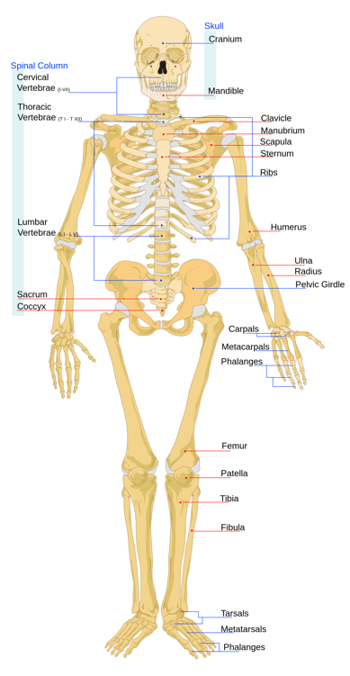

  

   <b class="calibre3">
    THE SKELETAL SYSTEM
   </b>
  

  

  

  

   CONCEPTS YOU WILL LEARN:
  

  

  

  

   FUNCTIONS OF THE SKELETAL SYSTEM
  

  

   <b class="calibre3">
    Support
   </b>
  

  

   The skeleton provides the framework which supports the body and maintains its shape, as well as providing a framework for the attachment of muscles and other tissues. The pelvis, associated ligaments and muscles provide a floor for the pelvic structures. Without the rib cages, costal cartilages, and intercostal muscles, the heart would col apse.
   <b class="calibre3">
   </b>
  

  

   <b class="calibre3">
    Movement
   </b>
  

  

   The joints between bones permit movement, some al owing a wider range of movement than others, e.g. the bal  and socket joint al ows a greater range of movement than the pivot joint at the neck. Movement is powered by skeletal muscles, which are attached to the skeleton at various sites on bones. Muscles, bones,  and  joints  provide  the  principal  mechanics  for  movement,  al coordinated by the nervous system.
  

  

   <b class="calibre3">
    Protection
   </b>
  

  

   The skeleton protects many vital organs, example:
  

  

   •  The skul  protects the brain, the eyes, and the middle and inner ears.
  

  

   •  The vertebrae protect the spinal cord.
  

  

  

  

   
  

  

  

  

   •  The rib cage, spine, and sternum protect the human lungs, human heart and major blood vessels.
  

  

   <b class="calibre3">
   </b>
  

  

   <b class="calibre3">
    Blood cell production
   </b>
  

  

   The  production  of  blood  cel s  occurs  in  the  red  marrow  found  within  the cavities of certain bones, such as:
  

  

   •  Epiphyses of long bones (e.g. humerus and femur)
  

  

   •  Flat bones (ribs and cranial bones)
  

  

   •  Vertebrae
  

  

   •  Pelvis
  

  

   <b class="calibre3">
   </b>
  

  

   <b class="calibre3">
    Mineral Storage
   </b>
  

  

   Bone  matrix  can  store  calcium  and  phosphorus  and  is  involved  in  calcium metabolism, and bone marrow can store iron in ferrotin and is involved in iron metabolism.
  

  

   <b class="calibre3">
   </b>
  

  

   <b class="calibre3">
    Energy Storage
   </b>
  

  

   Lipids (fats) stored  in adipose cel s of  the yel ow marrow serve as an energy reservoir.
  

  

   <b class="calibre3">
   </b>
  

  

  

  

  

  

  

  

   
  

  

  

  

   PARTS OF THE SKELETAL SYSTEM
  

  

   The bones of the body are categorized into 2 groups, the axial skeleton and the appendicular  skeleton.  The  bones  of  the  axial  skeleton  revolved  around  the vertical  axis  of  the  skeleton,  while  the  bones  of  the  appendicular  skeleton make up the limbs that have been appended to the axial skeleton.
  

  

   <b class="calibre3">
   </b>
  

  

   <b class="calibre3">
    Axial skeleton
   </b>
  

  

   The  upright  posture  of  humans  is  maintained  by  the  axial  skeleton,  which transmits  the  weight  from  the  head,  the  trunk,  and  the  upper  extremities down to the lower extremities at the hip joints.
  

  

   The axial skeleton (80 bones) is formed by the vertebral column (26), the rib cage (12 pairs of ribs and 1 sternum), and the skul  (22 bones and 7 associated bones)
  

  

   The rib cage consists of:
  

  

   •  True ribs: 7 pairs
  

  

   •  False ribs: 3 pairs
  

  

   •  Floating ribs: 2 pairs
  

  

   <b class="calibre3">
   </b>
  

  

   <b class="calibre3">
    Appendicular skeleton
   </b>
  

  

   Their functions of the appendicular skeleton are to make locomotion possible and  to  protect  the  major  organs  of  locomotion,  digestion,  excretion,  and reproduction.
  

  

   The  appendicular  skeleton  (126  bones)  is  formed  by  the  pectoral  girdles  (4), the upper limbs (60), the pelvic girdle (2), and the lower limbs (60).
  

  

  

  

  

  

   
  

  

   
  

  

  

  

  

  

  

  

   
  

  

   
  

  

   
  

  

  

  

   THE VERTEBRAE COLUMN
  

  

   •  Cervical vertebrae: 7
  

  

   •  Thoracic vertebrae: 12
  

  

   •  Lumbar vertebrae: 5
  

  

   •  Sacrum: 1 (5 fused into 1)
  

  

   •  Coccyx: 1 (3-4 fused into 1)
  

  

  

  

  

  

  

  

  

  

  

  

  

  

   
  

  

   
  

  

   
  

  

  

  

   MISALIGNMENT OF THE SPINE
  

  

   •  Kyphosis: Exaggerated hyperflexion of the thoracic vertebrae
  

  

   •  Lordosis: Exaggerated hyperextension of the lumbar vertebrae
  

  

   •  Scoliosis: Lateral curvature of the vertebrae
  

  

  

  

  

  

  

  

  

  

   
  

  

   
  

  

  

  

  

  

   TYPES OF JOINTS
  

  

   A joint is where two bones meet and articulate (move). Joints are also found between  bone  and cartilage.  To  al ow  movement,  the  bones  of  the  skeleton are  held  together  at  joints  by  flexible  bands  of  connective  tissue  called
   <b class="calibre3">
    ligaments
   </b>
   .
  

  

   Joints can be classified structurally under the following three types:
   <b class="calibre3">
    Fibrous  Joints:
   </b>
   These  are  usual y  immovable  joints  as  the  bones  are  tightly connected by fibrous connective tissue, eg sutures of the skul .
  

  

   <b class="calibre3">
    Cartilaginous  Joints:
   </b>
   These  joints  are  slightly  immovable.  The  ends  of  the bones  are  connected  by  cartilage.  One  example  of  cartilaginous  joints  is  the pubic symphysis in which the two pubic bones connect. Another example is the joints between each of the vertebrae.
  

  

   <b class="calibre3">
    Synovial  joints:
   </b>
   Most  of  the  joints  of  the  body  are  freely  movable  in  one  or more planes, eg.the shoulder and hip joint.
  

  

  

  

  

  

   
  

  

   
  

  

  

  

  

  

  

  

   <b class="calibre3">
   </b>
  

  

  

  

   
  

  

  

